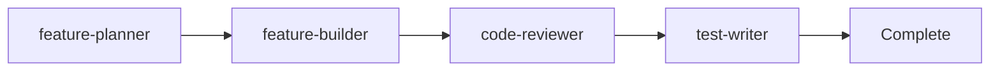

# AI Agents Directory

**Last Updated**: 2026-02-15

This directory contains all AI agent definitions organized by category.

---

## Agent Categories

### Core Agents (`core/`)

Primary workflow agents for feature development:

- **[feature-planner](core/feature-planner.md)** - Creates technical specifications
- **[feature-builder](core/feature-builder.md)** - Implements from specifications
- **[code-reviewer](core/code-reviewer.md)** - Code quality and pattern review
- **[frontend-developer](core/frontend-developer.md)** - React/Next.js engineering

### Specialist Agents (`specialists/`)

Expert agents for specific domains:

- **[architect](specialists/architect.md)** - System architecture and ADRs
- **[security-expert](specialists/security-expert.md)** - Security audits and reviews
- **[debugger](specialists/debugger.md)** - Root cause analysis
- **[dev-automation](specialists/dev-automation.md)** - Development environment

### Testing Agents (`testing/`)

Quality assurance specialists:

- **[test-writer](testing/test-writer.md)** - Unit/integration tests
- **[test-analyzer](testing/test-analyzer.md)** - Test failure analysis
- **[e2e-test-specialist](testing/e2e-test-specialist.md)** - E2E and accessibility

---

## Standard Workflow

**Typical flow**:
1. `@feature-planner` creates specification
2. `@feature-builder` implements from spec
3. `@code-reviewer` reviews implementation
4. `@test-writer` adds tests

---

## When to Use Each Agent

| Situation | Agent | Why |
|-----------|-------|-----|
| Planning new feature | feature-planner | Creates detailed spec |
| Implementing feature | feature-builder | Systematic implementation |
| UI/Component work | frontend-developer | React/Next.js expertise |
| Code review needed | code-reviewer | Quality assurance |
| Writing tests | test-writer | Jest + RTL |
| E2E testing | e2e-test-specialist | Playwright |
| Complex bugs | debugger | Root cause analysis |
| Security concerns | security-expert | Security audit |
| Architecture decision | architect | System design |

---

## Related Documentation

- [Context](../context/) - Quick references for agents
- [Guidelines](../guidelines/) - Coding standards
- [Workflows](../workflows/) - Standard procedures

---

## Navigation

- [← Back to .claude/](../)
- [↑ Project Root](../../)

---

**For detailed agent usage, see**: [/AGENT_LIST.md](../../AGENT_LIST.md)
