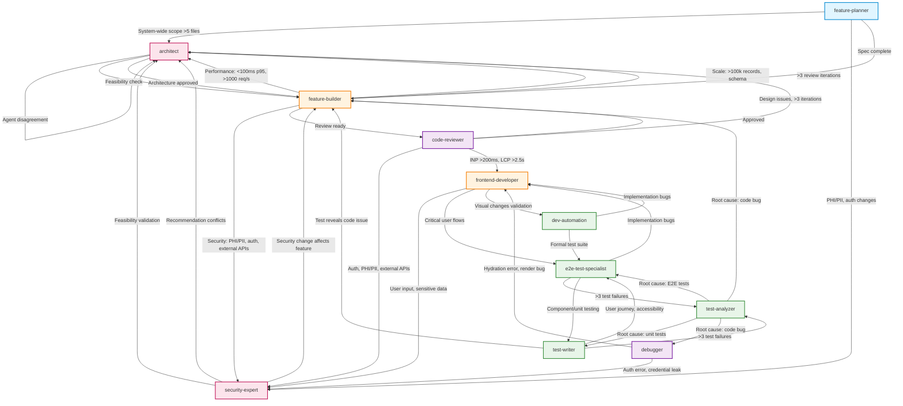

# Agent Collaboration Graph

**Version**: 1.0
**Last Updated**: 2026-01-09
**Purpose**: Visualization and analysis of all agent interactions

## Complete Collaboration Graph



## Interaction Matrix

| From Agent | To Agent | Trigger | Type |
|------------|----------|---------|------|
| **feature-planner** | architect | System-wide scope (>5 files) | Escalation |
| feature-planner | security-expert | PHI/PII, auth changes | Consultation |
| feature-planner | feature-builder | Spec complete | Handoff |
| **feature-builder** | security-expert | PHI/PII, auth, external APIs | Consultation |
| feature-builder | architect | Performance/Scale issues | Escalation |
| feature-builder | code-reviewer | Review ready | Quality Gate |
| feature-builder | architect | >3 review iterations | Escalation |
| **frontend-developer** | security-expert | User input, sensitive data | Consultation |
| frontend-developer | e2e-test-specialist | Critical user flows | Testing |
| frontend-developer | dev-automation | Visual changes | Validation |
| **code-reviewer** | security-expert | Auth, PHI/PII, external APIs | Flag |
| code-reviewer | frontend-developer | Performance issues | Flag |
| code-reviewer | architect | Design issues, >3 iterations | Escalation |
| code-reviewer | feature-builder | Feedback loop | Iterative |
| **test-writer** | test-analyzer | >3 test failures | Escalation |
| test-writer | e2e-test-specialist | User journey, accessibility | Collaboration |
| test-writer | feature-builder | Test reveals code issue | Feedback |
| **test-analyzer** | test-writer | Root cause: unit tests | Delegation |
| test-analyzer | e2e-test-specialist | Root cause: E2E tests | Delegation |
| test-analyzer | feature-builder | Root cause: code bug | Feedback |
| test-analyzer | debugger | Root cause: code bug | Delegation |
| **e2e-test-specialist** | test-analyzer | >3 test failures | Escalation |
| e2e-test-specialist | test-writer | Component/unit testing | Delegation |
| e2e-test-specialist | frontend-developer | Implementation bugs | Feedback |
| **dev-automation** | e2e-test-specialist | Formal test suite | Escalation |
| dev-automation | frontend-developer | Implementation bugs | Feedback |
| **debugger** | security-expert | Auth error, credential leak | Consultation |
| debugger | frontend-developer | Hydration, render bugs | Consultation |
| **security-expert** | architect | Feasibility validation | Consultation |
| security-expert | architect | Recommendation conflicts | Arbitration |
| security-expert | feature-builder | Security change affects feature | Consultation |
| **architect** | feature-builder | Feasibility check | Consultation |
| architect | feature-builder | Architecture approved | Handoff |

**Total Interactions**: 35

## Agent Roles by Interaction Pattern

### Entry Points (3)
Agents that typically start workflows:
1. **feature-planner** - Creates specs from requirements
2. **dev-automation** - Environment checks, UI validation
3. **debugger** - Bug investigation

### Orchestrators (3)
Agents that route to multiple other agents:
1. **architect** (5 interactions) - Design arbitration, conflict resolution
2. **feature-builder** (4 interactions) - Implementation hub
3. **code-reviewer** (4 interactions) - Quality gate

### Specialists (3)
Agents consulted for specific expertise:
1. **security-expert** (6 incoming) - Security validation
2. **frontend-developer** (4 incoming) - UI implementation & debugging
3. **test-analyzer** (2 incoming) - Test failure analysis

### Workflow Agents (2)
Agents in implementation/test cycles:
1. **test-writer** (3 interactions) - Unit/integration testing
2. **e2e-test-specialist** (3 interactions) - User journey testing

## Circular Dependencies Analysis

### Review Cycle (BOUNDED ✅)
```
feature-builder → code-reviewer → feature-builder
```
- **Termination**: Max 3 iterations, then escalate to architect
- **Status**: SAFE (loop termination enforced)

### Test Cycle (SAFE ✅)
```
test-writer → feature-builder → test-writer
```
- **Termination**: Test reveals code issue → fix → re-test
- **Status**: SAFE (natural termination when tests pass)

### No Unbounded Cycles Detected ✅

All circular paths have clear termination conditions.

## Critical Paths

### 1. Feature Development Path
```
feature-planner → feature-builder → code-reviewer → [approval]
                                   ↓ (if issues)
                                security-expert / architect
```

### 2. Bug Fix Path
```
debugger → feature-builder → code-reviewer → [approval]
         ↓ (if security)
      security-expert
```

### 3. Testing Path
```
feature-builder → test-writer → [pass/fail]
                              ↓ (if >3 failures)
                           test-analyzer → [root cause fix]
```

### 4. Conflict Resolution Path
```
security-expert ──┐
                  ├─→ architect → [arbitration decision] → feature-builder
feature-builder ──┘
```

## Escalation Triggers (NFR-Based)

### To Architect (System-Wide)
- System-wide scope (>5 files) - from feature-planner
- Performance (<100ms p95, >1000 req/s) - from feature-builder
- Scale (>100k records, schema) - from feature-builder
- Design issues (>3 review iterations) - from code-reviewer
- Agent conflicts - from security-expert

### To Security-Expert (Security)
- PHI/PII access - from feature-planner, feature-builder, frontend-developer, code-reviewer
- Auth changes - from feature-planner, feature-builder, code-reviewer, debugger
- External APIs - from feature-planner, feature-builder, code-reviewer
- User input validation - from frontend-developer

### To Test-Analyzer (Quality)
- >3 test failures - from test-writer, e2e-test-specialist

## Agent Utilization Metrics

### Most Connected Agents
1. **architect** - 8 total connections (3 in, 5 out)
2. **security-expert** - 9 total connections (6 in, 3 out)
3. **feature-builder** - 9 total connections (5 in, 4 out)
4. **code-reviewer** - 5 total connections (1 in, 4 out)

### Least Connected Agents
1. **dev-automation** - 2 total connections (0 in, 2 out)
2. **debugger** - 2 total connections (1 in, 2 out)

### Hub Agents (Most Incoming)
1. **security-expert** - 6 incoming (most consulted)
2. **feature-builder** - 5 incoming (implementation hub)
3. **architect** - 3 incoming (arbitration hub)

## Routing Validation

### ✅ All Routing Triggers are NFR-Based
All agent collaboration tables now use objective triggers from [nfr-matrix.md](nfr-matrix.md):
- Performance: `<100ms p95`, `>1000 req/s`, `INP <200ms`, `LCP <2.5s`
- Security: `PHI/PII access`, `auth changes`, `external APIs`
- Scale: `>100k records`, `>1000 records`, schema changes
- Quality: `>3 test failures`, `>3 review iterations`
- Complexity: `>5 files`, `>3 components`, `>3 branches`

### ✅ No Subjective Triggers
Before: "Security concerns", "Performance issues"
After: "PHI/PII access", "INP >200ms, LCP >2.5s"

## Coverage Analysis

### All Agents Have Clear Routing ✅
- 11/11 agents have Agent Collaboration sections
- 11/11 agents use NFR-based triggers
- 11/11 agents reference [nfr-matrix.md](nfr-matrix.md)

### All Critical Paths Covered ✅
- Feature development → feature-planner → feature-builder → code-reviewer
- Bug fixing → debugger → feature-builder
- Security review → security-expert
- Architecture decisions → architect
- Testing → test-writer, e2e-test-specialist, test-analyzer

## Recommendations

### 1. Monitor High-Utilization Agents
- **security-expert** (6 incoming) - Most consulted agent, ensure availability
- **feature-builder** (5 incoming) - Implementation bottleneck, consider load balancing
- **architect** (3 incoming) - Arbitration hub, critical for conflict resolution

### 2. Enhance Underutilized Agents
- **dev-automation** (0 incoming) - Consider proactive environment checks before feature-builder starts
- **debugger** (1 incoming) - Could be called more for complex bugs instead of feature-builder

### 3. Optimize Review Cycle
Current: `feature-builder → code-reviewer → feature-builder` (max 3 iterations)
- Track actual iteration counts
- If >3 iterations common, improve upfront validation

### 4. Strengthen Test Coverage
Current: `test-writer` and `e2e-test-specialist` are parallel
- Ensure both are called for critical features
- Feature-builder should route to test-writer automatically after implementation

## Version History

| Version | Date | Changes |
|---------|------|---------|
| 1.0 | 2026-01-09 | Initial graph with all 11 agents, NFR-based routing |

## Related Documentation

- [nfr-matrix.md](nfr-matrix.md) - NFR-based routing triggers
- [architecture-context.md](architecture-context.md) - System architecture
- [VALIDATION_PATTERNS.md](../guidelines/VALIDATION_PATTERNS.md) - Risk-based validation
- [agent_updates_complete_20260109.md](../logs/agent_updates_complete_20260109.md) - Agent update completion report

---

**All agents now use objective, NFR-based routing triggers. No unbounded cycles detected.**
