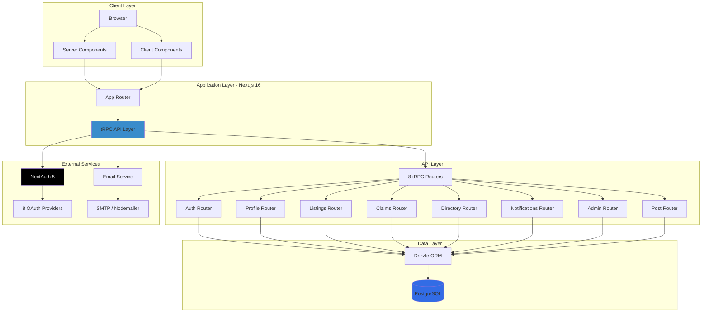
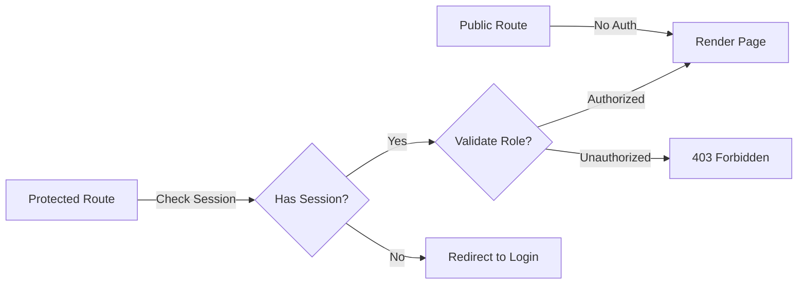

# Architecture Context

**Version**: 1.0
**Last Updated**: 2026-01-09
**Project**: info-web (Residential Complex Management System)

## System Architecture Overview



## Service Inventory

| Service | Responsibility | Technology | Port | Scale |
|---------|---------------|------------|------|-------|
| Frontend | UI/UX, Server Components, Client Components | Next.js 16, React 19, TailwindCSS 4 | 3000 | ~100-500 users/day |
| tRPC API | Type-safe API endpoints, Business logic | tRPC 11, Zod validation | 3000 (same) | ~1000-5000 req/day |
| Database | Data persistence, Multi-tenant data | PostgreSQL + Drizzle ORM | 5432 | ~10k-50k transactions/day |
| Auth Service | Authentication, OAuth, RBAC | NextAuth 5 | 3000 (same) | ~500-2000 auth/day |
| Email Service | Transactional emails, Notifications | Nodemailer + MJML | N/A | ~100-500 emails/day |

## Service Boundaries and Responsibilities

### Frontend Service (Next.js 16 App Router)

**Owns**:
- Server Components (default rendering strategy)
- Client Components (interactive UI with "use client")
- Route handlers (/app/api/*)
- Middleware (authentication checks)
- Static assets (/public/*)

**MUST NOT**:
- Direct database access (use tRPC only)
- Business logic in components (belongs in tRPC routers)
- Credential storage (use environment variables)
- Manual SQL queries

**Integration Points**:
- tRPC client (api.router.procedure.useQuery/useMutation)
- NextAuth session (auth())
- Server actions (where appropriate)

### tRPC API Service

**Owns**:
- API route definitions (routers)
- Input validation (Zod schemas)
- Business logic and orchestration
- Authorization checks (protectedProcedure, adminProcedure)
- Data transformation

**MUST NOT**:
- UI rendering logic
- Direct HTML generation
- Session management (NextAuth handles this)
- File system operations (except uploads)

**Integration Points**:
- Database via Drizzle ORM
- NextAuth for session validation
- Email service for notifications
- External OAuth providers

### Database Service (PostgreSQL + Drizzle)

**Owns**:
- Data schema (13+ tables)
- Data integrity constraints
- Indexes and query optimization
- Multi-tenant isolation (automatic via filters)
- Migrations

**MUST NOT**:
- Business logic (belongs in tRPC)
- Authentication logic (NextAuth tables only)
- Direct user exposure (always through tRPC)

**Integration Points**:
- Drizzle ORM (single source of truth)
- Migration scripts
- Seed data scripts

### Authentication Service (NextAuth 5)

**Owns**:
- User sessions (database sessions)
- OAuth flows (8 providers)
- Credential validation
- RBAC role management
- Password hashing (bcrypt)

**MUST NOT**:
- Business data storage
- Authorization logic (use tRPC procedures)
- Direct UI rendering

**Integration Points**:
- Database (users, accounts, sessions tables)
- OAuth providers (Yandex, VK, Google, etc.)
- tRPC context (provides session)

### Email Service (Nodemailer + MJML)

**Owns**:
- Email template rendering (MJML → HTML)
- Email delivery (SMTP)
- Transactional email logic
- Email queuing (async)

**MUST NOT**:
- User data storage
- Business logic
- Session management

**Integration Points**:
- Notification service (triggers)
- SMTP server
- Email templates (/public/templates/email/)

## Traffic and Volume Expectations

**Current Scale** (Development):
- Users: ~10-50 active users
- Requests: ~100-500 per day
- Database: ~1k-5k queries per day

**Expected Growth** (Production - Year 1):
- Users: ~500-1000 daily active users
- Requests: ~5k-10k per day
- Database: ~50k-100k queries per day
- Listings: ~100-500 active listings
- Buildings: 7 buildings (fixed)
- Apartments: ~1800 units
- Parking spots: ~800 spots

**Scaling Triggers**:
- Users > 1000 DAU: Consider caching layer
- Requests > 10k/day: Monitor response times, add indexes
- Database > 100k queries/day: Read replicas if needed
- Email > 1000/day: Consider email service provider

## Latency Requirements

| Endpoint Type | Target p95 | Target p99 | Critical Threshold |
|--------------|-----------|-----------|-------------------|
| Server Components (SSR) | < 500ms | < 1000ms | 2000ms |
| Client Queries (tRPC) | < 200ms | < 500ms | 1000ms |
| Mutations (tRPC) | < 500ms | < 1000ms | 2000ms |
| Database Queries | < 50ms | < 100ms | 200ms |
| Auth Operations | < 300ms | < 600ms | 1000ms |
| Email Send (async) | N/A | N/A | Best effort |

**Performance Budget**:
- Page Load (FCP): < 1.5s
- Page Load (LCP): < 2.5s
- Interaction (INP): < 200ms

## Sync vs Async Patterns

### Use Synchronous (Request/Response)

- **tRPC Queries**: User data fetching, listings, directory
- **tRPC Mutations**: Immediate user feedback required
- **Auth Operations**: Login, logout, session validation
- **Real-time UI Updates**: User interactions

**Justification**: Immediate feedback, simple error handling, type safety

### Use Asynchronous (Fire and Forget / Queue)

- **Email Sending**: `notifyAsync()` - don't block user request
- **Notifications**: Background notification creation
- **Cron Jobs**: Listing expiration, cleanup tasks
- **Analytics**: Event tracking, logging

**Justification**: Non-critical path, can retry, don't block UI

**Message Queue Patterns**:
- Currently: Simple async functions with Promise handling
- Future: Consider BullMQ or similar if queue complexity grows

## Security Zones and Data Sensitivity

### Public Zone (No Auth)
- Landing pages
- Login/Register pages
- Public listings (if implemented)
- Info pages

**Data**: No sensitive data

### Authenticated Zone (User Auth Required)
- User cabinet (/my/*)
- Profile management
- Notifications
- Property management (own properties only)

**Data**:
- User profile (name, email, phone)
- User-property relationships
- User preferences

### Multi-Tenant Isolation
- **Automatic**: All queries filtered by building/apartment/user
- **Enforcement**: Drizzle queries include tenant filters
- **Validation**: tRPC procedures validate ownership

**Critical**: Never expose cross-tenant data

### PHI/PII Handling

**Personal Identifiable Information (PII)**:
- User emails, phones, addresses
- Passport/document numbers (claims)
- OAuth provider IDs

**Protection**:
- Database: Encrypted at rest (PostgreSQL)
- Transport: HTTPS only (production)
- Access: Role-based (RBAC)
- Logging: Redact PII from logs

### Admin Zone (Admin Roles Required)
- Admin panel (/admin/*)
- User management
- Building management
- Claims approval
- Content moderation

**Data**: All system data
**Access Control**: 16 granular admin features (RBAC)

### Authentication Boundaries



## Scalability Constraints

### Current Constraints

**Database**:
- Single PostgreSQL instance
- Local development (Docker)
- No replication
- No sharding

**Application**:
- Single Next.js instance
- Stateless (can scale horizontally)
- Session storage: Database (can bottleneck)

**File Storage**:
- Local file system (listing photos)
- Max 20 photos per listing
- Not distributed

### Expected Growth

**Short-term (6 months)**:
- Users: 10x growth (500 DAU)
- Data: 2x growth (listings, users)
- Traffic: 5x growth

**Long-term (1 year)**:
- Users: 50x growth (2500 DAU)
- Data: 5x growth
- Traffic: 20x growth

### Scaling Triggers and Strategies

| Trigger | Strategy |
|---------|----------|
| Database CPU > 70% | Add indexes, optimize queries |
| Database Connections > 80% | Connection pooling, read replicas |
| API Response Time > 500ms p95 | Add caching (Redis), optimize queries |
| Memory Usage > 80% | Optimize bundle size, code splitting |
| File Storage > 50GB | Migrate to S3/CDN |
| Concurrent Users > 500 | Horizontal scaling (multiple Next.js instances) |

## Technology Stack Details

### Frontend Stack
| Technology | Version | Purpose | Notes |
|-----------|---------|---------|-------|
| Next.js | 16 | React framework | App Router, RSC, Turbopack |
| React | 19 | UI library | Server Components, Suspense |
| TypeScript | 5 | Type safety | Strict mode enabled |
| TailwindCSS | 4 | Styling | Utility-first CSS |
| Radix UI | Latest | Primitives | 30+ accessible components |
| Shadcn/ui | Latest | Component lib | Built on Radix |
| Zustand | 5 | State | Theme, global state |

### Backend Stack
| Technology | Version | Purpose | Notes |
|-----------|---------|---------|-------|
| tRPC | 11 | API | End-to-end type safety |
| React Query | 5 | Data fetching | Via tRPC integration |
| Zod | 4 | Validation | Runtime + compile-time |
| Drizzle ORM | 0.45 | Database | Type-safe queries |
| NextAuth | 5 (beta) | Authentication | 8 OAuth providers |

### Database Stack
| Technology | Version | Purpose | Notes |
|-----------|---------|---------|-------|
| PostgreSQL | Latest | RDBMS | Primary database |
| postgres.js | Latest | Client | Used by Drizzle |
| Drizzle Kit | Latest | Migrations | Schema management |

### Infrastructure
| Technology | Version | Purpose | Notes |
|-----------|---------|---------|-------|
| Docker | Latest | Containerization | Development database |
| Bun | Latest | Runtime | Package manager, dev server |
| PM2 | Latest | Process manager | Production deployment |

## Data Flow Examples

### Server Component Data Flow
```
1. User requests /listings page
2. Server Component executes on server
3. Calls api.listings.getAll() (server-side tRPC)
4. tRPC router validates auth (if needed)
5. Drizzle query executes (SELECT * FROM listings)
6. PostgreSQL returns results
7. tRPC transforms data
8. Server Component renders with data
9. HTML sent to browser
```

**Latency**: ~100-300ms (server component + DB query)

### Client Component Data Flow
```
1. User interacts with client component
2. Component calls api.listings.create.useMutation()
3. HTTP POST to /api/trpc/listings.create
4. tRPC handler receives request
5. Validates session (protectedProcedure)
6. Validates input (Zod schema)
7. Drizzle INSERT query
8. PostgreSQL persists data
9. Returns result to client
10. React Query invalidates cache
11. UI updates automatically
```

**Latency**: ~200-500ms (HTTP + validation + DB mutation)

## Critical Architectural Decisions

### 1. Server Components by Default

**Decision**: Use React Server Components as default rendering strategy

**Rationale**:
- Reduced bundle size
- Faster initial page loads
- Direct database access (via tRPC server caller)
- SEO benefits

**Trade-offs**:
- Cannot use hooks (useState, useEffect) without "use client"
- Hydration complexity
- Learning curve

### 2. tRPC for All API Communication

**Decision**: Use tRPC instead of REST or GraphQL

**Rationale**:
- End-to-end type safety
- No code generation needed
- Automatic type inference
- Built-in React Query integration

**Trade-offs**:
- TypeScript required (not a problem for us)
- Less suitable for public APIs
- Smaller ecosystem than REST/GraphQL

### 3. Database Sessions (not JWT)

**Decision**: Use database sessions instead of JWT

**Rationale**:
- Can revoke sessions immediately
- More secure for sensitive data
- NextAuth default

**Trade-offs**:
- Database dependency for every auth check
- Doesn't scale as well as JWT (acceptable for our scale)

### 4. Multi-Tenant via Application Logic

**Decision**: Single database, tenant isolation via filters

**Rationale**:
- Simpler architecture
- Cost-effective
- Suitable for fixed tenant count (7 buildings)

**Trade-offs**:
- Risk of data leakage if filters missed
- Cannot scale to thousands of tenants

## Non-Functional Requirements

See [nfr-matrix.md](./nfr-matrix.md) for detailed NFR-based routing triggers.

**Key NFRs**:
- **Availability**: 99% uptime (development), 99.9% target (production)
- **Performance**: See latency requirements above
- **Security**: HTTPS, RBAC, PII protection, SQL injection prevention
- **Scalability**: Horizontal scaling ready (stateless app)
- **Maintainability**: Type safety, tests, documentation

## Related Documentation

- [nfr-matrix.md](./nfr-matrix.md) - NFR-based routing triggers for agents
- [anti-patterns.md](./anti-patterns.md) - Anti-patterns to avoid
- [/ARCHITECTURE.md](../ARCHITECTURE.md) - Detailed architecture documentation
- [/DATABASE.md](../DATABASE.md) - Database schema and management
- [/CLAUDE.md](../CLAUDE.md) - AI agent guidelines

---

**Version Control**: Update this document when:
- New services are added
- Technology stack changes
- Scaling strategies change
- NFRs are modified
- Architecture decisions are made
