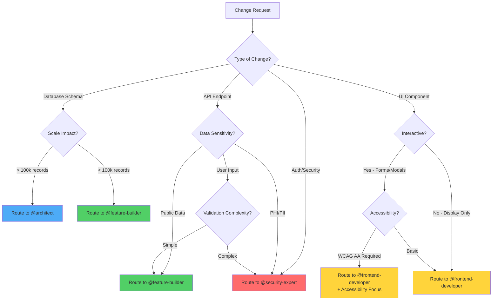

# Non-Functional Requirements Matrix

**Version**: 1.0
**Last Updated**: 2026-01-09
**Purpose**: Define NFR-based routing triggers for agent collaboration

## Overview

This document provides objective, measurable criteria for when to route work to specialist agents based on Non-Functional Requirements (NFRs). Use this matrix to make routing decisions instead of subjective judgment calls.

## Routing Triggers Based on NFRs

### Performance Triggers

Route to **@architect** or **@performance-profiler** when:

| Trigger | Threshold | Justification |
|---------|-----------|---------------|
| **Expected Traffic** | > 1000 requests/second | Need performance architecture review |
| **Latency Requirement** | < 100ms p95 | Need optimization strategy |
| **Query Complexity** | Joins > 3 tables OR N+1 risk detected | Database optimization needed |
| **Large Dataset** | > 10k records per response | Pagination/streaming required |
| **Real-time Requirements** | < 50ms response time | Need real-time architecture |
| **Bundle Size Impact** | Adding > 100KB to bundle | Code splitting required |
| **Database Operations** | Bulk operations > 1000 records | Batch processing design needed |

**Example**:
```typescript
// ❌ TRIGGER: Query complexity > 3 joins + N+1 risk
const listings = await db.query.listings.findMany({
  with: {
    apartment: {
      with: {
        floor: {
          with: {
            entrance: {
              with: { building: true }
            }
          }
        }
      }
    }
  }
}); // 4 levels deep = N+1 risk

// ✅ SOLUTION: Route to @architect for query optimization
```

### Security Triggers

Route to **@security-expert** when:

| Trigger | Threshold | Justification |
|---------|-----------|---------------|
| **PHI/PII Data Access** | Any read/write of user emails, phones, documents | Data protection critical |
| **Authentication Logic** | Changes to auth flows, session management | Security-critical path |
| **Authorization Logic** | Changes to RBAC, permissions, access control | Authorization bugs are critical |
| **External API Integration** | 3rd party API calls, webhooks | Attack surface expansion |
| **User Input Validation** | System boundary validation (forms, APIs) | Injection attack prevention |
| **Session Management** | Cookie handling, session storage, logout | Session hijacking risk |
| **Token/Credential Handling** | OAuth tokens, API keys, passwords | Credential exposure risk |
| **File Uploads** | User-uploaded files | Malware/XSS risk |
| **SQL Queries** | Raw SQL or string concatenation | SQL injection risk |
| **Admin Operations** | Admin panel features, elevated permissions | Privilege escalation risk |

**Example**:
```typescript
// ❌ TRIGGER: PHI/PII data + raw SQL
await db.execute(sql`
  SELECT email, phone FROM users WHERE id = ${userId}
`); // PII + raw SQL = security review needed

// ✅ ROUTE to @security-expert before implementation
```

### Scalability Triggers

Route to **@architect** when:

| Trigger | Threshold | Justification |
|---------|-----------|---------------|
| **Data Model Changes** | Affecting > 100k records | Schema migration impact |
| **Service Boundary Changes** | New service or service split | Architecture decision |
| **Distributed Workflow** | Multi-service transaction needed | Consistency/reliability design |
| **Caching Strategy** | Adding/modifying cache layer | Cache invalidation complexity |
| **Database Schema Migration** | ALTER TABLE on large tables | Production downtime risk |
| **Multi-Tenant Changes** | Tenant isolation logic | Data leakage risk |
| **Background Jobs** | New cron jobs or async processing | Resource contention |

**Example**:
```typescript
// ❌ TRIGGER: Data model change affecting ~1800 apartments
await db.schema.alterTable('apartments')
  .addColumn('new_field', 'text'); // Affects 1800+ records

// ✅ ROUTE to @architect for migration strategy
```

### Data Integrity Triggers

Route to appropriate specialist when:

| Trigger | Threshold | Justification |
|---------|-----------|---------------|
| **Multi-Tenant Isolation** | Changes to tenant filtering | Cross-tenant data leakage risk |
| **Transaction Boundaries** | Multi-step mutations | Consistency failure risk |
| **Consistency Requirements** | ACID vs BASE decision | Trade-off analysis needed |
| **Data Migration** | Production data changes | Data loss risk |
| **Referential Integrity** | Foreign key changes | Orphaned data risk |
| **Data Validation** | Schema validation changes | Data corruption risk |

**Example**:
```typescript
// ❌ TRIGGER: Multi-tenant isolation change
const apartments = await db.query.apartments.findMany();
// Missing building filter = cross-tenant leak!

// ✅ ROUTE to @architect for multi-tenant review
```

### Accessibility Triggers

Route to **@frontend-developer** (with accessibility focus) when:

| Trigger | Threshold | Justification |
|---------|-----------|---------------|
| **New UI Components** | Any new interactive element | WCAG compliance required |
| **Form Changes** | Form fields, validation, submission | Keyboard navigation critical |
| **Modal/Dialog** | New modal or dialog | Focus management required |
| **Navigation Changes** | Menu, routing, breadcrumbs | Screen reader compatibility |
| **Dynamic Content** | AJAX updates, notifications | ARIA live regions needed |
| **Color/Contrast Changes** | Theme, brand colors | Contrast ratio WCAG AA (4.5:1) |

**Example**:
```tsx
// ❌ TRIGGER: New modal without accessibility
<div className="fixed inset-0 bg-black/50">
  <div className="bg-white p-4">...</div>
</div> // Missing focus trap, ARIA, keyboard handling

// ✅ ROUTE to @frontend-developer for a11y review
```

### Testing Triggers

Route to **@test-writer** or **@e2e-test-specialist** when:

| Trigger | Threshold | Justification |
|---------|-----------|---------------|
| **Critical Path Changes** | Auth, payment, data mutations | Business-critical flows |
| **New API Endpoints** | New tRPC procedures | API contract testing |
| **Database Migrations** | Schema changes | Data integrity testing |
| **Security Features** | Auth, authz, validation | Security regression prevention |
| **Complex Business Logic** | Multi-step workflows | Edge case coverage |

## NFR Thresholds by Risk Level

| Risk Level | Performance | Security | Scale | Accessibility | Validation Required |
|-----------|-------------|----------|-------|---------------|---------------------|
| **Critical** | < 50ms p95 | PHI/PII access | > 1M records | WCAG AAA | 5+ Codex exchanges |
| **High** | < 100ms p95 | Auth/Authz changes | > 100k records | WCAG AA | 3 Codex exchanges |
| **Medium** | < 250ms p95 | User input validation | > 10k records | Basic a11y | 2 Codex exchanges |
| **Low** | < 500ms p95 | Public data only | < 10k records | Optional | 0-1 Codex exchanges |

## Risk Level Examples

### Critical Risk (5+ Codex Exchanges)

**Scenario**: Password reset flow changes
- **Performance**: < 500ms (auth operation)
- **Security**: Credential handling, session management
- **Scale**: All users affected
- **Required**:
  - Route to @security-expert
  - Minimum 5 Codex validation exchanges
  - Security review checklist
  - Test coverage > 90%

### High Risk (3 Codex Exchanges)

**Scenario**: New tRPC mutation for listing creation
- **Performance**: < 500ms p95
- **Security**: User input validation, multi-tenant isolation
- **Scale**: ~100-500 listings
- **Required**:
  - Route to @feature-builder
  - 3 Codex validation exchanges
  - Input validation with Zod
  - Integration tests

### Medium Risk (2 Codex Exchanges)

**Scenario**: New UI component for displaying user profile
- **Performance**: < 250ms (client query)
- **Security**: Display user data (no mutations)
- **Accessibility**: Form elements
- **Required**:
  - Route to @frontend-developer
  - 2 Codex validation exchanges
  - Accessibility checks (keyboard, ARIA)
  - Component tests

### Low Risk (0-1 Codex Exchanges)

**Scenario**: Update button text or styling
- **Performance**: No impact
- **Security**: No data access
- **Scale**: N/A
- **Required**:
  - No routing needed
  - Optional Codex validation

## Agent Routing Decision Tree



## Routing Matrix by Agent

### @architect

**Route when**:
- Scalability triggers met (> 100k records, service boundaries)
- Performance architecture needed (< 100ms p95)
- Distributed workflow design
- Database schema affecting > 1800 apartments or > 800 parking spots

**Do NOT route when**:
- Simple CRUD operations
- UI-only changes
- Small-scale features (< 10k records)

### @security-expert

**Route when**:
- ANY PHI/PII access (emails, phones, documents)
- Auth/authz logic changes
- External API integration
- User input validation at system boundaries
- File uploads
- Admin operations

**Do NOT route when**:
- Display-only UI components
- Public data queries
- Styling changes

### @feature-builder

**Route when**:
- New features (medium complexity)
- tRPC endpoint creation
- Business logic implementation
- Data model changes (< 100k records)

**Do NOT route when**:
- Critical security features (route to @security-expert)
- Large-scale changes (route to @architect)
- UI-only work (route to @frontend-developer)

### @frontend-developer

**Route when**:
- UI component creation
- Accessibility requirements (WCAG AA)
- Client-side state management
- Form implementation

**Do NOT route when**:
- API logic needed (route to @feature-builder)
- Performance-critical rendering (route to @architect)

### @test-writer / @e2e-test-specialist

**Route when**:
- Critical path changes (auth, mutations)
- New API endpoints
- Complex business logic
- Security features

**Do NOT route when**:
- Display-only components
- Trivial changes
- Already has > 90% test coverage

## Project-Specific NFR Values

### Current System (info-web)

| NFR | Current Value | Target (Production) | Critical Threshold |
|-----|--------------|---------------------|-------------------|
| Users (DAU) | ~10-50 | ~500-1000 | > 2000 |
| Requests/day | ~100-500 | ~5k-10k | > 20k |
| Database queries/day | ~1k-5k | ~50k-100k | > 200k |
| Listings (active) | ~10-50 | ~100-500 | > 1000 |
| Buildings | 7 (fixed) | 7 | 7 |
| Apartments | ~1800 | ~1800 | ~1800 |
| Parking spots | ~800 | ~800 | ~800 |

**Routing Implications**:
- Apartment changes: ALWAYS route to @architect (affects 1800 units)
- Building changes: ALWAYS route to @architect (multi-tenant)
- Parking changes: Route to @architect if > 100 spots affected
- User data: ALWAYS route to @security-expert (PII)

## Usage Examples

### Example 1: New Listing Creation API

**Scenario**: Add tRPC mutation for creating apartment listings

**NFR Analysis**:
- Security: User input validation (Zod) ✅
- Security: Multi-tenant isolation (listing.userId check) ✅
- Performance: INSERT query (< 50ms) ✅
- Scale: ~100-500 listings (< 10k threshold) ✅

**Routing Decision**: @feature-builder (Medium Risk, 2 Codex exchanges)

### Example 2: Password Reset Flow

**Scenario**: Update password reset email template and flow

**NFR Analysis**:
- Security: Credential handling ❗ CRITICAL
- Security: Session management ❗ CRITICAL
- Security: Email token validation ❗ CRITICAL
- Performance: < 500ms (acceptable)

**Routing Decision**: @security-expert (Critical Risk, 5+ Codex exchanges)

### Example 3: Apartment Bulk Update

**Scenario**: Add admin feature to bulk update apartment statuses

**NFR Analysis**:
- Scale: 1800 apartments ❗ EXCEEDS 100k threshold equivalent (all apartments)
- Security: Admin operation ❗ CRITICAL
- Performance: Bulk update (needs batch processing)
- Multi-tenant: Affects all tenants ❗ CRITICAL

**Routing Decision**: @architect + @security-expert (Critical Risk, 5+ Codex exchanges each)

### Example 4: New UI Button

**Scenario**: Add "Copy" button to listing card

**NFR Analysis**:
- Security: No data access ✅
- Performance: No impact ✅
- Accessibility: Button needs ARIA label
- Scale: N/A

**Routing Decision**: @frontend-developer (Low Risk, 1 Codex exchange for a11y)

## Related Documentation

- [architecture-context.md](./architecture-context.md) - System architecture overview
- [anti-patterns.md](./anti-patterns.md) - Anti-patterns to avoid
- [/CLAUDE.md](../CLAUDE.md) - AI agent guidelines

---

**Version Control**: Update this document when:
- NFR thresholds change (e.g., scale increases)
- New routing triggers identified
- Agent responsibilities change
- Project grows to new scale tier
