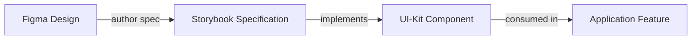

# Frontend Development Guidelines

This guideline establishes the end-to-end practices for delivering frontend features in the Intrigma platform. It unifies design, documentation, implementation, and verification so every change aligns with our product vision and UI-kit strategy.

> **LLM Compliance Note**: Treat this document as the authoritative checklist for frontend work. Read it end-to-end before coding, follow every directive exactly, and only deviate after recording the risk and obtaining review approval.

## How to Use This Guideline
1. Read the entire document before you start planning or implementing a task.
2. Work through each section in order unless a section explicitly allows parallel work.
3. When a section references another guideline or plan, open it immediately and follow the documented pattern verbatim.
4. Record every deviation as a risk in your notes and flag it during review.

**Tags:** frontend, nextjs, ui-kit, storybook, figma, testing, graphql, next-auth, tailwind, bun

**Agents:** frontend-developer, component-standardization, storybook-editor, code-reviewer, test-writer, e2e-test-specialist

**Risk:** High – Diverging from these practices breaks design parity, UI-kit integrity, and delivery reliability.

**Context:** Next.js 15 (App Router), React 19, TypeScript 5.8, Bun runtime, Apollo Client 3, Redux Toolkit, Tailwind CSS 4, Storybook 8, Playwright, Jest, next-auth

---

## Part 1: Frontend Delivery Flow

### System of Record
Frontend work follows the same single-source-of-truth chain defined for Storybook. Storybook is the documentation layer of the UI-kit; we inherit its philosophy and sequence.



- **Figma** holds the conceptual design, component anatomy, and interaction states.
- **Storybook** (see `.claude/guidelines/STORYBOOK_GUIDELINES.md`) documents the component, variants, usage rules, and status tags.
- **UI-kit** (`front-end.iss-free/ui-kit`) stores the reusable implementation.
- **Application layer** (`front-end.iss-free/app`, `components`, `features`) consumes UI-kit components exactly as specified.

### Mandatory Sequence
1. Confirm the Figma frame(s) and component references for the feature.
2. Check the existing Storybook spec and UI-kit implementation. If missing, extend Storybook first.
3. Update or create the UI-kit component with specs, stories, and tests before application usage.
4. Integrate the UI-kit artifact into the feature, respecting documented props and interaction contracts.

**Do not** bypass Storybook or UI-kit by implementing bespoke UI in the application layer. Treat Storybook guidance and status tags as release gates.

---

## Part 2: Technology Stack & Tooling

### Core Stack
| Layer | Tooling | Notes |
|-------|---------|-------|
| Runtime | Bun (latest), Node.js 20+ | All commands run via `bun`; Bun handles installation, scripts, and testing.
| Framework | Next.js 15 App Router | Mix of Server and Client Components; React 19 features enabled.
| Language | TypeScript 5.8 | Strict mode, `moduleResolution: bundler`, path aliases defined in `tsconfig.json`.
| Styling | Tailwind CSS 4, SCSS mixins, CSS Modules | Tokens in `app/globals.css`; utility mixins under `styles/`.
| State | Redux Toolkit, Apollo Client cache, React hooks | Feature state in `front-end.iss-free/features`.
| Forms | React Hook Form + Zod | Shared validation schemas live under `lib` or feature folders.
| GraphQL | Apollo Client + GraphQL Code Generator | Schema synced from backend via `bun run generate`.
| Auth | next-auth | Session helpers and adapters stored in `front-end.iss-free/auth`.
| Tests | Jest (unit), Playwright (e2e), storybook-addon-vitest (component) | Follows patterns in this guideline.

### Required Commands
- `bun install` – install dependencies
- `bun run dev` – run Next.js with Turbopack
- `bun run build` – compile production bundle (must pass before merge)
- `bun run lint` / `bun run lint:fix` – enforce lint rules defined in `front-end.iss-free/eslint.config.mjs`
- `bun run test` – run Jest-based functional tests (must pass)
- `bun run generate` – regenerate GraphQL types from `/graphql`
- `bun run storybook` / `bun run build-storybook` – Storybook workflows
- `bun run server` – start the backend GraphQL API (dotnet project)

---

## Part 3: Repository Structure & Ownership

Work inside `front-end.iss-free/` unless explicitly coordinating with backend teams.

```
front-end.iss-free/
├── app/                     # App Router routes, layouts, server components
│   ├── (app)/               # Authenticated area, feature entry points
│   └── (auth)/              # Authentication flows and public pages
├── auth/                    # next-auth adapters, session utilities, provider wrappers
├── components/              # Legacy and in-flight components (to migrate into ui-kit)
│   └── ui/                  # shadcn-derived primitives awaiting migration
├── features/                # Redux Toolkit slices, selectors, thunks per domain feature
├── graphql/                 # Queries, mutations, fragments, generated artifacts
│   ├── __generated__/       # Codegen output (never edit)
│   └── client.ts            # Apollo client setup
├── hooks/                   # Application-level React hooks
├── lib/                     # Shared helpers, formatters, date utilities (with tests)
├── stories/                 # Storybook documentation layer (mirrors ui-kit components)
├── ui-kit/                  # Target home for reusable atoms, molecules, and patterns
├── e2e/                     # Playwright artifacts and reports
├── jest.config.ts           # Jest setup for unit/integration tests
├── tsconfig.json            # TypeScript config with path aliases
└── eslint.config.mjs        # Linting rules (see Part 11)
```

**Ownership Notes**
- `components/` and `app/*` should only contain feature compositions. Reusable pieces must live in `ui-kit/`.
- `auth/` is the canonical location for session helpers, provider wrappers, and next-auth configuration; do not scatter auth utilities elsewhere.
- `lib/` is reserved for broadly reusable utilities (formatters, date calculations, type helpers). Each helper requires colocated tests and documentation.
- `hooks/` contains application hooks that are not coupled to a specific feature or UI-kit component.
- `features/` holds domain logic (Redux slices/selectors). Align state updates with GraphQL schemas and UI-kit contracts.

---

## Part 4: Component System & UI-Kit Migration

### Current Migration State
We are transitioning reusable components from `components/*` and `app/*` into `ui-kit/`. Every new reusable component must start in `ui-kit`, with documentation and tests, before any application usage.

- Migration backlog and sequencing should be tracked in `front-end.iss-free/ui-kit/` directory (create migration tracking documents as needed).
- Follow the phase/order defined in the sequence; do not jump ahead without agreement.
- When migrating, leave shims in `components/` only long enough to unblock feature delivery. Track duplicates as needed.

### UI-Kit Requirements
Each UI-kit component directory mirrors the Storybook structure:
```
ui-kit/components/[component-name]/
├── [component-name].tsx          # Implementation
├── [component-name].stories.tsx  # Linked to Storybook (must follow STORYBOOK_GUIDELINES)
├── [component-name].spec.md      # Specification consumed by AI and engineers
├── [component-name].test.tsx     # Jest tests (unit/integration)
```

- Stories must reference their Figma frame and include status tags (`concept → draft → beta → tested → genuine`).
- Specifications document purpose, anatomy, props, accessibility, and integration notes.
- Tests prove component behavior, edge cases, and accessibility contracts.
- Components expose well-typed props (no `any`), leverage CVA for variants, and consume tokens from `globals.css`.

### Checklist – Before Shipping a UI-Kit Component
- [ ] Figma frame verified, links embedded in Storybook docs.
- [ ] Storybook story follows `.claude/guidelines/STORYBOOK_GUIDELINES.md` template.
- [ ] `.spec.md` updated and cross-linked in Storybook docs.
- [ ] Jest tests in place (`*.test.tsx`) covering variants and error paths.
- [ ] Playwright specs ready or queued for workflow coverage (`*.spec.tsx`).
- [ ] Component exported via `ui-kit/index.ts` (or relevant barrel).
- [ ] Application usage updated to import from `ui-kit` instead of legacy paths.

---

## Part 5: Storybook Documentation Layer

Storybook is inseparable from frontend development. Treat `.claude/guidelines/STORYBOOK_GUIDELINES.md` as a companion document.

- Every UI-kit component must have a Storybook story that matches the Storybook guideline template.
- Documentation, status tagging, controls, and accessibility checks run through Storybook.
- Storybook spec files (`*.spec.md`) are the authoritative usage contract and are referenced by AI assistants.
- Use `bun run storybook` during implementation. `bun run build-storybook` must pass before releasing UI-kit changes.
- If you discover missing or outdated Storybook content, update it before touching application code.

---

## Part 6: GraphQL Integration Practices

The `/graphql` directory is the **single source of truth** for frontend data access.

- Schema-driven types live under `graphql/__generated__/` and are regenerated via `bun run generate` (uses `codegen.ts`). Never edit generated files manually.
- Define operations in `graphql/queries`, `graphql/mutations`, and shared fragments in `graphql/fragments`.
- Use generated typed hooks (`@/graphql/gql` imports) instead of handwritten `useQuery` calls.
- When backend schema changes, rerun `bun run generate`, review diff noise, and commit updated artifacts.
- GraphQL hooks must handle loading, error, and empty states as documented in the associated Storybook spec and UI-kit component requirements.
- The dev API server runs with `bun run server` (executes `../src/Fenix.Api`). Keep it running for local development and integration tests.

**Checklist – GraphQL Feature Work**
- [ ] Update or create documents under `graphql/` with clear naming.
- [ ] Regenerate types (`bun run generate`) and ensure clean git status.
- [ ] Extend or add typed hooks that compose generated documents.
- [ ] Co-locate hook tests (`*.test.ts`) verifying data shaping and error handling.
- [ ] Coordinate domain state updates in `features/` to match GraphQL payloads.

---

## Part 7: Authentication & Authorization Layer

Authentication is managed by next-auth with supporting utilities in `front-end.iss-free/auth`.

- Use the exported helpers (session retrieval, authorization guards) instead of duplicating logic.
- All protected routes in `app/(app)` must verify session state before fetching data.
- Client components should rely on context providers from `auth/` to access session state.
- When adjusting auth flows, update Storybook specs, UI-kit components (e.g., auth banners), and Playwright tests covering login/logout.
- Ensure GraphQL operations include the required headers/tokens (Apollo client is configured in `graphql/client.ts`).

---

## Part 8: Hooks, Utilities, and Shared Logic

### Hooks (`front-end.iss-free/hooks`)
- Store reusable client hooks that are not domain-specific (`useMediaQuery`, `useDebouncedValue`, etc.).
- Document expected behavior with JSDoc and example usage. Add tests using React Testing Library when possible.
- Feature-specific hooks belong inside the relevant `features/` folder.

### Lib (`front-end.iss-free/lib`)
- Home for helpers, formatters, date/time utilities, and type utilities.
- Every exported function must include JSDoc, dedicated unit tests (`*.test.ts` or `*.test.tsx`), and clear naming.
- Helpers that wrap external libraries (e.g., date-fns) should provide typed interfaces and hide implementation detail.
- Keep index files curated; avoid dumping unrelated exports.

---

## Part 9: Documentation & JSDoc Standards

Documentation is a first-class deliverable.

- Add JSDoc comments to every UI-kit component, hook, helper, and complex feature module. Include prop descriptions, example usage, and links to Storybook/Figma when relevant.
- Storybook stories must reference the correct Figma nodes and any upstream specs (UI-kit, design tokens).
- When introducing new functionality, update `FRONTEND-ARCHITECTURE.md` or feature-level docs as needed.
- Maintain cross-links between specs: Storybook → UI-kit → application usage. Document the path in the `.spec.md` files.

---

## Part 10: MCP Tools for Frontend Development

MCP (Model Context Protocol) servers provide powerful automation and analysis capabilities for frontend development. The following MCPs are configured and available:

### Chrome DevTools MCP - Performance & Debugging
**Primary use**: Deep performance analysis, network monitoring, and browser debugging during frontend development.

**When to use**:
- Analyzing page load performance and render times
- Profiling CPU usage during animations or complex interactions
- Monitoring network requests and responses
- Testing responsive behavior with device emulation
- Capturing screenshots for visual regression testing
- Debugging console errors and warnings
- Emulating slow networks or CPU throttling

**Integration with workflow**:
- Use during component development to verify performance impact
- Run performance traces before and after optimizations
- Capture network activity when debugging GraphQL queries
- Take screenshots of UI states for documentation
- Test mobile viewports alongside responsive design work

**Example prompts**:
```
"Analyze performance of http://localhost:3000/dashboard"
"Start a performance trace, navigate through the wizard, then stop and analyze"
"Check console errors on the scheduling page"
"Emulate slow 3G and test form submission"
"Take screenshots of all button variants at different viewport sizes"
```

### Playwright MCP - E2E Testing
**Primary use**: End-to-end user flow testing and browser automation.

**When to use**:
- Testing complete user workflows (login, scheduling, form submissions)
- Verifying multi-step interactions
- Accessibility testing with assistive technologies
- Cross-browser compatibility validation

### Storybook MCP - Component Documentation
**Primary use**: Retrieving component specifications, props, and story URLs.

**When to use**:
- Getting direct links to specific component stories
- Verifying component API documentation
- Checking component status tags and quality markers

### Figma MCP - Design Integration
**Primary use**: Extracting design specifications directly from Figma.

**When to use**:
- Building UI-kit components from design specs
- Verifying design tokens (colors, spacing, typography)
- Ensuring pixel-perfect implementation
- Checking component variants and states

### MCP Usage Checklist
- [ ] Use Chrome DevTools MCP for performance analysis of new features
- [ ] Run Playwright MCP for user flow testing before completion
- [ ] Verify Storybook MCP integration for component documentation
- [ ] Consult Figma MCP when implementing design-driven components

---

## Part 11: Testing Strategy

Testing is part of the acceptance criteria and cannot be skipped. Our standard requires:

- **Functional tests**: `*.test.ts` or `*.test.tsx` executed by `bun run test` (Jest). Minimum coverage for new modules: sensible assertions for success, error, and edge cases.
- **End-to-end tests**: `*.spec.ts` or `*.spec.tsx` executed via Playwright. Cover user flows, especially around authentication, scheduling, requests, and UI-kit-critical workflows.
  - **📚 See [PLAYWRIGHT_TESTING_GUIDE.md](PLAYWRIGHT_TESTING_GUIDE.md)** for complete E2E testing patterns, authentication setup, and best practices
- **Component tests**: Storybook-driven checks (visual regressions, accessibility) per `STORYBOOK_GUIDELINES.md`.

**Acceptance Gate**: No feature is done until `bun run test` passes locally with all relevant `.test` and `.spec` files updated.

### Testing Checklist
- [ ] Unit/functional tests added or extended in relevant directories.
- [ ] Playwright specs updated for user-facing flows (or ticket added if deferred).
  - [ ] Authentication handled via `tests/auth.setup.ts` (see [PLAYWRIGHT_TESTING_GUIDE.md](PLAYWRIGHT_TESTING_GUIDE.md))
  - [ ] Test uses semantic locators (role, text, label) over CSS selectors
  - [ ] Explicit waits used over arbitrary delays
- [ ] Storybook visual/a11y checks executed.
- [ ] Mocks align with GraphQL schema updates.
- [ ] Coverage thresholds maintained (Jest configured for coverage reports).

---

## Part 12: Linting, Formatting, and Quality Gates

`front-end.iss-free/eslint.config.mjs` defines mandatory rules. Key highlights:

- Based on `@typescript-eslint` strict configs, `@next/next`, React, `simple-import-sort`, `eslint-plugin-import-x`, Prettier enforcement.
- Relative parent imports (`../`) are disallowed; use aliases from `tsconfig.json` (`@/components/...`).
- Tailwind arbitrary value usage triggers warnings; confirm compatibility.
- Promises must be handled (`@typescript-eslint/no-floating-promises`).
- Hooks must obey the Rules of Hooks and exhaustive deps.

**Gate Commands**
- `bun run lint` – must pass without introducing new errors.
- `bun run lint:fix` – preferred to resolve style issues automatically.
- `bun run build` – ensures Next.js compilation succeeds; run before merging.

Do not merge code that depends on pending lint fixes or build errors. Capture any unavoidable lint suppression in review notes with justification.

---

## Part 13: Standard Development Workflow

Use this checklist for every feature or bug fix:
1. **Review specifications** – Confirm product requirements, design tokens, and Figma references.
   - 🎨 **MCP**: Use Figma MCP `get_metadata` to extract design requirements
2. **Audit existing assets** – Check UI-kit components, Storybook docs, and `/graphql` artifacts for reuse.
   - 📚 **MCP**: Use Storybook MCP `get_story_urls` to find existing components
3. **Update Storybook/UI-kit** – Extend documentation and components as needed before application integration.
   - 📚 **MCP**: Generate story URLs with Storybook MCP after updates
4. **Align with design** – Validate implementation details with Figma and design peers.
   - 🎨 **MCP**: Use Figma MCP `get_screenshot` for visual reference
5. **Implement feature** – Compose UI-kit components within the application layer, adhering to state and data patterns.
6. **Add documentation** – Update JSDoc, `.spec.md`, and README sections.
7. **Write tests** – Cover unit/integration (`*.test.tsx`) and e2e (`*.spec.tsx`) scenarios.
   - 🎭 **MCP**: Use Playwright MCP for E2E test automation
8. **Run quality gates** – `bun run lint`, `bun run test`, `bun run build`.
   - 🔧 **MCP**: Use Chrome DevTools MCP to check for console errors
9. **Verify Storybook** – Ensure `bun run storybook` renders without errors; update tags/status.
10. **Performance audit** – Analyze page performance and Core Web Vitals.
    - 🔧 **MCP**: Use Chrome DevTools MCP for performance tracing
11. **Prepare for QA & review** – Provide reviewers with links to Figma, Storybook, specs, and test evidence. Expect additional QA validation post-handoff.

### MCP-Enhanced Workflow Examples

**Example 1: New Component from Figma Design**
```
1. 🎨 Figma MCP: get_metadata('button-component-frame')
   → Extract variants, tokens, states
2. Create ui-kit/components/button/button.tsx with CVA variants
3. 📚 Storybook MCP: Create story, get_story_urls()
   → Add URLs to button.spec.md
4. 🔧 Chrome DevTools MCP: take_screenshot of each variant
   → Compare with Figma screenshot for parity
5. 🎭 Playwright MCP: Create E2E test for button interactions
```

**Example 2: Performance Optimization**
```
1. 🔧 Chrome DevTools MCP: performance_start_trace
2. Navigate through the feature manually
3. 🔧 Chrome DevTools MCP: performance_stop_trace
4. 🔧 Chrome DevTools MCP: performance_analyze_insight
   → Identify bottlenecks (LCP, INP, CLS)
5. Implement optimizations (memoization, code splitting, lazy loading)
6. 🔧 Chrome DevTools MCP: Re-trace and verify improvements
```

**Example 3: E2E Test Development**
```
1. Start application: bun run dev
2. 🔧 Chrome DevTools MCP: list_console_messages
   → Verify no errors on page load
3. 🎭 Playwright MCP: navigate_page('http://localhost:3000/feature')
4. 🎭 Playwright MCP: fill('input[name="email"]', 'user@example.com')
5. 🎭 Playwright MCP: click('button[type="submit"]')
6. 🎭 Playwright MCP: wait_for('text=Success')
7. 🔧 Chrome DevTools MCP: list_network_requests
   → Verify API calls were made correctly
```

---

## Part 14: Maintenance & Continuous Improvement

### Weekly Tasks
- [ ] Review Storybook status tags for components modified during the sprint.
- [ ] Update UI-kit migration tracking (create tracking documents as needed in `front-end.iss-free/ui-kit/`).
- [ ] Validate GraphQL schema changes and regenerate types if backend updated.
- [ ] Audit `lib/` and `hooks/` for unused exports; remove or deprecate as needed.

### Sprint Tasks
- [ ] Sync with design to incorporate new tokens or components.
- [ ] Run Playwright test suite for critical workflows.
- [ ] Analyze bundle metrics (Next.js build output) for regressions.
- [ ] Ensure documentation parity across Figma, Storybook, UI-kit, and app code.

---

## Quick Reference

### Documentation
- **Storybook Guideline**: `.claude/guidelines/STORYBOOK_GUIDELINES.md`
- **UI-kit Directory**: `front-end.iss-free/ui-kit/` (create tracking docs as migration progresses)
- **MCP Setup Guide**: `MCP_GUIDE.md`
- **Agent List**: `AGENT_LIST.md` (includes MCP integration mappings)

### Commands
- **GraphQL Types**: `bun run generate`
- **Tests**: `bun run test` (Jest), Playwright specs in `front-end.iss-free/e2e`
- **Lint**: `bun run lint`, config in `front-end.iss-free/eslint.config.mjs`
- **Build**: `bun run build`
- **Backend Server for local GraphQL**: `bun run server`
- **Storybook**: `bun run storybook`

### MCP Servers (see MCP_GUIDE.md for details)
- 🔧 **Chrome DevTools MCP**: Performance analysis, debugging, screenshots
- 🎭 **Playwright MCP**: E2E testing, browser automation
- 📚 **Storybook MCP**: Story URLs, component documentation
- 🎨 **Figma MCP**: Design extraction, token analysis
- 📖 **Context7 MCP**: Library documentation, best practices

### Agent Specialists (see AGENT_LIST.md for details)
- **frontend-developer**: General frontend work (React, performance, testing)
- **storybook-editor**: Story creation and documentation
- **component-standardization**: UI-kit migration
- **design-system-coordinator**: Figma-to-code translation
- **e2e-test-specialist**: Playwright E2E tests

---

Adhering to this guideline preserves design parity, keeps the UI-kit authoritative, and ensures our frontend remains testable, maintainable, and ready for AI-assisted development.
