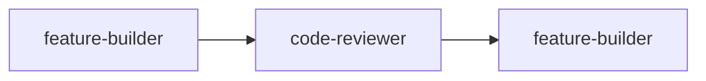
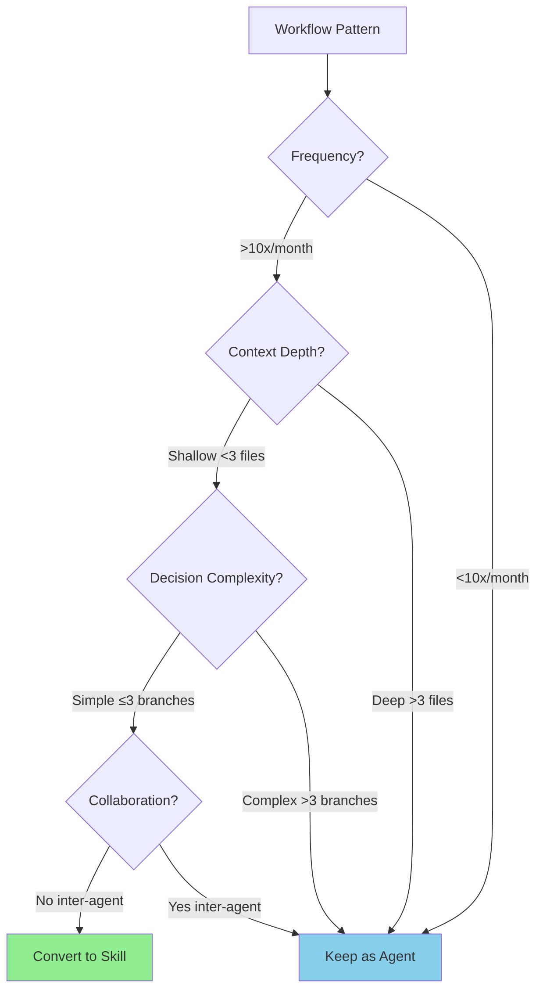

# Meta-Review Framework: Agents Reviewing Agents

**Version**: 1.0
**Last Updated**: 2026-01-09
**Purpose**: Enable review agents to critically analyze agent instructions and infrastructure

## Overview

This framework enables "meta-review" - review agents analyzing agent instructions, guidelines, templates, and infrastructure with the same rigor as code review.

**Key Insight**: Agent instructions are executable specifications. Apply the same quality standards as production code.

## Core Principle

**Agent instructions = Code**
- Logical consistency matters
- Completeness is testable
- Quality is measurable
- Review is necessary

## Meta-Review Process

### Phase 1: Review Agent Capabilities

Different review agents have different strengths:

| Review Agent | Best For | Review Scope |
|--------------|----------|--------------|
| **@code-reviewer** | Logic errors, completeness, patterns | Agent routing logic, decision trees, workflows |
| **@architect** | Architectural consistency, design quality | Agent collaboration patterns, system design |
| **@security-expert** | Security implications, access control | Agent permissions, data handling, security checks |

### Phase 2: Meta-Review Checklist

Use this checklist when review agents analyze agent instructions:

#### Logical Consistency (@code-reviewer)

- [ ] Routing logic is sound (no circular dependencies)
- [ ] No contradictions in instructions
- [ ] Prerequisites validated before actions
- [ ] Success/failure paths clearly defined
- [ ] Decision criteria are measurable (not subjective)
- [ ] Edge cases handled

**Example Review**:
```markdown
❌ BAD Agent Instruction:
"Consider routing to @security-expert for security concerns"

✅ GOOD Agent Instruction:
"Route to @security-expert when:
- PHI/PII data access
- Auth/authz logic changes
- External API integration
See nfr-matrix.md for complete triggers"
```

#### Architectural Quality (@architect)

- [ ] Agent responsibility clear and bounded
- [ ] Collaboration patterns appropriate
- [ ] Separation of concerns maintained
- [ ] Reusability considered
- [ ] NFR-based routing triggers present
- [ ] No duplication with other agents

**Example Review**:
```markdown
❌ BAD: Agent does too much (God Object)
"feature-builder implements, tests, deploys, monitors features"

✅ GOOD: Single Responsibility
"feature-builder implements features from specs
→ Routes to @test-writer for testing
→ Routes to DevOps for deployment"
```

#### Documentation Quality

- [ ] Instructions unambiguous
- [ ] Examples executable (can follow step-by-step)
- [ ] Success criteria measurable
- [ ] Assumptions explicit
- [ ] Prerequisites documented
- [ ] References valid (files exist)

**Example Review**:
```markdown
❌ BAD: Vague instruction
"Use best practices for performance"

✅ GOOD: Specific instruction
"Optimize when latency < 100ms p95 required:
1. Add database indexes
2. Use pagination for > 100 records
3. Measure with profiler
See nfr-matrix.md for performance triggers"
```

#### Complexity Assessment

- [ ] No unnecessary complexity
- [ ] Could parts be Skills? (see Skills decision matrix)
- [ ] Duplication minimized
- [ ] Abstractions appropriate
- [ ] Token efficiency maintained

**Example Review**:
```markdown
❌ BAD: Over-engineered
Agent has 50 conditional routing rules

✅ GOOD: Simple + NFR-based
Agent references nfr-matrix.md for routing
→ Single source of truth
→ Easier to maintain
```

### Phase 3: Requesting Meta-Review

**When to request meta-review**:
- New agent created
- Agent instructions significantly updated
- Agent collaboration patterns change
- After infrastructure audits (Epic PHX-667)
- Quarterly agent health checks

**How to request**:
```markdown
@code-reviewer please review agent instructions at:
- File: .claude/agents/feature-builder.md
- Focus: Routing logic consistency
- Check: No circular dependencies
- Validate: Prerequisites are explicit
```

## Review Agent Meta-Review Examples

### Example 1: Reviewing feature-builder.md

**@code-reviewer analysis**:

```markdown
# Meta-Review: feature-builder.md

## Logical Consistency: ⚠️ NEEDS IMPROVEMENT

**Issue 1**: Missing NFR-based routing triggers
- Line 72-77: Agent Collaboration table exists
- Missing: When to route to @security-expert (no triggers)
- Missing: When to route to @architect (no scale triggers)
- **Fix**: Add "See nfr-matrix.md for routing triggers"

**Issue 2**: No Codex validation mentioned
- Agent has no validation requirements
- High-risk operations (feature implementation) need validation
- **Fix**: Add Codex validation section with risk-based triggers

## Documentation Quality: ✅ GOOD

- Instructions are clear and step-by-step
- Examples provided (tracking file template)
- Success criteria measurable

## Recommendations:
1. Add NFR-based routing section referencing nfr-matrix.md
2. Add Codex validation requirements for medium+ risk features
3. Add reference to anti-patterns.md
```

### Example 2: Reviewing security-expert.md

**@security-expert self-review**:

```markdown
# Meta-Review: security-expert.md

## Security Review of Security Agent: ✅ PASS

**Strengths**:
- Comprehensive OWASP Top 10 checklist
- Clear auth/authz review areas
- No secrets in code enforcement

**Potential Blind Spot**:
- Agent doesn't specify WHEN it should be called
- Missing: Automatic triggers for PHI/PII operations
- **Fix**: Add "When to Call This Agent" section with NFR triggers

## Recommendations:
1. Reference nfr-matrix.md for security triggers
2. Add Codex validation requirement for critical security reviews
3. Self-review: Ensure security-expert validates its own recommendations
```

### Example 3: Circular Dependency Detection

**@architect analysis**:

```markdown
# Meta-Review: Agent Collaboration Graph

## Circular Dependencies Found: ❌ CRITICAL



**Issue**:
- feature-builder routes to code-reviewer
- code-reviewer can request changes from feature-builder
- Loop possible if not bounded

**Fix**:
- Add termination condition: Max 3 review cycles
- Add escalation: After 3 cycles, route to @architect
- Document in both agents
```

## Skills vs Agents Decision Framework

See detailed framework in [SKILLS_VS_AGENTS_DECISION_MATRIX.md](./SKILLS_VS_AGENTS_DECISION_MATRIX.md).

### Quick Decision Tree



### Use Skill When:
- ✅ Task frequently repeated (>10x/month)
- ✅ Context requirement shallow (<3 files)
- ✅ Decision tree simple (≤3 branches)
- ✅ User invocation common
- ✅ No inter-agent collaboration needed
- ✅ Completion time <2 minutes

### Use Agent When:
- ✅ Task requires deep analysis
- ✅ Multiple file/codebase exploration
- ✅ Complex decision making
- ✅ Inter-agent collaboration required
- ✅ Codex validation loops needed
- ✅ Open-ended problem solving

### Conversion Candidates (from current agents)

**Potential Skills** (need analysis):
1. **Authentication Check** (from feature-builder/security-expert)
   - Pattern: Verify user auth + permissions
   - Frequency: Every protected procedure
   - Complexity: Low (1-2 file reads)
   - **Decision**: Consider Skill

2. **Environment Health Check** (from dev-automation)
   - Pattern: Check Docker → Verify ports → Test endpoints
   - Frequency: Every dev session start
   - Complexity: Medium (5-7 commands)
   - **Decision**: Consider Skill

3. **Spec Validation** (from feature-planner)
   - Pattern: Read spec → Validate format → Check completeness
   - Frequency: Before every implementation
   - Complexity: Low (1 file, checklist)
   - **Decision**: Consider Skill

**Must Stay Agents**:
- feature-builder: Complex, multi-file, inter-agent collaboration
- architect: Deep analysis, trade-off evaluation, ADRs
- security-expert: Complex threat assessment, multi-layer review
- code-reviewer: Deep code analysis, pattern detection

## Blind Spot Detection Process

### Self-Review Paradox Mitigation

**Problem**: Agents reviewing agent instructions may perpetuate existing patterns instead of questioning them.

**Mitigation**:

1. **Deliberately Question Rules**
   - Every "always" and "never" rule → Ask "When does this NOT apply?"
   - Every assumption → Ask "What if this assumption is wrong?"
   - Every routing decision → Ask "Are there missing triggers?"

2. **Cross-Agent Review**
   - @code-reviewer reviews @architect instructions
   - @architect reviews @security-expert instructions
   - @security-expert reviews @code-reviewer instructions
   - Different perspective catches different issues

3. **External Validation**
   - Use Codex-high for critical agent instruction reviews
   - Minimum 3 exchanges for Critical agents
   - Present alternative instruction patterns for comparison

4. **Objective Metrics**
   - Token count per agent (target: 15-25% reduction)
   - Routing trigger coverage (% with NFR-based criteria)
   - Codex validation presence (target: 100% for Critical agents)
   - Contradiction detection (automated checks)

### Blind Spot Identification Checklist

Use when reviewing agent instructions:

- [ ] **Missing Failure Modes**: What failure scenarios are NOT covered?
- [ ] **Implicit Assumptions**: What is assumed but not stated?
- [ ] **Alternative Approaches**: Are there better ways not considered?
- [ ] **Edge Cases**: What uncommon scenarios exist?
- [ ] **Cross-Agent Conflicts**: Does this contradict other agents?
- [ ] **NFR Gaps**: Are routing triggers NFR-based or subjective?
- [ ] **Validation Gaps**: Where is Codex validation missing?

## Integration with Epic PHX-667 Tasks

This meta-review framework supports all Epic PHX-667 tasks:

| Task | Meta-Review Application |
|------|-------------------------|
| **PHX-661**: Agent Collaboration | Review routing logic, detect circular dependencies |
| **PHX-662**: Validation Patterns | Review Codex validation rigor, risk-based validation |
| **PHX-663**: Guidelines Audit | Review guideline references, detect conflicts |
| **PHX-664**: Templates Audit | Review template compliance, detect phantom references |
| **PHX-665**: Instructions Audit | Review instruction clarity, detect vague directives |
| **PHX-668**: SOLID Principles | Review agent SRP, detect God Objects |

## Success Metrics

**Meta-review effectiveness**:
- Issues found per agent review (target: >3 for established agents)
- Issue severity distribution (expect some Critical/High)
- Resolution rate (target: 100% of Critical issues)
- Review completion time (should be reasonable, not days)

**Agent quality improvement**:
- Post-review clarity score increase
- Routing trigger coverage increase
- Codex validation adoption increase
- Token efficiency improvement (15-25% reduction)

## Related Documentation

- [SKILLS_VS_AGENTS_DECISION_MATRIX.md](./SKILLS_VS_AGENTS_DECISION_MATRIX.md) - Detailed Skills decision framework
- [.claude/context/nfr-matrix.md](../.claude/context/nfr-matrix.md) - NFR-based routing triggers
- [.claude/context/anti-patterns.md](../.claude/context/anti-patterns.md) - Anti-patterns for agents
- [.claude/context/architecture-context.md](../.claude/context/architecture-context.md) - System architecture

---

**Version Control**: Update this document when:
- New review agent capabilities discovered
- Meta-review process improved
- Blind spot detection methods enhanced
- Skills conversion criteria change
