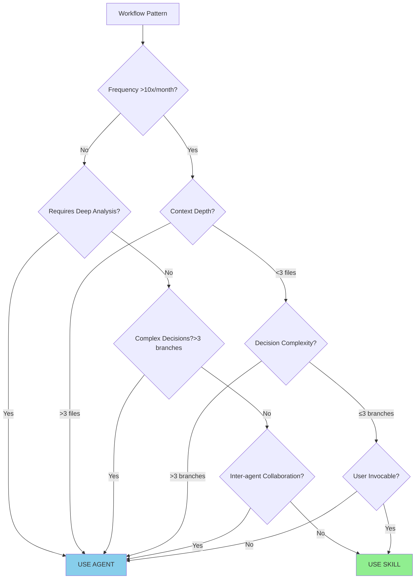

# Skills vs Agents Decision Matrix

**Version**: 1.0
**Last Updated**: 2026-01-09
**Purpose**: Framework for deciding when to create Skills vs Agents

## Overview

Claude Code supports both **Skills** (user-invocable, lightweight workflows) and **Agents** (autonomous, deep-analysis specialists). This matrix helps determine which to use.

**Key Question**: When should a workflow be a Skill vs an Agent?

## Decision Matrix

| Criteria | Skill | Agent |
|----------|-------|-------|
| **Frequency** | >10x per month | Any frequency |
| **Context Depth** | <3 files to understand | Multi-file exploration |
| **Decision Complexity** | ≤3 branches | Complex logic |
| **User Invocation** | Common (user-triggered) | Rare (agent-triggered) |
| **Collaboration** | No inter-agent needed | Agent-to-agent routing |
| **Completion Time** | <2 minutes | Open-ended |
| **Autonomy** | Low (scripted steps) | High (adaptive reasoning) |
| **Codex Validation** | Not required | Often required |

## Use Skill When

✅ All of these are true:
- Task is frequently repeated (>10x/month)
- Context requirement is shallow (<3 files)
- Decision tree is simple (≤3 branches)
- User invocation is common
- No inter-agent collaboration needed
- Completion time <2 minutes

**Example Skills**:
1. **Authentication Check**
   - Verify user logged in → Check permissions → Return status
   - Frequency: Every dev session, every protected procedure test
   - Complexity: 1 file (session data), simple check
   - Decision: ✅ SKILL

2. **Environment Health Check**
   - Check Docker running → Verify ports → Test endpoints → Report
   - Frequency: Every dev session start
   - Complexity: 5-7 commands, no code analysis
   - Decision: ✅ SKILL

3. **Spec Validation**
   - Read spec file → Validate format → Check completeness → Report
   - Frequency: Before every implementation
   - Complexity: 1 file, checklist comparison
   - Decision: ✅ SKILL

## Use Agent When

✅ Any of these are true:
- Task requires deep analysis
- Multiple file/codebase exploration needed
- Complex decision making (>3 branches)
- Inter-agent collaboration required
- Codex validation loops needed
- Open-ended problem solving
- Adaptive reasoning required

**Example Agents**:
1. **feature-builder**
   - Multi-component implementation
   - Routes to other agents (code-reviewer, test-writer, etc.)
   - Complex: spec interpretation, pattern matching, error handling
   - Decision: ✅ AGENT

2. **architect**
   - Deep problem analysis
   - Trade-off evaluation (multiple options)
   - Creates ADRs with Codex validation
   - Decision: ✅ AGENT

3. **security-expert**
   - Complex threat assessment
   - Multi-layer security review
   - OWASP checklist application with reasoning
   - Decision: ✅ AGENT

## Decision Tree



## What Skills Are Good For (vs Agents)

### Skills Strengths

1. **Quick User-Invocable Actions**
   - User types `/check-auth` → instant feedback
   - No need to spawn autonomous agent
   - Faster than agent invocation

2. **Shallow Context Requirements**
   - Read 1-2 files max
   - No codebase exploration
   - Predefined inputs

3. **Simple Decision Trees**
   - If-then-else logic (max 3 branches)
   - No complex reasoning
   - Scripted workflow

4. **High-Frequency Patterns**
   - Repeated >10x/month
   - Worth optimizing for speed
   - User muscle memory develops

5. **No Inter-Agent Collaboration**
   - Self-contained workflow
   - Returns result directly to user
   - No routing to other agents

### Skills Limitations

1. **Cannot do deep analysis**
   - Skills don't explore codebases
   - Skills don't reason about trade-offs
   - Skills follow predefined paths

2. **Cannot collaborate with agents**
   - Skills don't route to @other-agents
   - Skills don't participate in agent workflows
   - Skills are leaf nodes, not orchestrators

3. **Cannot adapt to unexpected scenarios**
   - Skills follow script
   - Skills don't handle novel problems
   - Skills fail gracefully if script doesn't apply

## What Must Remain in Agents

### Agent Strengths

1. **Complex Multi-Step Reasoning**
   - Evaluate trade-offs
   - Adapt to unexpected scenarios
   - Make context-dependent decisions

2. **Deep Context Analysis**
   - Explore multi-file codebases
   - Understand architectural patterns
   - Read and reason about specifications

3. **Agent-to-Agent Collaboration**
   - Route to specialists (@security-expert, @architect)
   - Pass context between agents
   - Orchestrate complex workflows

4. **Codex Validation Loops**
   - Iterative refinement (3-5 Codex exchanges)
   - Alternative evaluation
   - Critical decision validation

5. **Open-Ended Problem Solving**
   - Feature implementation (variable complexity)
   - Architecture design (multiple valid solutions)
   - Security review (threat modeling)

### Agent Limitations

1. **Slower invocation**
   - Agent startup overhead
   - Context loading time
   - Not suitable for instant feedback tasks

2. **Overkill for simple tasks**
   - Don't need autonomous reasoning for "check if Docker running"
   - Wasted resources for scripted workflows

## Conversion Candidates (Current Agents → Skills)

### High Priority (Convert to Skills)

1. **Authentication Check** (from feature-builder, security-expert)
   - **Current**: Agent checks session in multiple places
   - **Pattern**: Read session → Check roles → Return boolean
   - **Frequency**: Every protected procedure, every dev session
   - **Complexity**: Low (1 file, 2-3 branches)
   - **Recommendation**: ✅ Convert to `/check-auth` Skill

2. **Environment Health Check** (from dev-automation)
   - **Current**: Agent runs `docker ps`, checks ports, tests endpoints
   - **Pattern**: `docker ps` → `curl localhost:3000` → `curl localhost:5432`
   - **Frequency**: Every dev session start
   - **Complexity**: Medium (5-7 commands, no code analysis)
   - **Recommendation**: ✅ Convert to `/health-check` Skill

3. **Spec Format Validation** (from feature-planner)
   - **Current**: Agent reads spec, validates structure
   - **Pattern**: Read spec → Check headers → Validate completeness
   - **Frequency**: Before every implementation
   - **Complexity**: Low (1 file, checklist)
   - **Recommendation**: ✅ Convert to `/validate-spec` Skill

### Medium Priority (Consider Skills)

4. **Git Status Summary** (from workflow-patterns)
   - **Pattern**: `git status` → `git diff --stat` → Format output
   - **Frequency**: High (multiple times per session)
   - **Complexity**: Low (3 commands)
   - **Recommendation**: 🤔 Consider `/git-summary` Skill

5. **Dependency Check** (from common-pitfalls)
   - **Pattern**: `bun run check` → Parse errors → Highlight top 3
   - **Frequency**: Medium (before commits, after changes)
   - **Complexity**: Low (1 command + parsing)
   - **Recommendation**: 🤔 Consider `/deps-check` Skill

### Must Stay Agents (Do NOT Convert)

❌ **feature-builder**: Multi-file implementation, inter-agent collaboration, complex
❌ **architect**: Trade-off evaluation, ADRs, deep analysis
❌ **security-expert**: Threat modeling, OWASP review, multi-layer
❌ **code-reviewer**: Pattern detection, complexity analysis, multi-file
❌ **test-writer**: Test strategy, coverage analysis, multi-file

## Skills Creation Best Practices

### 1. Skill Structure

```markdown
---
name: check-auth
description: Verify user authentication and permissions
version: 1.0
---

# Authentication Check Skill

## Purpose
Quick check if user is authenticated and has required permissions.

## Usage
`/check-auth [permission]`

## Workflow
1. Read session from NextAuth
2. Check if user logged in
3. If permission specified, check role
4. Return status

## Success Criteria
- [ ] Session read successfully
- [ ] User authentication status determined
- [ ] Permission check (if requested) completed
- [ ] Result returned in <2s

## Example
`/check-auth admin:access`
→ "✅ User authenticated with admin:access permission"

`/check-auth`
→ "✅ User authenticated (no specific permission checked)"
```

### 2. Keep Skills Simple

✅ **GOOD Skill**:
```
Read session → Check role → Return boolean
```

❌ **BAD Skill** (too complex, should be agent):
```
Read session → Analyze permissions → Check database for user roles →
Evaluate RBAC rules → Consider context → Make decision
```

### 3. Skills vs Functions

**Skill**: User-invocable, cross-cutting concern
- `/check-auth`: Check authentication across entire app
- `/health-check`: Verify environment health

**Function/Utility**: Code-level abstraction
- `getUserSession()`: Helper function in code
- `checkPermission()`: Utility function

Don't create Skills for single-use utilities.

### 4. Skills Maintenance

**Ownership**: Skills should be maintained alongside agents
**Versioning**: Skills have version numbers (update when workflow changes)
**Testing**: Skills should have example invocations that work

## Integration with Agents

### Agent References to Skills

Agents can **recommend** Skills to users but **cannot invoke** Skills themselves.

✅ **GOOD** (agent recommends Skill to user):
```markdown
"Before implementing, run `/check-auth` to verify your session has the required permissions."
```

❌ **BAD** (agent tries to invoke Skill):
```markdown
"Let me run /check-auth for you..."  # Agents can't invoke Skills!
```

### Skills Reference to Agents

Skills can **fail gracefully** and **recommend agents** for complex cases.

✅ **GOOD** (Skill recommends agent):
```markdown
Skill `/validate-spec` result:
"❌ Spec format invalid (missing Technical Design section)
→ Recommend: @feature-planner to create proper spec"
```

## Pilot Conversion Plan

### Phase 1: Create 2 Skills (Pilot)

1. **`/check-auth`**: Authentication check
2. **`/health-check`**: Environment health check

### Phase 2: Measure Effectiveness

**Metrics**:
- Usage frequency (how often users invoke)
- Time savings vs agent invocation
- User satisfaction (feedback)
- Failure rate (when Skill can't complete)

### Phase 3: Scale

If pilots successful (>10 uses/month, positive feedback):
- Convert remaining high-priority candidates
- Document Skills creation guidelines
- Update agents to reference Skills

## Related Documentation

- [META_REVIEW_FRAMEWORK.md](./META_REVIEW_FRAMEWORK.md) - Meta-review process
- [.claude/context/nfr-matrix.md](../.claude/context/nfr-matrix.md) - NFR-based routing triggers
- [Claude Code Skills Documentation](https://code.claude.com/docs/en/skills) - Official Skills docs

---

**Version Control**: Update this document when:
- New Skills created
- Conversion candidates identified
- Decision criteria change
- Skills capabilities change (new Claude Code version)
