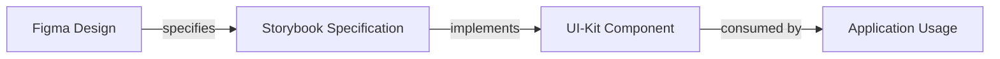
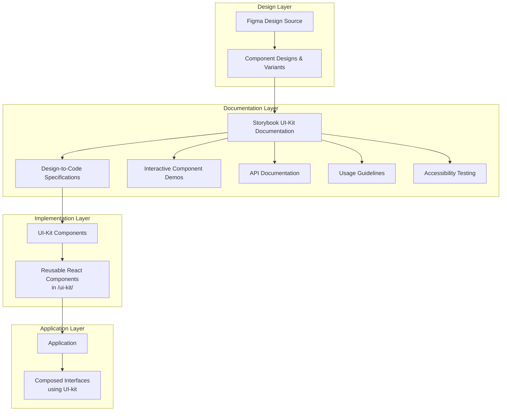
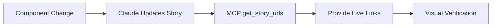
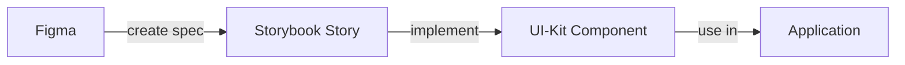

# Storybook Development Guidelines

This comprehensive guideline establishes Storybook as an integral part of the UI-kit system, serving as the critical bridge between Figma design specifications and UI-kit component implementations in the Intrigma frontend application.

> **LLM Compliance Note**: Treat this document as the authoritative checklist for Storybook work. Read it end-to-end before creating or modifying stories, follow every instruction exactly, and do not improvise steps unless the guideline explicitly grants an exception.

## Storybook as UI-Kit Documentation Layer

Storybook is not a separate system but rather the documentation and specification layer of the UI-kit. It serves three critical functions:

1. **Design Translation**: Converts Figma designs into interactive, documented specifications
2. **Component Laboratory**: Provides isolated environment for UI-kit component development
3. **Living Documentation**: Maintains real-time synchronization between design intent and code implementation

The relationship is unidirectional and strict:



## How to Use This Guideline
1. Review the entire document prior to creating or modifying stories
2. Execute tasks in the order they appear within each section
3. Apply the documented patterns verbatim for consistency
4. Record any deviations as risks in your working notes and flag them for review

**Tags:** storybook, ui-kit, components, design-system, documentation, figma, testing
**Agents:** feature-builder, code-reviewer, test-writer
**Risk:** High - Inconsistent component documentation affects design system integrity and developer velocity
**Context:** Storybook 8.x, Next.js 15, TypeScript 5.x, Vite, Figma integration, UI-kit system

## Part 1: Storybook Purpose and Philosophy

### Why Storybook Exists

Storybook is the documentation layer of the UI-kit system, serving as the essential bridge that translates Figma designs into implementable specifications:



**Key Insight**: Every UI-kit component MUST have a corresponding Storybook story that documents its API, demonstrates its usage, and validates its design compliance.

### Core Principles

1. **UI-Kit First**: Storybook documents UI-kit components, not application-specific implementations
2. **Design-Code Parity**: Every UI-kit component must accurately reflect its Figma counterpart
3. **Specification-Driven**: Stories serve as executable specifications for UI-kit components
4. **Documentation-Driven Development**: Comprehensive specs enable AI-assisted and human development
5. **Component Isolation**: UI-kit components are developed in Storybook before application use
6. **Progressive Enhancement**: Components evolve through defined status stages within the UI-kit

## Part 2: Configuration Specification

### Current Storybook Setup

```typescript
// .storybook/main.ts - Core configuration
{
  framework: "@storybook/nextjs-vite",  // Next.js integration with Vite bundler
  stories: [
    "../stories/**/*.mdx",              // Documentation stories
    "../stories/**/*.stories.tsx"      // Component stories
  ],
  addons: [
    "@storybook/addon-docs",          // Auto-documentation generation
    "@storybook/addon-a11y",          // Accessibility testing
    "@storybook/addon-vitest",        // Test integration
    "@storybook/addon-designs",       // Figma design embedding
    "@storybook/addon-mcp",           // MCP integration
    "storybook-addon-tag-badges"      // Status badge system
  ]
}
```

### Directory Structure

**Current Structure** (transitional):
```
front-end.iss-free/stories/
├── Foundations/              # Design tokens and primitives
│   ├── Colors.stories.tsx    # Color system documentation
│   ├── Typography.stories.tsx # Typography scales
│   ├── Spacing/              # Spacing system
│   └── Shadows/              # Elevation system
├── Components/               # UI components
│   ├── Button.stories.tsx    # Component implementations
│   └── Icon.stories.tsx      # Icon library
└── Development/              # Process documentation
    ├── Component-Status-System.stories.tsx
    └── UI-Kit-Overview.stories.tsx
```

**Target Structure** (co-located with UI-kit):
```
front-end.iss-free/ui-kit/
├── foundations/
│   ├── colors/
│   │   ├── colors.tsx
│   │   ├── colors.stories.tsx    # Co-located story
│   │   └── colors.spec.md        # Specification
│   └── typography/
│       ├── typography.tsx
│       ├── typography.stories.tsx
│       └── typography.spec.md
├── components/
│   ├── button/
│   │   ├── button.tsx            # Component implementation
│   │   ├── button.stories.tsx    # Co-located story
│   │   ├── button.spec.md        # Detailed specification
│   │   └── button.test.tsx       # Tests
│   └── icon/
│       ├── icon.tsx
│       ├── icon.stories.tsx
│       └── icon.spec.md
└── patterns/                      # Composite components
    └── form-field/
        ├── form-field.tsx
        ├── form-field.stories.tsx
        └── form-field.spec.md
```

**Migration Note**: Stories should be progressively migrated to live alongside their UI-kit components, creating a cohesive component package that includes implementation, documentation, and tests.

## Part 3: Component Status System

### Status Progression

Components progress through five defined stages with specific quality gates:

| Status | Badge | Color | Hex Code | Description | Usage |
|--------|-------|-------|----------|-------------|--------|
| `concept` | Concept | Orange | `#f59e0b` | Initial development phase | Development only |
| `draft` | Draft | Cyan | `#06b6d4` | Implementation complete | Review required |
| `beta` | Beta | Purple | `#8b5cf6` | Near-final version | Testing phase |
| `tested` | Tested | Blue | `#3b82f6` | Test coverage complete | QA approved |
| `genuine` | Genuine | Green | `#22c55e` | Production-ready | Safe for use |

### Additional Quality Markers

| Tag | Badge Text | Color | Hex Code | Purpose |
|-----|-----------|-------|----------|---------|
| `figma-sync` | Figma | Pink | `#ec4899` | Design specs verified and synced |
| `duplicate-impl` | ⚠️ Duplicate | Red | `#dc2626` | Multiple implementations exist (technical debt) |
| `a11y` | A11y | - | - | WCAG 2.1 AA compliant (not yet configured) |
| `perf` | Perf | - | - | Performance optimized (not yet configured) |

**Badge System Implementation**: All badges are configured in [.storybook/tagBadges.ts](../../front-end.iss-free/.storybook/tagBadges.ts) using the `storybook-addon-tag-badges` addon. Badges appear automatically in the Storybook UI when tags are added to story metadata.

### Status Implementation

```typescript
// In story meta configuration
const meta: Meta<ComponentProps> = {
  title: "Components/ComponentName",
  component: Component,
  tags: ["draft", "figma-sync"],  // Status and quality tags
  // Use "duplicate-impl" tag when component exists in multiple locations:
  // tags: ["draft", "figma-sync", "duplicate-impl"],
  parameters: {
    design: {                      // Figma integration
      type: "figma",
      url: "figma.com/design/..."
    },
    sourceUrl: "path/to/component.tsx"  // Source code link
  }
};
```

#### Special Tag: `duplicate-impl`
Use this tag when a component has multiple implementations in the codebase:
- Component exists in both `/components/ui/` and `/ui-kit/components/`
- During migration phase where prototype and production versions coexist
- Indicates technical debt requiring consolidation
- Shows as red "⚠️ Duplicate" badge in Storybook UI

### Status System Visualization

The complete status system with colors and progression flow is documented in:
- **Interactive Story**: [Component-Status-System.stories.tsx](../../front-end.iss-free/stories/Development/Component-Status-System.stories.tsx)
- **Badge Configuration**: [tagBadges.ts](../../front-end.iss-free/.storybook/tagBadges.ts)

**Important**: Do NOT create custom CSS for status badges. The `storybook-addon-tag-badges` addon handles all badge rendering automatically based on the configuration in `tagBadges.ts`.

## Part 4: MCP Integration

### Storybook MCP Server

The `@storybook/addon-mcp` addon provides Model Context Protocol (MCP) integration, enabling AI assistants to interact with Storybook programmatically.

### MCP Server Details

**Server Endpoint**: `http://localhost:6006/mcp` (when Storybook is running)

**Available Tools**:
1. **get_story_urls** - Retrieve direct URLs for stories
   - Input: Story identifiers (title, component)
   - Output: Live URLs for visual inspection

2. **get_ui_building_instructions** - Get UI development guidelines
   - Provides best practices for component development
   - Includes Storybook 9 migration notes
   - Enforces story creation requirements

### Setup Process

1. **Install the addon** (already included in package.json):
   ```bash
   @storybook/addon-mcp
   ```

2. **Configure MCP server** (run once when Storybook is running):
   ```bash
   # Run Storybook first
   bun run storybook

   # Then configure MCP
   claude mcp add --transport http storybook-mcp http://localhost:6006/mcp --scope project
   ```

3. **Or use the setup script**:
   ```bash
   ./verify_mcp.sh
   # Select option to install Storybook MCP when prompted
   ```

### Usage with Claude and Agents

When Storybook MCP is configured:
- Claude can automatically retrieve story URLs after changes
- Visual verification of component modifications
- Agents can automate documentation updates
- Automated story URL generation for specs and documentation

### MCP Automation Examples

#### Example 1: After Story Creation (storybook-editor agent)
```typescript
// 1. Create story file: ui-kit/components/button/button.stories.tsx
// 2. Agent uses Storybook MCP to get URLs

📚 Storybook MCP: get_story_urls({ component: "Button" })

Response:
{
  "Basic": "http://localhost:6006/?path=/story/ui-kit-button--basic",
  "Variants": "http://localhost:6006/?path=/story/ui-kit-button--variants",
  "States": "http://localhost:6006/?path=/story/ui-kit-button--states",
  "Playground": "http://localhost:6006/?path=/story/ui-kit-button--playground"
}

// 3. Agent auto-updates button.spec.md with story links
```

#### Example 2: Component Migration Verification (component-standardization agent)
```typescript
// After migrating component from legacy location to ui-kit

📚 Storybook MCP: get_story_urls({ component: "Card" })

// Verify all expected stories exist:
✓ Basic story accessible
✓ Variants story accessible
✓ States story accessible
✓ Playground story accessible

// Update migration documentation with verified URLs
```

#### Example 3: Figma + Storybook Integration (design-system-coordinator agent)
```typescript
// 1. Extract design from Figma
🎨 Figma MCP: get_metadata('button-component')
   → Extract design tokens, variants, states

// 2. Verify implementation in Storybook
📚 Storybook MCP: get_story_urls({ component: "Button" })

// 3. Visual comparison
🔧 Chrome DevTools MCP: navigate_page(storybook_url)
🔧 Chrome DevTools MCP: take_screenshot()
🎨 Figma MCP: get_screenshot('button-component')

// 4. Compare screenshots for design-code parity
```

#### Example 4: Automated Documentation Updates
```typescript
// Workflow: Create component → Generate docs → Distribute URLs

1. storybook-editor creates button.stories.tsx
2. 📚 Storybook MCP: get_story_urls({ component: "Button" })
3. Auto-generate button.spec.md with story links:

## Button Component

### Storybook Stories
- [Basic Usage](http://localhost:6006/?path=/story/ui-kit-button--basic)
- [All Variants](http://localhost:6006/?path=/story/ui-kit-button--variants)
- [Interactive States](http://localhost:6006/?path=/story/ui-kit-button--states)
- [Playground](http://localhost:6006/?path=/story/ui-kit-button--playground)

4. Share URLs with team in GitLab MR descriptions
```

#### Example 5: Quality Gate Automation
```typescript
// Before marking component as [Genuine]

Quality Gate Checklist:
1. 📚 Storybook MCP: get_story_urls({ component })
   → Verify all required stories exist

2. 🔧 Chrome DevTools MCP: navigate to each story URL
   → Check for console errors (list_console_messages)
   → Verify no accessibility violations

3. 🎨 Figma MCP: get_metadata(component)
   → Ensure design parameter is set in story

4. Only then update status tag to [Genuine]
```

### Agent Workflow Integration

The **storybook-editor** agent automatically uses Storybook MCP in these scenarios:

1. **After Story Creation**:
   ```
   10) 📚 Use Storybook MCP: get_story_urls to generate documentation links
   11) Add story URLs to .spec.md file for easy navigation
   ```

2. **During Status Progression**:
   ```
   6) 📚 Update documentation with current story URLs via Storybook MCP
   ```

3. **Quality Audits**:
   ```
   Verify all stories are accessible via generated URLs
   Ensure no broken links in documentation
   ```

### Best Practices for MCP Automation

1. **Always verify Storybook is running** before invoking MCP tools
2. **Cache story URLs** in documentation for offline reference
3. **Re-generate URLs** after component moves or renames
4. **Include URLs in all specs** for easy navigation
5. **Use URLs in GitLab MR descriptions** for reviewer convenience
6. **Automate URL generation** in CI/CD pipelines where possible
- Direct links to component documentation
- Automated story generation guidance

### MCP Workflow



### Benefits

1. **Automated Linking**: Get story URLs without manual navigation
2. **Visual Feedback**: See changes immediately in Storybook
3. **Development Guidance**: Automated reminders for story creation
4. **Integration Testing**: Verify component rendering in isolation

### Requirements

- Storybook must be running (`bun run storybook`)
- MCP server available at port 6006
- Claude MCP configuration completed

## Part 5: Story Analysis and Patterns

### Current Story Inventory

| Category | Stories | Status Distribution | Coverage |
|----------|---------|-------------------|----------|
| Foundations | 7 | Mostly `genuine` | Design tokens |
| Components | 3 | `draft`/`beta` | Core UI elements |
| Development | 3 | `genuine` | Process documentation |

### Identified Best Practices

1. **Centered Presentation**: Components displayed in viewport center
2. **Variant Alignment**: Multiple variants shown horizontally with consistent spacing
3. **Interactive Controls**: ArgTypes enable real-time property manipulation
4. **Responsive Design**: Stories adapt to viewport changes
5. **Minimalist Layout**: Focus on component, not decoration

## Part 5: Story Template Specification

### Story Naming Convention

**CRITICAL**: Story titles for UI-kit components MUST use the flat structure without duplication:

✅ **CORRECT**: `title: "Components/Button"`
❌ **WRONG**: `title: "UI Kit/Components/Button"` (creates duplicate folder in sidebar)

The Storybook sidebar already shows "UI Kit" as the root category. Adding it to the title creates:
```
UI Kit
└── Components        ← From root category
    └── UI Kit        ← Duplicate!
        └── Components
            └── Button
```

### Standard Story Structure

Every UI-kit component story must follow this consistent structure pattern, organized by component props:

**Story Organization Pattern:**
1. **Basic** - Simple component presentation with default props
2. **Prop Variations** - Stories grouped by component props (e.g., Variants, Sizes, States)
3. **Examples** - Real-world usage examples
4. **Edge Cases** - Boundary conditions, error states, accessibility considerations

```typescript
import type { Meta, StoryFn } from "@storybook/react";
// Import from ui-kit, not application components
import { ComponentName } from "@/ui-kit/components/component-name";

// Meta Configuration
const meta: Meta = {
  title: "Components/ComponentName",  // IMPORTANT: Use "Components/" not "UI Kit/Components/"
  component: ComponentName,
  parameters: {
    layout: "centered",              // Default: centered presentation
    docs: {
      description: {
        component: `
# Component Name

UI-kit component that bridges Figma design with application implementation.

## Design Source
- Figma Component: [Component Name in Figma]
- Figma URL: https://figma.com/design/...?node-id=...
- Design Tokens: Uses foundation tokens from design system

## Prerequisites
- **Design Principles**: What design principles this component embodies
- **When to Use**: Specific use cases and scenarios
- **When NOT to Use**: Anti-patterns or inappropriate usage

## Component Props
- \`propName\`: Description and possible values
- \`variant?\`: "primary" | "secondary" | "tertiary"
- \`size?\`: "sm" | "md" | "lg"
- \`disabled?\`: boolean

## Features
- Key feature 1
- Key feature 2
- Accessibility features
        `,
      },
    },
    design: {                       // REQUIRED: Figma integration
      type: "figma",
      url: "https://figma.com/design/...?node-id=...",
    },
    sourceUrl: "ui-kit/components/component-name/component-name.tsx",
  },
  tags: ["draft", "ui-kit"],        // Status tags (REQUIRED)
  decorators: [
    // Optional: Wrap stories with providers if needed
    (Story) => (
      <div className="min-h-[400px] flex items-center justify-center">
        <Story />
      </div>
    ),
  ],
};

export default meta;

// ============================================================================
// 1. BASIC PRESENTATION
// ============================================================================

export const Basic: StoryFn = () => {
  return <ComponentName>Default content</ComponentName>;
};

Basic.storyName = "Basic";
Basic.parameters = {
  docs: {
    description: {
      story: "Basic component with default props.",
    },
  },
};

// ============================================================================
// 2. PROP VARIATIONS (Group by component props)
// ============================================================================

// Story 2.1: Variants prop (if component has variants)
export const Variants: StoryFn = () => {
  const variants = ["primary", "secondary", "tertiary"] as const;

  return (
    <div className="flex gap-3 items-center flex-wrap">
      {variants.map((variant) => (
        <ComponentName key={variant} variant={variant}>
          {variant}
        </ComponentName>
      ))}
    </div>
  );
};

Variants.storyName = "Variants";
Variants.parameters = {
  docs: {
    description: {
      story: "Available variants: primary (default), secondary, tertiary.",
    },
  },
};

// Story 2.2: Size prop (if component has size variations)
export const Sizes: StoryFn = () => {
  const sizes = ["sm", "md", "lg"] as const;

  return (
    <div className="flex gap-3 items-center flex-wrap">
      {sizes.map((size) => (
        <ComponentName key={size} size={size}>
          {size}
        </ComponentName>
      ))}
    </div>
  );
};

Sizes.storyName = "Sizes";
Sizes.parameters = {
  docs: {
    description: {
      story: "Available sizes: small, medium (default), large.",
    },
  },
};

// Story 2.3: States prop (if component has state variations)
export const States: StoryFn = () => {
  return (
    <div className="flex gap-3 items-center flex-wrap">
      <ComponentName>Default</ComponentName>
      <ComponentName disabled>Disabled</ComponentName>
      <ComponentName loading>Loading</ComponentName>
    </div>
  );
};

States.storyName = "States";
States.parameters = {
  docs: {
    description: {
      story: "Component states: default, disabled, loading.",
    },
  },
};

// Additional prop variation stories as needed...
// Group stories by the actual props your component has

// ============================================================================
// 3. REAL-WORLD EXAMPLES
// ============================================================================

export const Examples: StoryFn = () => {
  return (
    <div className="flex flex-col gap-4">
      <div>
        <h3>Example: Form Submit</h3>
        <ComponentName variant="primary" onClick={() => alert("Submit")}>
          Submit Form
        </ComponentName>
      </div>
      <div>
        <h3>Example: Cancel Action</h3>
        <ComponentName variant="secondary" onClick={() => alert("Cancel")}>
          Cancel
        </ComponentName>
      </div>
    </div>
  );
};

Examples.storyName = "Examples";
Examples.parameters = {
  docs: {
    description: {
      story: "Real-world usage examples demonstrating common use cases.",
    },
  },
};

// ============================================================================
// 4. EDGE CASES & CONSIDERATIONS
// ============================================================================

export const EdgeCases: StoryFn = () => {
  return (
    <div className="flex flex-col gap-4">
      <div>
        <h3>Long Text Content</h3>
        <ComponentName>
          This is a very long text that might cause layout issues if not handled properly in the component design
        </ComponentName>
      </div>
      <div>
        <h3>Empty Content</h3>
        <ComponentName />
      </div>
      <div>
        <h3>Accessibility: Keyboard Navigation</h3>
        <ComponentName>Press Tab to focus, Enter to activate</ComponentName>
      </div>
    </div>
  );
};

EdgeCases.storyName = "Edge Cases";
EdgeCases.parameters = {
  docs: {
    description: {
      story: "Edge cases, boundary conditions, and accessibility considerations.",
    },
  },
};
```

### Story Structure Guidelines

**DO:**
- ✅ Organize stories by component props (Variants, Sizes, States, etc.)
- ✅ Include prop descriptions in story parameters
- ✅ Show all variations for each prop
- ✅ Include real-world examples
- ✅ Document edge cases and accessibility
- ✅ Use consistent naming: `Variants`, `Sizes`, `States`, `Examples`, `EdgeCases`

**DON'T:**
- ❌ Create redundant "Basic" and "Playground" stories (use argTypes for interactive controls)
- ❌ Mix multiple prop variations in one story (separate them)
- ❌ Skip edge cases and accessibility testing
- ❌ Create stories for every possible combination (focus on key variations)

## Part 6: Story Documentation Structure

### MDX Documentation Template

For comprehensive component documentation:

```mdx
import { Meta, Story, Canvas, ArgsTable, Description } from '@storybook/blocks';
import * as ComponentStories from './Component.stories';

<Meta of={ComponentStories} />

# Component Name

{/* Status badges are auto-generated from tags by storybook-addon-tag-badges */}
{/* Configured in .storybook/tagBadges.ts - no additional markup needed */}

## Overview

Brief description of what this component does and its primary use cases.

## Prerequisites

- **Design Principles**: What design system principles this embodies
- **Use When**: Specific scenarios where this component is appropriate
- **Don't Use When**: Anti-patterns or inappropriate usage

## Examples

<Canvas of={ComponentStories.Basic} />

## Variants

<Canvas of={ComponentStories.Variants} />

## API Reference

<ArgsTable of={ComponentStories.Basic} />

## Usage Guidelines

### Do's
- ✅ Use for primary actions
- ✅ Maintain consistent spacing
- ✅ Follow color semantics

### Don'ts
- ❌ Don't nest interactive elements
- ❌ Avoid using for navigation
- ❌ Don't override core styles

## Accessibility

- **Keyboard Navigation**: Full support with Tab/Enter/Space
- **Screen Readers**: Proper ARIA labels and roles
- **Color Contrast**: WCAG 2.1 AA compliant
- **Focus Indicators**: Visible focus states

## Implementation Notes

```typescript
// Example implementation
import { Button } from '@/components/ui/button';

function MyComponent() {
  return (
    <Button variant="primary" size="md">
      Click Me
    </Button>
  );
}
```
```

## Part 7: Styling and Presentation Guidelines

### Visual Presentation Standards

```typescript
// Centered layout for single components
<div className="flex items-center justify-center min-h-[200px]">
  <Component />
</div>

// Horizontal layout for variants
<div className="flex gap-3 items-center">
  {variants.map(variant => <Component key={variant} />)}
</div>

// Grid layout for multiple examples
<div className="grid grid-cols-3 gap-4">
  {examples.map(example => <Component key={example} />)}
</div>

// Vertical layout with labels
<div className="flex flex-col gap-4">
  <div>
    <label className="text-sm text-gray-600 mb-2 block">Label</label>
    <Component />
  </div>
</div>
```

### Spacing Guidelines

- **Component spacing**: Use consistent gaps (12px/3 in Tailwind)
- **Section spacing**: 32px between major sections
- **Padding**: 32px for story containers
- **Minimum height**: 200px for centered displays

### Color and Theme

- Use application design tokens from `globals.css`
- Maintain theme consistency with `className` utilities
- Avoid inline styles except for layout
- Support both light and dark themes

### Tailwind CSS v4 Compatibility (CRITICAL)

**⚠️ IMPORTANT**: This project uses **Tailwind CSS v4** with CSS-first configuration (`@import "tailwindcss"` in `globals.css`).

**Arbitrary Value Restrictions**:
- ❌ **DO NOT use bracket notation**: `min-h-[200px]`, `w-[350px]`, `gap-[12px]` (NOT compatible with Tailwind v4)
- ✅ **USE standard utilities**: `min-h-48`, `w-80`, `gap-3`, `p-8`
- ✅ **OR define in @theme block**: Add custom values to `globals.css` if needed

**Why**: Tailwind v4's CSS-first architecture does not support arbitrary values with brackets. All utilities must either:
1. Exist in the default Tailwind theme, OR
2. Be explicitly defined in the `@theme { }` block in `app/globals.css`

**Examples**:
```tsx
// ❌ WRONG - Will trigger ESLint error and fail in Tailwind v4
<div className="flex items-center justify-center min-h-[200px]">

// ✅ CORRECT - Use standard utilities
<div className="flex items-center justify-center p-8">
<div className="flex items-center justify-center min-h-48"> // 192px

// ✅ CORRECT - Or define custom spacing in globals.css @theme block
// @theme {
//   --spacing-50: 12.5rem; /* 200px */
// }
<div className="flex items-center justify-center min-h-50">
```

**ESLint Rule**: The `no-restricted-syntax` rule will flag arbitrary value usage. This is intentional to enforce Tailwind v4 compatibility.

**When You Need Custom Values**:
1. Check if a standard Tailwind utility exists first (use Tailwind docs)
2. If truly needed, propose adding it to the `@theme` block in `globals.css`
3. Get approval before adding new theme values to maintain design system consistency

## Part 8: Development Workflow

### Creating New Stories

```bash
# 1. Create UI-kit component structure
mkdir -p ui-kit/components/new-component
touch ui-kit/components/new-component/new-component.tsx
touch ui-kit/components/new-component/new-component.stories.tsx
touch ui-kit/components/new-component/new-component.spec.md

# 2. Link Figma design first
# Get Figma node URL and component specs

# 3. Write specification
# Document in new-component.spec.md

# 4. Implement story using template
# Follow Part 5 template structure

# 5. Implement component
# Build according to spec and story

# 6. Verify story renders
bun run storybook

# 7. Test accessibility
# Check a11y addon panel for violations

# 8. Update status tag
# Progress through: concept → draft → beta → tested → genuine
```

### Story Validation Checklist

Before marking a story complete:

- [ ] Component renders without errors
- [ ] All variants are displayed
- [ ] Interactive controls work
- [ ] Accessibility checks pass
- [ ] Figma design linked (if available)
- [ ] Source code path provided
- [ ] Documentation complete
- [ ] Status tag appropriate
- [ ] Build succeeds: `bun run build-storybook`

## Part 9: Best Practices and Anti-Patterns

### Best Practices

1. **Component Focus**: Keep stories minimal, highlighting the component
2. **Real Data**: Use realistic content, not Lorem Ipsum
3. **Responsive**: Test components at different viewport sizes
4. **Interactive**: Provide controls for all meaningful props
5. **Documented**: Include usage examples and guidelines
6. **Accessible**: Ensure all interactions work with keyboard
7. **Performant**: Lazy load heavy assets
8. **Consistent**: Follow established patterns

### Anti-Patterns to Avoid

- ❌ **Over-decoration**: Adding unnecessary visual elements
- ❌ **Prop drilling**: Exposing internal implementation details
- ❌ **Missing status**: Stories without status tags
- ❌ **Broken links**: Invalid Figma or source URLs
- ❌ **Console errors**: Components throwing errors in stories
- ❌ **Inaccessible**: Components failing a11y checks
- ❌ **Inconsistent spacing**: Not following design system
- ❌ **Hard-coded values**: Not using design tokens

## Part 10: Integration with Development Pipeline

### AI-Assisted Development

Storybook stories serve as the primary specification for AI agents working with the UI-kit:

```typescript
// UI-Kit Story provides:
// 1. Figma design reference (source of truth)
// 2. Component API through ArgTypes
// 3. Visual examples through rendered stories
// 4. Usage patterns through story variations
// 5. Constraints through documentation
// 6. Co-located specifications in .spec.md files

// AI agents workflow:
// 1. Read Figma design from story's design parameter
// 2. Analyze story structure and ArgTypes
// 3. Generate UI-kit component implementation
// 4. Create tests based on story examples
// 5. Validate against design specifications
// 6. Update story status tags as work progresses
```

**Key Point**: AI agents should ALWAYS reference the Storybook story as the authoritative specification when implementing or modifying UI-kit components.

### Testing Integration

```typescript
// Stories as test cases
import { composeStories } from '@storybook/react';
import * as stories from './Button.stories';

const { Basic, Variants } = composeStories(stories);

describe('Button', () => {
  it('renders basic story', () => {
    render(<Basic />);
    // Test implementation
  });
});
```

### UI-Kit Development Flow

The UI-kit development follows a strict Figma → Storybook → Implementation flow:

1. **Design Creation**: Designer creates/updates component in Figma
2. **Specification**: Developer creates `.spec.md` file in UI-kit
3. **Story Creation**: Developer creates `.stories.tsx` with Figma link
4. **Status: `concept`**: Initial story structure created
5. **Implementation**: UI-kit component built to match story spec
6. **Status: `draft`**: Implementation complete, needs review
7. **Design Review**: Designer validates against Figma
8. **Status: `beta`**: Design approved, needs testing
9. **Testing**: Automated tests and QA validation
10. **Status: `tested`**: All tests passing
11. **Final Review**: Production readiness check
12. **Status: `genuine`**: Ready for application use

## Part 11: Common Patterns and Recipes

### Form Components

```typescript
export const FormInput: StoryFn = () => {
  const [value, setValue] = useState('');

  return (
    <div className="w-full max-w-sm">
      <Input
        value={value}
        onChange={(e) => setValue(e.target.value)}
        placeholder="Enter text..."
      />
      <p className="mt-2 text-sm text-gray-600">
        Value: {value || '(empty)'}
      </p>
    </div>
  );
};
```

### Data Display Components

```typescript
export const DataTable: StoryFn = () => {
  const data = generateMockData(10);

  return (
    <div className="w-full max-w-4xl">
      <Table data={data} columns={columns} />
    </div>
  );
};
```

### Interactive Components

```typescript
export const Interactive: StoryFn = () => {
  const [state, setState] = useState('initial');

  return (
    <div className="flex flex-col items-center gap-4">
      <Component
        onAction={(action) => setState(action)}
      />
      <div className="text-sm text-gray-600">
        Current state: {state}
      </div>
    </div>
  );
};
```

## Part 12: Maintenance and Updates

### Story Maintenance Checklist

Weekly:
- [ ] Check for console errors
- [ ] Validate Figma links still work
- [ ] Update status tags as components progress
- [ ] Remove deprecated stories

Per Sprint:
- [ ] Review component coverage
- [ ] Update documentation for changes
- [ ] Sync with design system updates
- [ ] Archive obsolete components

### Version Management

```typescript
// Use tags for version tracking
tags: ["genuine", "v2"]  // Production component, version 2

// Document breaking changes
parameters: {
  docs: {
    description: {
      component: `
## Migration from v1
- Changed \`color\` prop to \`variant\`
- Removed \`size="xs"\` option
      `,
    },
  },
},
```

## Important Notes

- **STORYBOOK IS PART OF UI-KIT** - Not a separate system but the documentation layer
- **FIGMA IS THE SOURCE** - Every UI-kit component starts from Figma design
- **CO-LOCATE WITH COMPONENTS** - Stories live alongside UI-kit components
- **ALWAYS use the story template** from Part 5 for consistency
- **NEVER skip status tags** - they're required for tracking
- **ALWAYS center components** unless showing relationships
- **KEEP stories minimal** - focus on the component, not decoration
- **UPDATE documentation** when component API changes
- **TEST accessibility** before marking as `tested` or `genuine`
- **LINK Figma designs** - This is MANDATORY, not optional
- **FOLLOW spacing guidelines** for visual consistency
- **SPECS BEFORE CODE** - Write `.spec.md` before implementation

## Quick Reference

### UI-Kit Development Flow



### Status Tag Progression
`concept` → `draft` → `beta` → `tested` → `genuine`

### Required Story Elements
1. Figma design link (MANDATORY)
2. Meta configuration with UI-Kit prefix
3. Status tags for tracking
4. Basic story with controls
5. Variants story showing all options
6. Co-located specification file

### File Structure (Target)
```
ui-kit/components/[component-name]/
├── [component-name].tsx          # Implementation
├── [component-name].stories.tsx  # Storybook story
├── [component-name].spec.md      # Specification
└── [component-name].test.tsx     # Tests
```

### File Naming
- Component: `component-name.tsx`
- Stories: `component-name.stories.tsx`
- Specification: `component-name.spec.md`
- Location: Co-located in `ui-kit/` directory

---
*This document is the authoritative guide for Storybook as part of the UI-kit system. Storybook serves as the bridge between Figma designs and UI-kit component implementations. For general frontend guidelines, see `/front-end.iss-free/CLAUDE.md`*