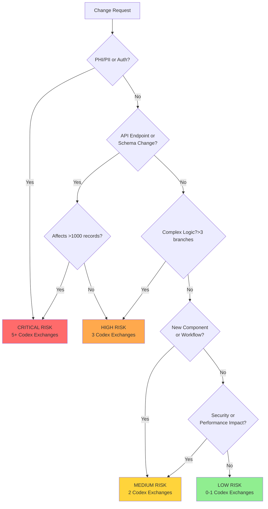

# Validation Patterns and Codex Usage Rigor

**Version**: 1.0
**Last Updated**: 2026-01-09
**Purpose**: Define risk-based validation requirements for all agent decisions

## Critical Problem

**Current State**: Zero agents have Codex validation requirements
**Impact**: High-risk decisions made without sufficient validation, leading to:
- Suboptimal implementations
- Missed alternative approaches
- Unvalidated assumptions
- Security vulnerabilities
- Performance issues

**Solution**: Risk-based validation matrix with mandatory Codex validation for critical decisions.

## Core Principle

**Not all decisions require the same validation rigor.**

Use risk level to determine validation depth:
- **Critical**: 5+ Codex exchanges, review agent validation
- **High**: 3 Codex exchanges, alternative consideration
- **Medium**: 2 Codex exchanges, optional
- **Low**: 0-1 Codex exchanges, skip for trivial

## Risk-Based Validation Matrix

### Critical Risk (5+ Codex Exchanges)

**Criteria** (ANY of these):
- PHI/PII data access or storage
- Authentication/authorization logic changes
- Multi-tenant isolation changes
- Database schema affecting >1000 records
- Security-critical operations
- External API integration (3rd party)
- Production data migration

**Validation Requirements**:
- Minimum 5 Codex-high exchanges
- Review agent validation required (@code-reviewer or @security-expert)
- Alternative approaches MUST be considered
- Document validation in logs (full Codex dialogues)
- Stakeholder approval before implementation

**Example**:
```markdown
Task: Implement password reset flow

Risk Level: CRITICAL
- Credential handling ✓
- Session management ✓
- Email token validation ✓

Validation Required:
1. Codex exchange 1: "Validate password reset architecture"
2. Codex exchange 2: "What are security vulnerabilities in this approach?"
3. Codex exchange 3: "Compare my approach vs industry best practices"
4. Codex exchange 4: "Rate my security (1-10), explain weaknesses"
5. Codex exchange 5: "Validate token expiration and rate limiting"
6. Review: @security-expert validates final design
7. Document: Full Codex dialogues in .claude/logs/password-reset_log_*.jsonl
```

### High Risk (3 Codex Exchanges)

**Criteria** (ANY of these):
- New tRPC endpoints (API contracts)
- Database schema changes (<1000 records affected)
- Complex business logic (>3 decision branches)
- Performance-critical paths (<100ms p95 requirement)
- User input validation at system boundaries
- State management patterns

**Validation Requirements**:
- Minimum 3 Codex-high exchanges
- Alternative approaches considered
- Document key decisions
- Optional review agent for architecture

**Example**:
```markdown
Task: Create tRPC mutation for listing creation

Risk Level: HIGH
- New API endpoint ✓
- User input validation ✓
- Multi-tenant isolation ✓

Validation Required:
1. Codex exchange 1: "Validate input schema and Zod validation"
2. Codex exchange 2: "Are there security issues with this approach?"
3. Codex exchange 3: "Compare this vs alternative implementations"
4. Document: Validation summary in implementation log
```

### Medium Risk (2 Codex Exchanges)

**Criteria** (ANY of these):
- New React components (complex state)
- Database queries (read-only, <10k records)
- UI workflows (multi-step forms)
- Integration with existing APIs
- Non-critical business logic

**Validation Requirements**:
- Minimum 2 Codex exchanges (recommended, not mandatory)
- Consider alternatives
- Document if complex

**Example**:
```markdown
Task: Create multi-step form component

Risk Level: MEDIUM
- Complex client state ✓
- Multi-step workflow ✓

Validation Optional (Recommended):
1. Codex exchange 1: "Validate form state management approach"
2. Codex exchange 2: "Any accessibility issues with this pattern?"
```

### Low Risk (0-1 Codex Exchanges)

**Criteria** (ALL of these):
- Standard CRUD operations
- UI styling changes
- Display-only components
- Simple data transformations
- No security implications
- No performance implications

**Validation Requirements**:
- No Codex validation required
- Optional 1 exchange for complex patterns

**Example**:
```markdown
Task: Update button text and styling

Risk Level: LOW
- No data access ✓
- No security implications ✓
- No performance impact ✓

Validation: SKIP (trivial change)
```

## Risk Assessment Decision Tree



## Codex Validation Best Practices

### 1. Pre-Validation Context Check

**BEFORE Codex validation**:
- [ ] Understand the requirement completely
- [ ] Read relevant context files (architecture-context.md, nfr-matrix.md, anti-patterns.md)
- [ ] Identify constraints and assumptions
- [ ] Formulate specific questions

❌ **BAD**: "Is this approach good?"
✅ **GOOD**: "Validate this multi-tenant query approach: [specific code]. Constraints: 1800 apartments across 7 buildings. Concerns: N+1 queries, missing tenant filters."

### 2. Iterative Refinement

Use Codex exchanges to refine, not just validate:

**Exchange 1**: Validate initial approach
**Exchange 2**: Explore alternative identified in Exchange 1
**Exchange 3**: Compare approaches, get recommendation
**Exchange 4-5**: Deep dive on chosen approach edge cases

### 3. Alternative Consideration

**Always ask Codex**:
- "What are alternative approaches to this problem?"
- "What are the trade-offs of each approach?"
- "Which approach is best for my constraints?"

**Avoid confirmation bias**:
❌ "Validate my approach" (seeking approval)
✅ "Compare my approach vs alternatives" (seeking truth)

### 4. Specific, Measurable Questions

❌ **BAD (vague)**:
- "Is this secure?"
- "Is this performant?"
- "Is this good?"

✅ **GOOD (specific)**:
- "Does this approach prevent SQL injection? Check line 42."
- "Will this query perform well with 1800 records? Identify N+1 risks."
- "Rate this approach 1-10 for maintainability. Explain weaknesses."

### 5. Document Full Dialogues

**For Critical tasks, consider logging** (see MINIMAL_LOGGING.md):
- Full Codex prompts (not summaries)
- Full Codex responses (not summaries)
- Exchange number and type (request/response)
- Decision made based on validation

**Example**:
```json
{
  "timestamp":"2026-01-09T16:00:00Z",
  "agent":"feature-builder",
  "action":"codex",
  "exchange":1,
  "type":"request",
  "risk_level":"high",
  "content":{
    "summary":"Validate tRPC listing mutation",
    "full_prompt":"[COMPLETE PROMPT WITH CODE AND CONTEXT]",
    "size_bytes":4567
  }
}
```

## Anti-Patterns to Avoid

### Anti-Pattern 1: Skipping Validation for "Simple" Changes

❌ **WRONG**:
```markdown
"This is a simple CRUD endpoint, skip Codex validation"

*Proceeds to implement without checking:*
- Missing authorization (anyone can delete)
- Missing multi-tenant filter (cross-tenant data leak)
- SQL injection via raw query
```

✅ **RIGHT**:
```markdown
"This is a CRUD endpoint with user input and authorization.

Risk Assessment:
- User input: HIGH (injection risk)
- Authorization: CRITICAL (ownership check needed)
- Multi-tenant: CRITICAL (1800 apartments)

Risk Level: CRITICAL → 5 Codex exchanges required"
```

### Anti-Pattern 2: Single-Exchange "Rubber Stamp"

❌ **WRONG**:
```markdown
Codex exchange 1: "Is this implementation correct?"
Codex response: "Yes, looks good"
*Considers validation complete*
```

✅ **RIGHT**:
```markdown
Exchange 1: "Validate this implementation: [code]"
Exchange 2: "What edge cases am I missing?"
Exchange 3: "What are alternative approaches?"
Exchange 4: "Compare my approach vs [alternative from E3]"
Exchange 5: "Deep dive: does this prevent [specific attack]?"
```

### Anti-Pattern 3: Validation After Implementation

❌ **WRONG**:
```markdown
1. Implement feature completely
2. Write tests
3. Deploy to staging
4. THEN validate with Codex
5. Discover fundamental flaw
6. Rewrite everything
```

✅ **RIGHT**:
```markdown
1. Define requirement
2. VALIDATE approach with Codex (5 exchanges)
3. Implement validated approach
4. Write tests
5. Deploy
```

### Anti-Pattern 4: Ignoring Codex Feedback

❌ **WRONG**:
```markdown
Codex: "This approach has SQL injection risk. Use parameterized queries."
Agent: "I'll stick with my approach, seems fine."
```

✅ **RIGHT**:
```markdown
Codex: "This approach has SQL injection risk. Use parameterized queries."
Agent: "Updating to use Drizzle ORM parameterized queries. Validating fix..."
*Exchange 2 validates the fix*
```

## Integration with NFR Matrix

Use [nfr-matrix.md](../context/nfr-matrix.md) to determine risk level:

| NFR Threshold | Maps to Risk Level |
|--------------|-------------------|
| Critical NFR (PHI/PII, >1M records) | Critical Risk (5+ Codex) |
| High NFR (Auth/Authz, >100k records) | High Risk (3 Codex) |
| Medium NFR (User input, >10k records) | Medium Risk (2 Codex) |
| Low NFR (Public data, <10k records) | Low Risk (0-1 Codex) |

## Agent-Specific Validation Requirements

### feature-builder
- **Default Risk**: Medium (implements features from specs)
- **Upgrade to High**: If API endpoints or database changes
- **Upgrade to Critical**: If auth, PHI/PII, or multi-tenant isolation

### security-expert
- **Default Risk**: Critical (all security reviews)
- **Self-Validation**: Security-expert MUST validate its own recommendations (3+ Codex exchanges)

### architect
- **Default Risk**: High (architectural decisions)
- **Upgrade to Critical**: If affects >1000 records or security

### code-reviewer
- **Default Risk**: Low (reviews existing code)
- **Upgrade to High**: If reviewing Critical-risk code

## Validation vs Token Efficiency

**Important**: Validation and token efficiency are COMPLEMENTARY, not contradictory.

**Reduce tokens in**:
- Instructions (concise writing, reference docs) ✅
- Code generation (reuse existing code) ✅
- Documentation (avoid duplication) ✅

**Increase tokens in**:
- Validation (thorough Codex exchanges) ✅
- Critical decision documentation ✅
- Security review depth ✅

**These are both correct and work together.**

## Success Metrics

**Measure validation effectiveness**:
- Issues caught during validation (vs after implementation)
- Time saved by validating early
- Quality of Codex exchanges (specific vs vague)
- Alternative approaches considered per decision

**Target**:
- 90%+ of Critical decisions validated BEFORE implementation
- 3+ alternatives considered for High/Critical decisions
- Zero Critical issues discovered AFTER deployment that validation could have caught

## Related Documentation

- [nfr-matrix.md](../context/nfr-matrix.md) - NFR-based routing triggers and risk levels
- [anti-patterns.md](../context/anti-patterns.md) - Anti-patterns to avoid
- [META_REVIEW_FRAMEWORK.md](./META_REVIEW_FRAMEWORK.md) - Meta-review process

---

**Version Control**: Update this document when:
- Risk thresholds change
- Codex validation patterns improve
- New anti-patterns discovered
- Validation metrics evolve
