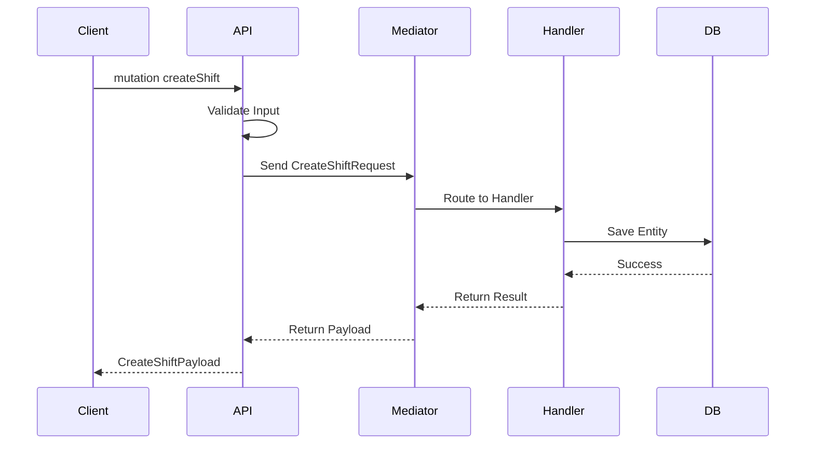
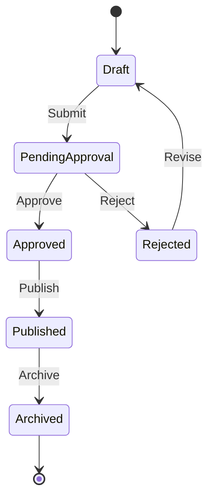
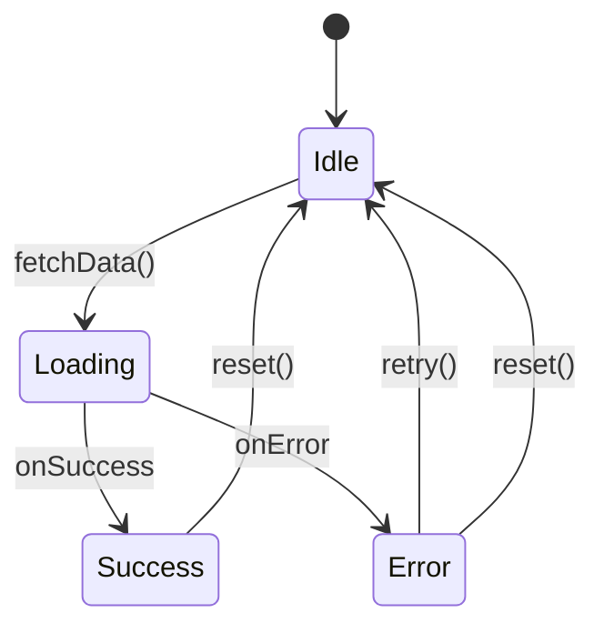
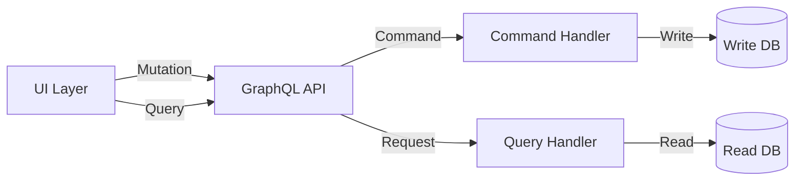

# Markdown Documentation Workflow

This reference document contains comprehensive guidelines for creating, maintaining, and validating markdown documentation in the Intrigma project.

**When to read this file:**
- Creating or updating documentation files (`*.md`)
- Working with diagrams (Mermaid, PlantUML, etc.)
- Documenting features, APIs, or architectural decisions
- Ensuring documentation quality and consistency

**Key principle:** Documentation is code. Treat it with the same rigor as source code.

---

## Table of Contents

1. [Documentation Structure](#documentation-structure)
2. [Markdown Best Practices](#markdown-best-practices)
3. [Advanced Documentation Workflows](#advanced-documentation-workflows)
4. [Mermaid Diagram Workflow](#mermaid-diagram-workflow)
5. [Code Examples in Documentation](#code-examples-in-documentation)
6. [Documentation Review Checklist](#documentation-review-checklist)
7. [Common Patterns and Templates](#common-patterns-and-templates)

---

## Documentation Structure

### Standard Documentation Files

```
fx-backend/
├── CLAUDE.md                          # Root: Common rules for all development
├── README.md                          # Project overview
├── AGENT_LIST.md                      # Agent catalog and selection guide
├── MCP_GUIDE.md                       # MCP server setup and usage
│
├── src/
│   ├── CLAUDE.md                      # Backend-specific directives
│   ├── GRAPHQL_STYLE_GUIDE.md         # GraphQL conventions
│   └── README.md                      # Backend architecture overview
│
├── front-end.iss-free/
│   ├── CLAUDE.md                      # Frontend-specific directives
│   └── README.md                      # Frontend architecture overview
│
└── .claude/
    ├── guidelines/                    # Domain-specific patterns
    │   ├── BACKEND_GUIDELINE.MD
    │   ├── GRAPHQL_GUIDELINE.MD
    │   ├── SECURITY_GUIDELINES.MD
    │   └── PERFORMANCE_GUIDELINE.MD
    │
    ├── instructions/                  # Shared instructions (this file)
    │   ├── MARKDOWN_WORKFLOW.md
    │   └── SIMPLE_LOGGING.md
    │
    └── agents/                        # Agent definitions (*.md)
```

### Documentation Hierarchy

1. **CLAUDE.md files** - Mandatory directives and workflows
   - Root: Common rules for all areas
   - Subdirectories: Domain-specific additions

2. **README.md files** - Architectural overviews and getting started guides
   - Project-level: High-level overview
   - Component-level: Implementation details

3. **Guidelines** (`.claude/guidelines/`) - Detailed patterns and conventions
   - Authoritative source for specific domains
   - Referenced by CLAUDE.md files

4. **References** (`.claude/references/`) - Technical reference documentation
   - Passive documentation (read on-demand)
   - Deep-dive topics and workflows

5. **Agent definitions** (`.claude/agents/`) - AI agent specifications
   - Agent capabilities and usage instructions
   - Workflow integration points

6. **Company Google Drive** - Extensive technical documentation repository
   - Location: https://drive.google.com/drive/home
   - Contains: Design specifications, architecture diagrams, meeting notes, requirements
   - Use Gemini MCP for: Searching, analyzing, and extracting information from Drive documents
   - Access: Required for comprehensive project knowledge and historical context

---

## Markdown Best Practices

### File Naming Conventions

- **Uppercase for important docs**: `CLAUDE.md`, `README.md`, `LICENSE.md`
- **Uppercase for guidelines**: `BACKEND_GUIDELINE.MD`, `SECURITY_GUIDELINES.MD`
- **Lowercase for regular docs**: `api-reference.md`, `deployment-guide.md`
- **Use hyphens for separators**: `feature-planning-guide.md` (NOT `feature_planning_guide.md`)

### Formatting Standards

#### Headers

```markdown
# H1 - Document Title (one per file)

## H2 - Major Sections

### H3 - Subsections

#### H4 - Details (use sparingly)
```

**Rules:**
- Only ONE H1 per file (document title)
- Use H2 for major sections
- Don't skip heading levels (H2 → H4 is forbidden)
- Keep heading text concise and descriptive

#### Emphasis and Formatting

```markdown
**Bold** - For emphasis, important terms, MANDATORY requirements
*Italic* - For subtle emphasis, technical terms, references
`code` - For inline code, file names, commands, variables
~~strikethrough~~ - For deprecated features (rarely used)
```

#### Lists

**Unordered lists:**
```markdown
- Use hyphens for consistency
- Indent with 2 spaces for nested items
  - Like this
  - And this
- Keep items parallel in structure
```

**Ordered lists:**
```markdown
1. Use numbers for sequential steps
2. Auto-numbering is acceptable
3. Use for procedures and workflows
```

**Task lists:**
```markdown
- [ ] Incomplete task
- [x] Completed task
```

#### Links

```markdown
# Internal links (preferred)
[CLAUDE.md](../../CLAUDE.md)
[Backend Guidelines](../guidelines/BACKEND_GUIDELINE.MD)
[Section in same file](#mermaid-diagram-workflow)

# External links
[HotChocolate Docs](https://chillicream.com/docs/hotchocolate)
[Next.js Documentation](https://nextjs.org/docs)

# Reference-style links (for repeated URLs)
See the [GraphQL documentation][graphql-docs] for details.

[graphql-docs]: https://graphql.org/learn/
```

#### Code Blocks

````markdown
```bash
# Specify language for syntax highlighting
npm install
```

```typescript
// TypeScript code example
interface User {
  id: string;
  name: string;
}
```

```csharp
// C# code example
public class User
{
    public string Id { get; set; }
    public string Name { get; set; }
}
```
````

**Language identifiers:**
- `bash` / `sh` - Shell commands
- `typescript` / `ts` - TypeScript code
- `csharp` / `cs` - C# code
- `json` - JSON data
- `graphql` - GraphQL schemas
- `markdown` / `md` - Markdown examples

#### Tables

```markdown
| Column 1 | Column 2 | Column 3 |
|----------|----------|----------|
| Data     | Data     | Data     |
| Data     | Data     | Data     |

# Alignment
| Left | Center | Right |
|:-----|:------:|------:|
| L    | C      | R     |
```

**Best practices:**
- Keep tables simple and readable
- Use alignment for numeric columns (right-align)
- Consider using lists for complex data
- Test table rendering in different viewers

#### Blockquotes

```markdown
> Use blockquotes for callouts, warnings, or quoted text
>
> Multi-paragraph blockquotes use `>` on blank lines

> **Note:** Combine with bold for emphasis
```

#### Horizontal Rules

```markdown
---

Use three hyphens for section separators (sparingly)
```

---

## Advanced Documentation Workflows

### Using Gemini for Documentation Tasks

Gemini MCP excels at processing, analyzing, and transforming documentation. Use it for tasks that require deep understanding of document structure and content.

#### Workflow 1: Reviewing Existing Documentation

**Use case:** Audit documentation for completeness and quality

**Steps:**
1. Identify documentation files to review
2. Use Gemini to analyze each file
3. Collect feedback and create improvement plan

**Example commands:**
```
"Use Gemini to review BACKEND_GUIDELINE.MD and identify missing sections"
"Ask Gemini to check if GRAPHQL_STYLE_GUIDE.md covers all necessary patterns"
"Have Gemini analyze the documentation structure for consistency"
```

**Output:** List of gaps, inconsistencies, and improvement suggestions

#### Workflow 2: Extracting Requirements from Design Docs

**Use case:** Convert design documents into actionable tasks

**Steps:**
1. Search Google Drive for relevant design documents (if needed)
2. Provide design document to Gemini
3. Request extraction of requirements, constraints, and action items
4. Generate structured output (markdown checklist, user stories, etc.)

**Example commands:**
```
"Use Gemini to search Google Drive for the scheduling feature design doc"
"Use Gemini to extract technical requirements from this design doc"
"Ask Gemini to create a task list from the feature specification"
"Have Gemini identify all stakeholders and their concerns in this document"
"Ask Gemini to find related design docs in Google Drive for this feature"
```

**Output:** Structured requirements, task lists, constraint summaries

**Tip:** Use Gemini to search company Google Drive (https://drive.google.com/drive/home) for historical design documents and specifications.

#### Workflow 3: Documentation Summarization

**Use case:** Create executive summaries or TL;DR sections

**Steps:**
1. Select long documentation file
2. Use Gemini to generate summary at desired detail level
3. Review and integrate summary into document

**Example commands:**
```
"Use Gemini to create a 3-paragraph summary of FRONTEND_GUIDELINES.md"
"Ask Gemini to extract the 5 most important rules from this CLAUDE.md file"
"Have Gemini generate a quick reference card from this documentation"
```

**Output:** Concise summaries, key points, quick reference cards

#### Workflow 4: Cross-Document Analysis

**Use case:** Ensure consistency across multiple documentation files

**Steps:**
1. Identify related documentation files
2. Use Gemini to analyze consistency
3. Flag inconsistencies and conflicts

**Example commands:**
```
"Use Gemini to compare BACKEND_GUIDELINE.MD with GRAPHQL_GUIDELINE.MD for conflicts"
"Ask Gemini to verify that src/CLAUDE.md doesn't contradict root CLAUDE.md"
"Have Gemini check if all agent definitions follow the same structure"
```

**Output:** Consistency report, conflict identification, harmonization suggestions

#### Workflow 5: Documentation Format Conversion

**Use case:** Convert between documentation formats or restructure content

**Steps:**
1. Provide source documentation
2. Specify target format and structure
3. Use Gemini to perform conversion
4. Review and validate output

**Example commands:**
```
"Use Gemini to convert this Google Doc specification to markdown"
"Ask Gemini to restructure this documentation into FAQ format"
"Have Gemini transform this meeting notes into action items with owners"
```

**Output:** Converted documentation in target format

### Recommended Tool Combinations

#### Documentation Creation Pipeline

```
1. Specification → Gemini → Extract requirements
2. Requirements → Codex-High → Generate documentation structure
3. Structure → Manual writing → Draft documentation
4. Draft → Gemini → Review and improve
5. Final → Mermaid Generator → Add diagrams
6. Diagrams → Mermaid Validator → Validate
```

#### Documentation Maintenance Workflow

```
1. Identify outdated docs → Gemini → Analyze gaps
2. Gaps → Codex-High → Suggest improvements
3. Updates → Manual edits → Revise documentation
4. Revised → Gemini → Verify completeness
5. Complete → Git commit → Version control
```

#### Large Documentation Review

```
1. Full directory → Gemini → Summarize each file
2. Summaries → Gemini → Cross-reference analysis
3. Issues found → Codex-High → Generate fixes
4. Fixes → Manual review → Apply changes
5. Changes → Mermaid tools → Update diagrams
```

---

## Mermaid Diagram Workflow

### Overview

Mermaid diagrams are **first-class documentation** in this project. All diagrams MUST be validated before committing.

**Two MCPs available (passive - use on demand):**
1. **Mermaid Generator** (`mcp-mermaid`) - AI-powered diagram creation
2. **Mermaid Validator** (`@rtuin/mcp-mermaid-validator`) - Syntax validation

### When to Use Mermaid Diagrams

| Diagram Type | Use Case | Example |
|--------------|----------|---------|
| **Flowchart** | Process flows, decision trees | User registration flow |
| **Sequence** | Interactions between systems | GraphQL query execution |
| **State** | State machines, lifecycles | Order status transitions |
| **Class** | Domain models, relationships | Entity relationships |
| **ER Diagram** | Database schema | Table relationships |
| **Git Graph** | Branch strategies | Feature branch workflow |

### Standard Workflow (6 Steps)

#### 1. Generate (Optional)

Use natural language to create initial diagram:

```
"Generate a sequence diagram showing the GraphQL mutation flow for creating a shift"
"Create a state diagram for the employee onboarding lifecycle"
"Build a flowchart for the schedule approval process"
```

The Mermaid Generator MCP will create initial diagram code.

#### 2. Refine

Edit the diagram to match exact requirements:
- Add/remove entities, states, or steps
- Adjust relationships and transitions
- Clarify labels and descriptions
- Ensure domain accuracy

#### 3. Validate Syntax

Use Mermaid Validator to check for errors:

```
"Validate this Mermaid diagram"
"Check if this state diagram has syntax errors"
```

Common issues caught:
- Self-referencing states (cycle errors)
- Unbalanced braces in composite states
- Invalid transition syntax
- Missing state definitions

#### 4. Fix Issues

Resolve all reported errors:
- Syntax errors: Fix invalid Mermaid code
- Structural issues: Resolve cycles and references
- Formatting: Ensure proper indentation

#### 5. Verify Rendering

Request visual verification:

```
"Render this diagram and show me the output"
"Validate and render the flowchart"
```

Check:
- Visual clarity and readability
- Proper alignment and spacing
- Correct relationships displayed
- Labels are visible and clear

#### 6. Commit

Only commit after validation passes:
- No syntax errors
- No structural issues
- Rendering is correct
- Diagram serves its purpose

### Diagram Examples by Domain

#### Backend: GraphQL Mutation Flow



#### Backend: Entity State Machine



#### Frontend: Component Lifecycle



#### Architecture: CQRS Flow



### Common Mermaid Issues

#### Backend-Specific
- **GraphQL schema cycles**: Avoid circular type references
- **CQRS flow errors**: Ensure command/query separation is clear
- **Entity state self-references**: State machines with invalid transitions
- **Layer violations**: Dependencies pointing wrong direction

#### Frontend-Specific
- **UI state machine cycles**: Invalid state transitions in components
- **Component interaction loops**: Circular dependencies
- **User flow errors**: Dead ends or missing transitions
- **Redux state cycles**: Action/reducer circular dependencies

#### General Issues
- **Syntax errors**: Unbalanced quotes, missing semicolons
- **Undefined references**: Using states/nodes before defining them
- **Layout problems**: Too many nodes causing overlap
- **Label clarity**: Text too long or ambiguous

### Mermaid Syntax Quick Reference

```mermaid
# Flowchart
flowchart TD
    A[Square] --> B{Decision}
    B -->|Yes| C[Result 1]
    B -->|No| D[Result 2]

# Sequence Diagram
sequenceDiagram
    Alice->>Bob: Hello
    Bob-->>Alice: Hi there

# State Diagram
stateDiagram-v2
    [*] --> State1
    State1 --> State2
    State2 --> [*]

# Class Diagram
classDiagram
    Animal <|-- Duck
    Animal : +int age
    Animal : +String gender
    Animal: +isMammal()
```

**Full reference:** See [Mermaid Documentation](https://mermaid.js.org/intro/)

---

## Code Examples in Documentation

### Guidelines for Code Examples

1. **Keep examples minimal** - Show only relevant code
2. **Use real patterns** - Match actual project code
3. **Include context** - Explain what the code does
4. **Test examples** - Ensure code actually works
5. **Show complete imports** - Don't assume reader knows

### Backend Code Examples

#### GraphQL Mutation Example

````markdown
```csharp
// Request Handler
[RequestHandler]
public class CreateShiftRequestHandler : IRequestHandler<CreateShiftRequest, CreateShiftPayload>
{
    private readonly IWriteDbContext _context;

    public async Task<CreateShiftPayload> HandleAsync(
        CreateShiftRequest request,
        CancellationToken cancellationToken)
    {
        var shift = new Shift
        {
            StartTime = request.Input.StartTime,
            EndTime = request.Input.EndTime,
            CustomerId = request.CustomerId
        };

        _context.Shifts.Add(shift);
        await _context.SaveChangesAsync(cancellationToken);

        return new CreateShiftPayload(shift);
    }
}
```

```csharp
// GraphQL Mutation
public class Mutation
{
    [Error<ValidationException>]
    [Error<NotFoundException>]
    public async Task<CreateShiftPayload> CreateShift(
        CreateShiftInput input,
        [Service] IMediator mediator,
        CancellationToken cancellationToken)
    {
        var request = new CreateShiftRequest(input);
        return await mediator.Send(request, cancellationToken);
    }
}
```
````

#### Entity Example

````markdown
```csharp
public class Shift : IntKeyedEntity
{
    public DateTime StartTime { get; set; }
    public DateTime EndTime { get; set; }
    public int CustomerId { get; set; }
    public Customer Customer { get; set; } = null!;

    // Navigation properties
    public ICollection<Assignment> Assignments { get; set; } = new List<Assignment>();
}
```
````

### Frontend Code Examples

#### React Component Example

````markdown
```tsx
'use client'

import { useGetShiftsQuery } from '@/graphql/__generated__/graphql'
import { ShiftCard } from '@/components/shifts/ShiftCard'

export function ShiftList() {
  const { data, loading, error } = useGetShiftsQuery()

  if (loading) return <div>Loading shifts...</div>
  if (error) return <div>Error: {error.message}</div>

  return (
    <div className="grid gap-4">
      {data?.shifts.map(shift => (
        <ShiftCard key={shift.id} shift={shift} />
      ))}
    </div>
  )
}
```
````

#### GraphQL Query Example

````markdown
```graphql
query GetShifts {
  shifts {
    id
    startTime
    endTime
    assignments {
      id
      employee {
        id
        name
      }
    }
  }
}
```
````

### Shell Command Examples

````markdown
```bash
# Build the backend
dotnet build

# Run tests
dotnet test

# Start API
dotnet run --project Fenix.Api/Fenix.Api.csproj
```

```bash
# Install frontend dependencies
bun install

# Start dev server
bun dev

# Build for production
bun run build
```
````

---

## Documentation Review Checklist

Before committing documentation changes, verify:

### Content Quality

- [ ] **Accuracy**: All technical details are correct
- [ ] **Completeness**: No missing critical information
- [ ] **Clarity**: Text is easy to understand
- [ ] **Conciseness**: No unnecessary verbosity
- [ ] **Examples**: Code examples are tested and work
- [ ] **Links**: All links are valid and accessible

### Formatting

- [ ] **Headers**: Proper hierarchy (H1 → H2 → H3)
- [ ] **Lists**: Consistent formatting (hyphens for bullets)
- [ ] **Code blocks**: Language specified for syntax highlighting
- [ ] **Tables**: Aligned and readable
- [ ] **Line length**: Reasonable (80-120 chars preferred)

### Mermaid Diagrams

- [ ] **Validation**: All diagrams validated with Mermaid Validator
- [ ] **Syntax**: No syntax errors
- [ ] **Rendering**: Visual output is correct
- [ ] **Purpose**: Diagram serves clear documentation purpose
- [ ] **Labels**: All nodes/states have clear labels

### Project Standards

- [ ] **File naming**: Follows project conventions
- [ ] **Location**: File in correct directory
- [ ] **Cross-references**: Links to related docs are updated
- [ ] **CLAUDE.md**: Directives are consistent with project rules
- [ ] **Guidelines**: Follows domain-specific guidelines if applicable

---

## Common Patterns and Templates

### Feature Documentation Template

```markdown
# Feature Name

## Overview
Brief description of the feature and its purpose.

## Use Cases
- Who uses this feature
- When it's used
- What problem it solves

## Implementation

### Backend
- API endpoints
- Database schema
- Business logic

### Frontend
- UI components
- User interactions
- State management

## Examples

### Example 1: Common Use Case
[Code example with explanation]

### Example 2: Advanced Use Case
[Code example with explanation]

## Testing
- Unit test approach
- Integration test scenarios
- E2E test coverage

## Related Documentation
- [Related Doc 1](link)
- [Related Doc 2](link)
```

### API Documentation Template

```markdown
# API Name

## Endpoint
`POST /api/endpoint`

## Description
What this API does.

## Request

### Headers
```json
{
  "Authorization": "Bearer <token>",
  "Content-Type": "application/json"
}
```

### Body
```json
{
  "field1": "value",
  "field2": 123
}
```

## Response

### Success (200)
```json
{
  "result": "success",
  "data": {}
}
```

### Error (400)
```json
{
  "error": "Validation failed",
  "details": []
}
```

## Examples

### cURL
```bash
curl -X POST https://api.example.com/endpoint \
  -H "Authorization: Bearer token" \
  -d '{"field1":"value"}'
```

### TypeScript
```typescript
const response = await fetch('/api/endpoint', {
  method: 'POST',
  headers: { 'Content-Type': 'application/json' },
  body: JSON.stringify({ field1: 'value' })
})
```
```

### Decision Record Template (ADR)

```markdown
# ADR-NNN: Decision Title

## Status
Proposed | Accepted | Deprecated | Superseded by ADR-XXX

## Context
What is the issue we're trying to solve? What constraints exist?

## Decision
What did we decide to do and why?

## Consequences
What are the positive and negative outcomes of this decision?

## Alternatives Considered
What other options did we evaluate?

## References
- [Related Document 1](link)
- [Related Document 2](link)
```

---

## Tools and Resources

### Documentation MCPs (Passive - Use on Demand)

#### Gemini CLI (`gemini-cli`)

**Primary use:** Advanced document processing, summarization, and analysis

**Capabilities:**
- Summarize long documentation files
- Extract key points and action items from docs
- Convert between documentation formats
- Process Google Docs/Sheets integration
- Answer questions about documentation content
- Generate documentation from specifications

**When to use:**
- Reviewing large documentation files
- Creating summaries of meeting notes or design docs
- Extracting requirements from specifications
- Converting documentation formats
- Analyzing documentation quality and completeness

**Example commands:**
```
"Use Gemini to summarize this documentation file"
"Ask Gemini to extract action items from the design doc"
"Use Gemini to convert this Google Doc to markdown"
"Have Gemini analyze the completeness of this API documentation"
"Use Gemini to search Google Drive for architecture documentation"
"Ask Gemini to find all design specs related to the scheduling feature"
```

**Google Drive Integration:**
- **Company Drive**: https://drive.google.com/drive/home
- Contains extensive technical documentation, design specs, meeting notes
- Use Gemini to search, analyze, and extract information from Drive documents
- Essential for accessing historical context and comprehensive project knowledge

**Installation:** See [MCP_GUIDE.md](../../MCP_GUIDE.md#7-gemini-cli---google-workspace-integration)

#### Mermaid Generator (`mcp-mermaid`)

**Primary use:** AI-powered diagram creation from natural language

**Capabilities:**
- Generate diagrams from descriptions
- Full support for all Mermaid syntax
- Export to PNG, SVG, and Mermaid formats
- Multi-round refinement

**Example commands:**
```
"Generate a sequence diagram showing the authentication flow"
"Create a flowchart for the user registration process"
"Build an ER diagram for the customer and employee entities"
```

**Installation:** See [MCP_GUIDE.md](../../MCP_GUIDE.md#9-mermaid-generator---ai-powered-diagram-creation)

#### Mermaid Validator (`@rtuin/mcp-mermaid-validator`)

**Primary use:** Syntax validation and rendering verification

**Capabilities:**
- Validate Mermaid diagram syntax
- Check for structural issues (cycles, self-references)
- Render diagrams for visual verification
- Support for all Mermaid diagram types

**Example commands:**
```
"Validate this Mermaid diagram"
"Check if this state diagram has syntax errors"
"Render this flowchart to verify the output"
```

**Installation:** See [MCP_GUIDE.md](../../MCP_GUIDE.md#8-mermaid-validator---diagram-validation)

### External References

- [Markdown Guide](https://www.markdownguide.org/)
- [GitHub Flavored Markdown](https://github.github.com/gfm/)
- [Mermaid Documentation](https://mermaid.js.org/)
- [CommonMark Spec](https://commonmark.org/)

### Validation Tools

```bash
# Markdown linting (if configured)
markdownlint *.md

# Link checking (if configured)
markdown-link-check README.md

# Spell checking (if configured)
cspell "**/*.md"
```

---

## Version History

| Version | Date | Changes |
|---------|------|---------|
| 1.0.0 | 2025-10-08 | Initial version - consolidated from CLAUDE.md files |

---

**For questions or improvements to this workflow, update this file and notify the team.**
