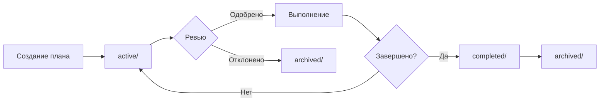

# Plans Directory

**Назначение**: Хранение планов работ, анализов и стратегических документов для проекта info-web.

**Последнее обновление**: 2026-02-15

---

## Структура каталога

```
.claude/plans/
├── README.md                              # Этот файл
├── active/                                # Активные планы (в работе)
├── completed/                             # Завершенные планы
├── archived/                              # Архив старых планов
│
├── EXECUTIVE_SUMMARY.md                   # Краткое резюме всех планов
├── documentation-reorganization-plan.md   # АКТИВНЫЙ: План реорганизации
├── current-state-analysis.md              # Анализ текущего состояния
└── cleanup-recommendations.md             # Рекомендации по cleanup
```

---

## Активные планы (Active Plans)

### 1. Documentation Reorganization Plan

**Файл**: [documentation-reorganization-plan.md](documentation-reorganization-plan.md)

**Статус**: ⏳ Ожидает одобрения

**Цель**: Реорганизовать всю структуру документации, агентов, планов и спецификаций в единую логичную систему.

**Ключевые задачи**:
- Создать `docs/` для всей документации
- Категоризовать агентов (core, specialists, testing)
- Создать `.claude/workflows/` и `.claude/tracking/`
- Обновить версии пакетов
- Консолидировать дублирующиеся документы

**Ожидаемый результат**: Упорядоченная, логичная, актуальная структура с минимальным дублированием.

**Связанные документы**:
- [current-state-analysis.md](current-state-analysis.md) - детальный анализ текущего состояния

---

## Анализы (Analyses)

### 1. Executive Summary

**Файл**: [EXECUTIVE_SUMMARY.md](EXECUTIVE_SUMMARY.md)

**Дата**: 2026-02-15

**Цель**: Краткое резюме всех планов и анализов для быстрого понимания ситуации.

**Содержит**:
- TL;DR всех проблем и решений
- 3 варианта выполнения (A, B, C)
- Риски и митигации
- FAQ

**Для кого**: Пользователь (для быстрого review)

---

### 2. Current State Analysis

**Файл**: [current-state-analysis.md](current-state-analysis.md)

**Дата**: 2026-02-15

**Цель**: Полный аудит текущей структуры документации для выявления проблем и возможностей улучшения.

**Ключевые находки**:
- 45 markdown файлов, общий размер ~720K
- Версии устарели в 60% документов
- Дублирование информации (~30%)
- Отсутствие иерархии и навигации
- Нет структуры для планов и tracking

**Рекомендации**: Реализовать Documentation Reorganization Plan

---

### 3. Cleanup Recommendations

**Файл**: [cleanup-recommendations.md](cleanup-recommendations.md)

**Дата**: 2026-02-15

**Цель**: Выявить устаревший, дублирующий или избыточный контент для удаления.

**Ключевые находки**:
- 3 файла для полного удаления
- 12 файлов требуют cleanup секций
- 5 файлов для консолидации в 2
- Потенциальная экономия: ~100KB (~15%)

**Фазы cleanup**:
1. Безопасное удаление (~46KB)
2. Оптимизация SKILLS_GUIDE (~30KB)
3. Консолидация архитектуры (~20KB)
4. Cleanup версий (~5KB)
5. Архивация tracking (variable)

**Рекомендации**: Выполнить cleanup ДО или ПОСЛЕ реорганизации (см. документ)

---

## Workflow планов

### Lifecycle плана



### Категории планов

**Strategic (Стратегические)**:
- Долгосрочные планы (>1 месяц)
- Архитектурные изменения
- Инфраструктурные улучшения

**Tactical (Тактические)**:
- Краткосрочные планы (<1 месяц)
- Реорганизации
- Оптимизации

**Operational (Операционные)**:
- Планы задач (<1 неделя)
- Багфиксы
- Рефакторинги

---

## Правила работы с планами

### Создание плана

1. **Создать файл** в корне `.claude/plans/[plan-name].md`
2. **Использовать шаблон** (см. ниже)
3. **Связать с issues/specs** если применимо
4. **Получить одобрение** перед началом работы

### Во время выполнения

1. **Обновлять статус** в плане
2. **Создать tracking** в `.claude/tracking/`
3. **Ссылаться на план** в commits

### После завершения

1. **Обновить статус** на "Completed"
2. **Переместить** в `completed/`
3. **Создать summary** результатов
4. **Архивировать** через 90 дней

---

## Шаблон плана (Plan Template)

```markdown
# Plan Title

**Дата создания**: YYYY-MM-DD
**Автор**: Agent/User
**Статус**: Draft | Active | Completed | Archived
**Приоритет**: P0 (Critical) | P1 (High) | P2 (Medium) | P3 (Low)

---

## Executive Summary

[2-3 предложения о цели плана]

## Background

### Текущее состояние
[Что есть сейчас]

### Проблемы
1. ...
2. ...

### Цели
1. ...
2. ...

## Detailed Plan

### Phase 1: [Name]
**Цель**: ...
**Шаги**:
1. ...

**Критерии успеха**:
- [ ] ...

### Phase N: ...

## Success Criteria

**Количественные**:
- [ ] Метрика 1: X → Y
- [ ] Метрика 2: A → B

**Качественные**:
- [ ] Критерий 1
- [ ] Критерий 2

## Risks & Mitigation

| Риск | Вероятность | Влияние | Митигация |
|------|-------------|---------|-----------|
| ... | Low/Med/High | Low/Med/High/Critical | ... |

## Timeline

**Оценка**: X часов/дней

| Фаза | Время | Статус |
|------|-------|--------|
| 1 | ... | ⏳ / ✅ / ❌ |

## Related Documents

- [Link to spec](...)
- [Link to analysis](...)

---

**Последнее обновление**: YYYY-MM-DD
**Статус**: [Current Status]
```

---

## Типы планов

### 1. Feature Implementation Plan

**Когда использовать**: Реализация новой фичи

**Связь**: `specs/active/[feature]_spec.md` → `.claude/plans/active/[feature]_plan.md`

**Ключевые секции**:
- Technical Design
- Implementation Phases
- Testing Strategy
- Rollout Plan

### 2. Refactoring Plan

**Когда использовать**: Крупный рефакторинг кода

**Ключевые секции**:
- Current State Analysis
- Target Architecture
- Migration Strategy
- Rollback Plan

### 3. Infrastructure Plan

**Когда использовать**: Изменения инфраструктуры

**Ключевые секции**:
- Current Infrastructure
- Proposed Changes
- Deployment Strategy
- Monitoring Plan

### 4. Documentation Plan

**Когда использовать**: Улучшение документации (как этот документ!)

**Ключевые секции**:
- Current State Analysis
- Target Structure
- Migration Plan
- Verification Strategy

---

## Retention Policy

### Active Plans
- **Срок хранения**: Пока план активен
- **Расположение**: `.claude/plans/active/`
- **Action**: Переместить в `completed/` после завершения

### Completed Plans
- **Срок хранения**: 90 дней
- **Расположение**: `.claude/plans/completed/`
- **Action**: Переместить в `archived/` через 90 дней

### Archived Plans
- **Срок хранения**: 1 год
- **Расположение**: `.claude/plans/archived/`
- **Action**: Можно удалить после 1 года

---

## Best Practices

### DO (Делать)

✅ **Создавать планы для крупных задач** (>3 часов работы)
✅ **Связывать планы со specs** где применимо
✅ **Обновлять статус** регулярно
✅ **Использовать шаблоны** для консистентности
✅ **Добавлять метрики успеха** (measurable)
✅ **Документировать риски** и митигации

### DON'T (Не делать)

❌ **Создавать планы для тривиальных задач** (<1 час)
❌ **Оставлять планы устаревшими** (обновлять!)
❌ **Смешивать план и implementation tracking** (разные файлы)
❌ **Забывать про retention policy** (переносить и архивировать)
❌ **Делать очень детальные планы** (balance detail vs overhead)

---

## Связь с другими каталогами

### Plans ↔ Specs

```
specs/active/feature.md          (ЧТО делать)
    ↓
.claude/plans/active/feature_plan.md    (КАК делать)
    ↓
.claude/plans/active/feature_impl.md    (Tracking выполнения)
```

### Plans ↔ Tracking

```
.claude/plans/active/plan.md     (План)
    ↓
.claude/tracking/logs/           (Логи выполнения)
.claude/tracking/reports/        (Отчеты о прогрессе)
```

### Plans ↔ Agents

**Feature-Planner** → создает `specs/`
**Architect** → создает `.claude/plans/` для сложных задач
**Feature-Builder** → использует `specs/` и `plans/`

---

## FAQ

### Когда создавать план?

**Создавать план когда**:
- Задача займет >3 часов
- Требуется координация между агентами
- Есть риски и нужны митигации
- Нужно одобрение перед началом

**Не создавать план когда**:
- Задача тривиальная (<1 час)
- Уже есть spec и он достаточно детальный
- Quickfix или hotfix

### В чем разница между Plan и Spec?

**Spec (Спецификация)**:
- **ЧТО** нужно сделать (requirements)
- Создается **Feature-Planner**
- Фокус на **функциональности**
- Расположение: `specs/`

**Plan (План)**:
- **КАК** нужно сделать (implementation)
- Создается **Architect** или **Feature-Builder**
- Фокус на **стратегии реализации**
- Расположение: `.claude/plans/`

### Где хранить implementation tracking?

**Implementation tracking** (`[feature]_implementation.md`):
- Создается **Feature-Builder**
- Хранится в `.claude/plans/active/`
- Содержит чеклисты выполнения
- Переносится в `completed/` вместе с планом

---

## Navigation

- [← Back to .claude/](..)
- [→ Executive Summary](EXECUTIVE_SUMMARY.md)
- [→ Documentation Reorganization Plan](documentation-reorganization-plan.md)
- [→ Current State Analysis](current-state-analysis.md)
- [→ Cleanup Recommendations](cleanup-recommendations.md)
- [↑ Project Root](../..)

---

**Maintainer**: Claude Code + User
**Last Review**: 2026-02-15
**Next Review**: 2026-03-15 (monthly)
