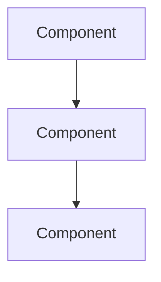

# Technical Specification: [Feature Name]

## Metadata
- **Created**: [Date]
- **Author**: Feature Planner Agent
- **Status**: Draft | Approved | In Implementation | Implemented
- **Complexity**: Low | Medium | High

## Executive Summary

[2-3 sentence overview of what this feature does and why it's needed]

---

## Requirements

### User Story

As a [role], I want [feature] so that [benefit].

### Acceptance Criteria

1. **GIVEN** [precondition] **WHEN** [action] **THEN** [result]
2. **GIVEN** [precondition] **WHEN** [action] **THEN** [result]

### Functional Requirements

- **FR1**: [Requirement description]
- **FR2**: [Requirement description]

### Non-Functional Requirements (if applicable)

- **NFR1**: [Performance/security/accessibility requirement]

---

## Technical Design

### Architecture Overview



### Component Specifications

#### Component: [Name]

**Purpose**: [What this component does]

**Location**: `src/path/to/component.tsx`

**Props/Inputs**:
```yaml
props:
  name: string  # Description
  value: number # Description
```

**Behavior**:
- [Behavior 1]
- [Behavior 2]

#### Component: [Name]

[Repeat for each component]

### Data Models

```yaml
Entity:
  id: uuid
  name: string
  createdAt: timestamp
  relations:
    - belongsTo: OtherEntity
```

### API Contracts (if applicable)

```yaml
tRPC Procedure:
  name: example.create
  type: mutation
  input:
    name: string (required)
    value: number (optional)
  output:
    id: string
    name: string
  errors:
    - BAD_REQUEST: Invalid input
    - UNAUTHORIZED: Not authenticated
```

---

## Implementation Guidance

### Development Phases

1. **Phase 1**: Foundation
   - [Task 1]
   - [Task 2]

2. **Phase 2**: Core Logic
   - [Task 1]
   - [Task 2]

3. **Phase 3**: Polish
   - [Task 1]
   - [Task 2]

### Integration Points

| Integration | Description |
|-------------|-------------|
| [System/Component] | [How it integrates] |

### Dependencies

- [Dependency 1]
- [Dependency 2]

---

## Test Strategy

### Unit Tests

- [Test scenario 1]
- [Test scenario 2]

### Integration Tests

- [Integration scenario 1]

### E2E Tests (if applicable)

- [User journey 1]

---

## Risks and Mitigations

| Risk | Impact | Probability | Mitigation |
|------|--------|-------------|------------|
| [Risk description] | High/Medium/Low | High/Medium/Low | [Mitigation approach] |

---

## Open Questions

- [ ] [Question 1]
- [ ] [Question 2]

---

## References

- [Link to related documentation]
- [Link to design]
