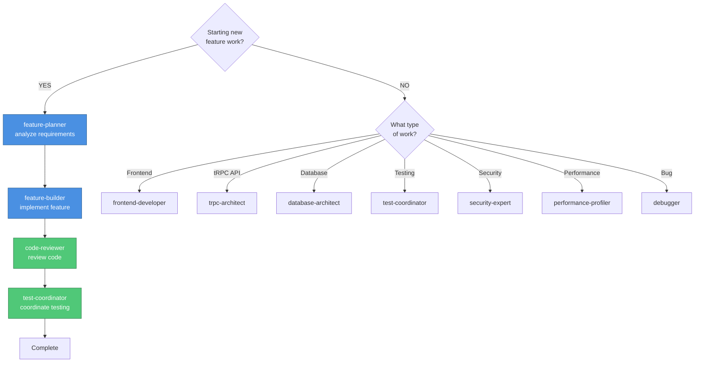
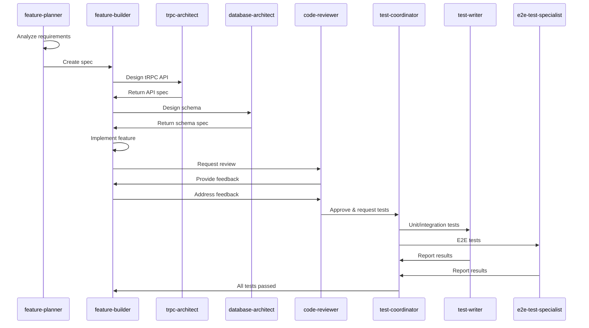

# Agent Usage Guidelines - T3 Stack Project

## Unified Agent Organization
All agents are consolidated in `/.claude/agents/` with clear naming conventions. Agents are available from any working directory in the repository.

## Available Agents

### 🚀 Core Workflow Agents
Essential agents for the main development workflow:

- **feature-planner**: Strategic planning for new features
  - **Purpose**: Creates detailed technical specifications (NO code in specs)
  - **Use Cases**:
    - Starting work on new features
    - Breaking down complex requirements
    - Creating technical specifications before coding
    - Planning implementation approach
  - **Typical Flow**:
    1. Analyzes requirements EXACTLY as stated
    2. Explores codebase with filesystem tools (Grep, Glob, Read)
    3. Designs technical approach (data models, tRPC contracts, Drizzle schemas)
    4. Validates approach with `mcp__codex-high__codex` (interactive dialogue, max 5 exchanges)
    5. Generates spec document with NO programming code
  - **MCP Tools Used**: codex-high, filesystem tools
  - **Generates**: `/specs/[feature-name]_spec.md` (kebab-case naming)

- **feature-builder**: Systematic feature implementation
  - **Purpose**: Implements features from specifications with comprehensive validation
  - **Use Cases**:
    - Implementing features from `/specs/` documents
    - Component-by-component development
    - Ensuring best practices compliance
    - Coordinating testing and review cycles
  - **Typical Flow**:
    1. Reads specification from `/specs/[feature-name]_spec.md`
    2. Implements components incrementally per spec
    3. Validates decisions with `mcp__codex-medium__codex` (interactive, max 3 exchanges)
    4. Submits to `code-reviewer` and iterates until approval
    5. Requests tests from `test-coordinator` after review approval
    6. Final validation with `mcp__codex-high__codex` (interactive, max 5 exchanges)
  - **MCP Tools Used**: codex-medium, codex-high, filesystem tools
  - **Collaborates With**: `code-reviewer`, `test-coordinator`
  - **Generates**: `/specs/[feature-name]_implementation.md`

- **code-reviewer**: Code quality and best practices review
  - **Purpose**: Reviews code for quality, patterns, and best practices
  - **Use Cases**:
    - Pre-commit code review
    - Pattern identification
    - Refactoring suggestions
    - TypeScript type safety review
  - **Expertise**:
    - SOLID principles
    - Design patterns
    - Code smells
    - Next.js 16 best practices
    - React 19 patterns
    - tRPC conventions
    - Drizzle ORM patterns
  - **MCP Tools Used**: codex-high (validation), filesystem tools
  - **Generates**: `review.md` with detailed findings

### 🌐 Universal Agents
Cross-cutting concerns applicable to all development work:

- **debugger**: Complex debugging and troubleshooting
  - **Use for**: Difficult bugs, performance issues, system failures
  - **Expertise**:
    - Root cause analysis
    - Debugging strategies
    - Log analysis
    - Next.js error handling
    - tRPC error debugging
    - React 19 hydration issues

- **security-expert**: Security vulnerability assessment
  - **Use for**: Security audits, OWASP vulnerabilities, authentication/authorization
  - **Expertise**:
    - NextAuth v5 security
    - OAuth flows (Yandex OAuth)
    - Session management
    - CSRF/XSS protection
    - SQL injection prevention
    - Data validation

- **prompt-engineer**: Optimize prompts and documentation
  - **Use for**: Improving agent instructions, documentation clarity
  - **Expertise**: LLM prompt patterns, documentation best practices

### 🎨 Frontend Agents

- **frontend-developer** ⭐ PRIMARY
  - **Purpose**: Comprehensive frontend engineering
  - **Use for**: ALL frontend work - Next.js, React, performance, accessibility, UI/UX
  - **Expertise**:
    - Next.js 16 App Router
    - React 19 Server Components
    - TailwindCSS 4
    - Radix UI components
    - TypeScript patterns
    - Core Web Vitals optimization
    - tRPC client integration
  - **MCP Integration**:
    - Chrome DevTools MCP (performance analysis)
    - Playwright MCP (E2E testing)
    - Figma MCP (design implementation)
  - **Modes**:
    - `architecture-review`: Component patterns and structure
    - `perf-audit`: Performance optimization
    - `trpc-integration`: API integration
    - `testing`: Test implementation
    - `a11y`: Accessibility compliance
    - `ui-ux-review`: Design system and UX

- **design-system-coordinator**
  - **Purpose**: Figma-to-code translation and design-system maintenance
  - **Use for**:
    - Analyzing Figma designs
    - Extracting design tokens
    - Ensuring design-code parity
    - Accessibility translation
  - **Expertise**:
    - Figma API integration
    - Design token extraction
    - WCAG 2.1 AA compliance
    - TailwindCSS custom properties
    - Visual parity validation
  - **MCP Integration**:
    - Figma MCP (design extraction)
    - Chrome DevTools MCP (visual verification)
  - **Modes**:
    - `figma-analysis`
    - `token-extraction`
    - `parity-validation`
    - `accessibility-translation`

### 🧪 Testing Agents

- **test-coordinator** ⭐ ORCHESTRATOR
  - **Purpose**: Coordinates all testing work across specialists (does NOT write tests)
  - **Use for**: Routing testing work, aggregating results, enforcing quality gates
  - **Expertise**: Test strategy, coverage requirements, failure triage
  - **MCP Integration**: codex-medium (quick coordination decisions)
  - **Coverage Targets**:
    - Frontend unit/integration: 80%
    - E2E critical flows: 100%
  - **Typical Flow**:
    1. Receives testing request from feature-builder
    2. Assesses scope and risk level
    3. Routes to test-writer (unit/integration) or e2e-test-specialist
    4. Aggregates results and enforces quality gates
    5. Coordinates test-analyzer for complex failures
    6. Reports final status to feature-builder
  - **Called By**: `feature-builder` after code review approval
  - **Collaborates With**: `test-writer`, `e2e-test-specialist`, `test-analyzer`

- **test-writer**: Unit and integration test specialist
  - **Purpose**: Creates and executes unit/integration tests (NO E2E)
  - **Scope**: Jest + React Testing Library ONLY
  - **Use Cases**:
    - Writing tests from feature specifications
    - Component testing with RTL
    - tRPC client mocking
    - Hook testing
    - Utility function testing
    - Ensuring coverage targets
  - **Typical Flow**:
    1. Receives work from test-coordinator
    2. Uses codex-medium for quick pattern validation
    3. Writes tests following Jest/RTL patterns
    4. Single codex-high validation
    5. Executes tests and verifies coverage
    6. **If multiple failures**: Calls test-analyzer
    7. Reports to test-coordinator
  - **MCP Tools Used**: codex-medium, codex-high
  - **Test Patterns**:
    - Component rendering tests
    - User interaction tests
    - tRPC query/mutation mocking
    - Server Component testing
    - Form validation testing
  - **Does NOT handle**: E2E tests, accessibility tests

- **e2e-test-specialist**
  - **Purpose**: E2E and accessibility testing with Playwright
  - **Scope**: Playwright E2E + WCAG 2.1 AA accessibility
  - **Use for**:
    - Creating/maintaining E2E tests
    - User journey testing
    - Accessibility compliance
    - Cross-browser/device testing
  - **Expertise**:
    - Playwright test runner
    - Page object patterns
    - Cross-browser compatibility
    - axe-core accessibility testing
    - Screen reader testing (VoiceOver)
  - **MCP Integration**:
    - Playwright MCP (browser automation)
    - Chrome DevTools MCP (debugging)
  - **Risk-Based Requirements**:
    - **HIGH**: Auth flows (Yandex OAuth), property registration (100% coverage)
    - **MEDIUM**: Core features (80% coverage, Chrome + Safari)
    - **LOW**: Non-critical features (60% coverage, Chrome only)
  - **Typical Flow**:
    1. Receives work from test-coordinator
    2. Performs risk assessment
    3. Designs E2E test strategy
    4. Validates with codex-high
    5. Implements Playwright tests
    6. Integrates accessibility testing
    7. Reports to test-coordinator
  - **Accessibility Testing**:
    - Automated axe-playwright
    - Manual keyboard navigation
    - Screen reader testing
    - 200% zoom testing
  - **Called By**: `test-coordinator`

- **test-analyzer**: Universal test failure analyzer
  - **Purpose**: Analyzes ALL test failures (Jest, Playwright)
  - **Context Adaptation**: Automatically detects frontend/E2E from file paths
  - **Use Cases**:
    - Analyzing multiple test failures (>3 tests)
    - Identifying root causes
    - Creating actionable fix reports
    - Preventing cascading failures
  - **Typical Flow**:
    1. Receives failure analysis request
    2. Runs tests and collects failure data
    3. Uses codex-medium for pattern recognition
    4. Groups failures by root cause
    5. Generates structured analysis
    6. Hands off to requesting specialist
  - **Failure Patterns**:
    - Component rendering failures
    - tRPC mock configuration issues
    - Playwright selector failures
    - Timeout issues
    - Hydration mismatches
  - **MCP Tools Used**: codex-medium, filesystem, bash
  - **Called By**: `test-writer`, `e2e-test-specialist`

### 🔧 Backend Agents

- **trpc-architect**: tRPC API design and optimization
  - **Purpose**: Designs and optimizes tRPC routers and procedures
  - **Use Cases**:
    - Creating new tRPC routers
    - Designing procedures with proper error handling
    - Input validation with Zod schemas
    - Optimizing query performance
    - Ensuring type safety end-to-end
  - **Expertise**:
    - tRPC v11 patterns
    - Zod validation schemas
    - React Query integration
    - Server-side error handling
    - Middleware patterns
  - **Typical Flow**:
    1. Receives requirements from feature-planner or feature-builder
    2. Reviews existing routers
    3. Designs procedure contracts with Zod
    4. Validates with codex-high
    5. Documents usage patterns
  - **MCP Tools Used**: codex-high, filesystem tools
  - **Called By**: `feature-planner`, `feature-builder`
  - **Generates**: `/specs/trpc/[feature-name]_trpc_spec.md`

- **database-architect**: Database schema and query design
  - **Purpose**: Designs Drizzle schemas and optimizes database queries
  - **Use Cases**:
    - Creating Drizzle table definitions
    - Designing relationships and indexes
    - Query optimization
    - Migration strategy
    - PostgreSQL-specific optimizations
  - **Expertise**:
    - Drizzle ORM patterns
    - PostgreSQL best practices
    - Index optimization
    - Migration management
    - Type-safe queries
  - **Typical Flow**:
    1. Receives requirements
    2. Reviews existing schema
    3. Designs new tables/relations
    4. Plans migration strategy
    5. Validates with codex-high
  - **MCP Tools Used**: codex-high, filesystem tools
  - **Generates**: `/specs/database/[feature-name]_schema_spec.md`

- **performance-profiler**: Performance optimization specialist
  - **Purpose**: Identifies and fixes performance bottlenecks
  - **Use Cases**:
    - Database query optimization
    - tRPC procedure performance
    - React rendering optimization
    - Server Component caching
    - Image optimization
  - **Expertise**:
    - Next.js performance patterns
    - React 19 optimization
    - Drizzle query optimization
    - Caching strategies
    - Core Web Vitals
  - **MCP Integration**: Chrome DevTools MCP (profiling)

### 🏗️ Architecture Agent

- **architect**: Strategic architecture problem solver
  - **Purpose**: Solves complex architectural problems and designs scalable solutions
  - **Use Cases**:
    - Solving performance/scalability bottlenecks
    - Designing system architecture
    - Planning major refactoring
    - Integration strategies
    - Data migration planning
  - **Typical Flow**:
    1. Analyzes problem domain and constraints
    2. Designs multiple solution approaches
    3. Evaluates trade-offs
    4. Validates with codex-high (interactive, max 5 exchanges)
    5. Creates diagrams and migration strategies
    6. Documents Architecture Decision Records (ADRs)
    7. Hands off to feature-planner
  - **MCP Tools Used**: codex-high, mermaid-generator, mermaid-validator
  - **Generates**: `/specs/architecture/[problem-name]_spec.md` and ADRs

## Agent Selection Guide

### Quick Reference

| Task | Primary Agent | Supporting Agents |
|------|--------------|-------------------|
| New feature planning | feature-planner | architect (if complex) |
| Feature implementation | feature-builder | trpc-architect, database-architect |
| Code review | code-reviewer | - |
| Frontend work | frontend-developer | design-system-coordinator |
| Unit/integration tests | test-writer | test-analyzer |
| E2E tests | e2e-test-specialist | test-analyzer |
| tRPC API design | trpc-architect | - |
| Database schema | database-architect | - |
| Performance issues | performance-profiler | frontend-developer |
| Security review | security-expert | - |
| Bug investigation | debugger | - |

### Workflow Decision Tree



### Standard Feature Development Flow



## Technology Stack Context

### T3 Stack Components
- **Next.js 16.0.1**: App Router, React Server Components, API routes
- **React 19.2.0**: Server Components, Suspense, use hook
- **tRPC 11.7.1**: Type-safe API layer, React Query integration
- **Drizzle ORM 0.44.7**: PostgreSQL ORM with type-safe queries
- **NextAuth 5.0.0-beta.25**: Authentication with Yandex OAuth
- **TailwindCSS 4.1.17**: Utility-first CSS framework
- **Radix UI**: Accessible component primitives
- **Zod**: Runtime type validation
- **TypeScript 5.9.3**: Strict mode enabled

### Package Manager
- **Bun 1.3+**: Primary package manager and runtime

### Testing Stack
- **Jest**: Unit and integration testing
- **React Testing Library**: Component testing
- **Playwright**: E2E and accessibility testing
- **axe-playwright**: Automated accessibility testing

### Development Tools
- **ESLint 9**: Flat config with comprehensive rules
- **Prettier**: Code formatting
- **Docker**: PostgreSQL database containerization

## Best Practices

### Agent Collaboration
1. **Always start with feature-planner** for new features
2. **Use test-coordinator** to orchestrate all testing work
3. **Engage specialists early** (trpc-architect, database-architect) for design validation
4. **Validate with Codex** at strategic decision points
5. **Document specifications** before implementation

### MCP Tool Usage
1. **Playwright MCP**: Use for E2E testing and browser automation
2. **Chrome DevTools MCP**: Use for performance profiling and debugging
3. **Figma MCP**: Use for design-to-code translation
4. **Codex MCP**: Use for architecture validation and complex decisions
5. **Mermaid MCPs**: Use for diagram creation and validation

### Code Quality
1. **Type safety**: Leverage TypeScript strict mode throughout
2. **Validation**: Use Zod for runtime validation at API boundaries
3. **Testing**: Maintain 80%+ frontend coverage, 100% for critical flows
4. **Accessibility**: Follow WCAG 2.1 AA standards
5. **Performance**: Optimize for Core Web Vitals

### Security
1. **Authentication**: NextAuth v5 with secure session management
2. **Authorization**: Validate user permissions at API layer
3. **Input validation**: Zod schemas for all tRPC inputs
4. **CSRF protection**: Enabled by default in Next.js
5. **SQL injection**: Prevented by Drizzle parameterized queries

## Common Patterns

### tRPC Procedure Pattern
```typescript
export const myRouter = createTRPCRouter({
  myProcedure: protectedProcedure
    .input(z.object({ id: z.string() }))
    .query(async ({ ctx, input }) => {
      return await ctx.db.query.table.findFirst({
        where: eq(table.id, input.id),
      });
    }),
});
```

### Server Component Pattern
```typescript
export default async function Page() {
  const data = await api.myRouter.myProcedure({ id: "123" });
  return <div>{data.name}</div>;
}
```

### Client Component with tRPC
```typescript
"use client";
export function MyComponent() {
  const { data } = api.myRouter.myProcedure.useQuery({ id: "123" });
  return <div>{data?.name}</div>;
}
```

---

*For detailed agent instructions, see individual agent files in `/.claude/agents/`*
