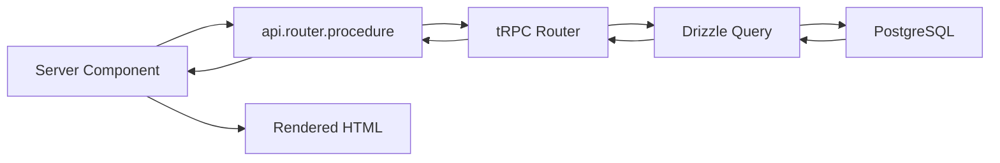
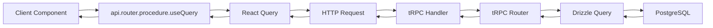

# T3 Stack Architecture

## Overview

This project uses the [T3 Stack](https://create.t3.gg/) - a modern, full-stack TypeScript framework combining Next.js, tRPC, and Drizzle ORM for type-safe, rapid development. The application is designed for residential complex management (buildings, apartments, parking, property claims, listings).

## Core Principles

1. **End-to-end Type Safety** - TypeScript from database to UI
2. **Server-First** - Leverage React Server Components by default
3. **Type-Safe APIs** - tRPC provides automatic type inference
4. **Modern React** - React 19 with Server Components and Suspense
5. **Database Type Safety** - Drizzle ORM with TypeScript schemas
6. **Role-Based Access Control** - Granular permissions system

## Technology Stack

### Framework Layer
| Package | Version | Purpose |
|---------|---------|---------|
| Next.js | 16 | React framework with App Router |
| React | 19 | UI library with Server Components |
| TypeScript | 5 | Type-safe JavaScript (strict mode) |

### API Layer
| Package | Version | Purpose |
|---------|---------|---------|
| tRPC | 11 | End-to-end type-safe APIs |
| React Query | 5 | Data fetching and caching |
| Zod | 4 | Runtime validation and type inference |

### Data Layer
| Package | Version | Purpose |
|---------|---------|---------|
| Drizzle ORM | 0.45 | Type-safe SQL query builder |
| PostgreSQL | - | Relational database |
| postgres.js | - | PostgreSQL client |

### Authentication
| Package | Version | Purpose |
|---------|---------|---------|
| NextAuth | 5 (beta) | Authentication framework |
| bcryptjs | - | Password hashing |

### Styling & UI
| Package | Version | Purpose |
|---------|---------|---------|
| TailwindCSS | 4 | Utility-first CSS |
| Radix UI | - | Accessible component primitives |

### State Management
| Package | Version | Purpose |
|---------|---------|---------|
| Zustand | 5 | Lightweight global state |

## Project Structure

```
src/
├── app/                    # Next.js App Router
│   ├── (main)/            # Main layout group
│   │   ├── listings/      # Apartment & parking listings
│   │   ├── my/            # User cabinet
│   │   │   └── (cabinet)/ # Protected cabinet routes
│   │   │       ├── ads/           # Manage listings
│   │   │       ├── notifications/ # User notifications
│   │   │       ├── profile/       # User profile
│   │   │       ├── property/      # Property management
│   │   │       └── security/      # Security settings
│   │   ├── info/[slug]/   # Info pages
│   │   ├── map/           # Map view
│   │   ├── login/         # Login page
│   │   ├── register/      # Registration
│   │   ├── forgot-password/    # Password recovery
│   │   ├── reset-password/     # Password reset
│   │   └── verify-email/       # Email verification
│   ├── (admin)/           # Admin panel routes
│   │   └── admin/         # Admin dashboard
│   ├── _components/       # Root layout components
│   └── api/               # API routes
│       ├── auth/          # NextAuth endpoints
│       └── trpc/          # tRPC HTTP adapter
│
├── components/            # React components
│   ├── admin/             # Admin-specific components
│   ├── auth/              # Authentication components
│   ├── community/         # Community features
│   ├── social-icons/      # Social provider icons
│   └── ui/                # Radix UI + Shadcn components (30+)
│
├── hooks/                 # Custom React hooks
│   └── use-toast.ts       # Toast notifications
│
├── lib/                   # Shared utilities
│   ├── utils.ts           # Helper functions (cn, etc.)
│   ├── weather.ts         # Weather integration
│   └── validations/       # Zod schemas
│       └── auth.ts        # Auth validation schemas
│
├── server/                # Server-side code
│   ├── api/               # tRPC API
│   │   ├── routers/       # Feature-specific routers (8)
│   │   ├── root.ts        # Root router
│   │   └── trpc.ts        # tRPC setup and context
│   ├── auth/              # Authentication
│   │   ├── config.ts      # NextAuth configuration
│   │   ├── rbac.ts        # Role-based access control
│   │   └── providers/     # Custom OAuth providers
│   ├── db/                # Database
│   │   ├── index.ts       # Database connection
│   │   ├── schema.ts      # Schema exports
│   │   └── schemas/       # Drizzle table schemas
│   ├── email/             # Email service (Nodemailer + MJML)
│   └── notifications/     # Notification service
│
├── stores/                # Zustand stores
│   └── theme-store.ts     # Theme management
│
├── trpc/                  # tRPC client setup
│   ├── query-client.ts    # React Query configuration
│   ├── react.tsx          # tRPC React hooks
│   └── server.ts          # Server-side tRPC caller
│
├── types/                 # TypeScript definitions
│
├── styles/                # Global styles
│   └── globals.css        # Tailwind + custom CSS
│
└── env.js                 # Environment variable validation
```

## tRPC Routers

### Available Routers (8)

| Router | Description | Procedures |
|--------|-------------|------------|
| `auth` | Authentication | register, login, password reset, email verification, OAuth linking |
| `profile` | User profile | get/update profile, messengers, privacy settings |
| `listings` | Real estate listings | CRUD, photos, status management, moderation |
| `claims` | Property claims | submit, status tracking, document upload |
| `directory` | Building directory | entries, contacts, tags, scope filtering |
| `notifications` | User notifications | get, mark read, real-time |
| `admin` | Admin operations | user/building management, feature control |
| `post` | Posts/content | create, read |

### Procedure Types

```typescript
publicProcedure      // No auth required
protectedProcedure   // User auth required
adminProcedure       // Admin role required
adminProcedureWithFeature(feature)  // Feature-based access
```

## Database Schema

### Core Tables (13+)

#### Authentication & Users
```
users
├── accounts (OAuth accounts)
├── sessions
├── userRoles (RBAC)
├── userProfiles (extended info, messengers, privacy)
├── passwordResetTokens
├── emailVerificationTokens
└── telegramAuthTokens
```

#### Buildings & Properties
```
buildings
├── buildingChannels (Telegram, Email, WhatsApp)
├── entrances
│   └── floors
│       └── apartments

parkings
└── parkingFloors
    └── parkingSpots
```

#### User-Property Relationships
```
userApartments (user_id, apartment_id, status, role)
userParkingSpots (user_id, parking_spot_id, status, role)
```

#### Listings
```
listings
├── listingPhotos (up to 20)
├── Statuses: draft, pending_moderation, approved, rejected, archived
└── Archive reasons: manual, expired, rights_revoked, admin
```

#### Claims
```
propertyClaims
├── Types: apartment, parking, commercial
├── Statuses: pending, review, approved, rejected, documents_requested
└── References: apartment, parking, or organization
```

#### Organizations & Directory
```
organizations
└── organizationTags

directoryEntries
├── directoryContacts
├── directoryTags
├── Types: contact, organization, location, document
└── Scope: core, commerce, city, promoted
```

#### Other
```
notifications
deletionRequests
contacts
posts
```

## Authentication System

### OAuth Providers (8)
- **Primary**: Yandex
- **Standard**: VK, Google, Mail.ru
- **Custom**: Одноклассники, Sber, Tinkoff
- **Bot**: Telegram

### Credentials
- Email/password with bcrypt hashing
- Email verification required
- Password reset flow

### RBAC (Role-Based Access Control)

#### User Roles (12)
```
Root, SuperAdmin, Admin
Editor, Moderator
BuildingChairman, ComplexChairman, ComplexRepresentative
ApartmentOwner, ApartmentResident
ParkingOwner, ParkingResident
StoreOwner, StoreRepresentative
Guest
```

#### Admin Features (16)
```
admin:access
users:view, users:manage, users:roles, users:delete
buildings:view, buildings:manage
properties:view, properties:approve
claims:view, claims:review
listings:view, listings:moderate
content:view, content:moderate
directory:manage
system:settings, system:logs
```

### Test Accounts (Development)
| Account | Email | Roles |
|---------|-------|-------|
| admin | admin@test.local | Root, SuperAdmin, Admin |
| moderator | moderator@test.local | Moderator |
| owner | owner@test.local | ApartmentOwner, ParkingOwner |
| resident | resident@test.local | ApartmentResident |
| editor | editor@test.local | Editor |
| guest | guest@test.local | Guest |

## Email System

### Configuration
- Provider: Nodemailer
- Templates: MJML (compiled to HTML)
- Location: `/public/templates/email/`

### Environment Variables
```
SMTP_HOST, SMTP_PORT (465), SMTP_SECURE (true)
SMTP_USER, SMTP_PASSWORD
SMTP_FROM_NAME ("Парадная")
SMTP_FROM_EMAIL, SMTP_REPLY_TO
```

## Notifications Service

### Event Types
- User registration / email verification
- Password reset (requested/completed)
- Account linking/unlinking (OAuth)
- Property claims (submitted/approved/rejected)
- Security alerts (login, suspicious activity)

### Usage
```typescript
import { notifyAsync } from "~/server/notifications";

notifyAsync({
  type: "user.registered",
  userId: user.id,
  email: user.email,
  name: user.name,
});
```

## Data Flow

### Server Component


### Client Component


## Development Workflow

### Commands

```bash
# Development
bun dev                  # Start dev server (port 3000, Turbopack)
bun run build            # Build for production
bun run preview          # Preview production build
bun run start            # Start production server

# Code Quality
bun run check            # Lint + TypeScript check
bun run lint             # ESLint check
bun run lint:fix         # ESLint fix
bun run format:check     # Prettier check
bun run format:write     # Prettier format
bun run typecheck        # TypeScript check

# Database
bun run db:push          # Push schema to database
bun run db:generate      # Generate migrations
bun run db:migrate       # Run migrations
bun run db:studio        # Drizzle Studio
bun run db:seed          # Seed database
bun run db:reset         # Reset database
bun run db:init          # Initialize (push + seed)

# Email & Crons
bun run email:compile    # Compile email templates (MJML → HTML)
bun run cron:listing-expiration  # Process listing expiration
```

### Quick Start
```bash
docker-compose up -d     # Start PostgreSQL
bun run db:push          # Push schema
bun dev                  # Start dev server
```

### Access Points
- **Frontend**: http://localhost:3000
- **Database Studio**: `bun run db:studio`

## Type Safety Chain

```
Database Schema (Drizzle)
    ↓ (inferred)
TypeScript Types
    ↓ (used in)
tRPC Router
    ↓ (inferred)
tRPC Client Types
    ↓ (used in)
React Components
```

**Result**: End-to-end type safety from database to UI with zero manual type definitions.

## State Management

### Server State (React Query via tRPC)
- **Queries**: Data fetching with caching
- **Mutations**: Data updates with optimistic updates
- **Invalidation**: Automatic cache invalidation

### Client State
- **Zustand**: Theme management, global state
- **useState/useReducer**: Local component state

### URL State (Next.js Router)
- **Search params**: Filters, pagination
- **Route params**: Resource IDs

## Security Measures

1. **NextAuth Session Management** - Secure, HTTP-only cookies
2. **tRPC Protected Procedures** - Server-side auth checks
3. **RBAC with Feature Flags** - Granular permission control
4. **Zod Input Validation** - Runtime type checking
5. **Drizzle Parameterized Queries** - SQL injection prevention
6. **bcrypt Password Hashing** - Secure password storage
7. **Email Verification** - Required for password-based accounts
8. **CSRF Protection** - Built into Next.js
9. **Environment Variable Validation** - @t3-oss/env-nextjs

## UI Components

### Radix UI + Shadcn (30+)
- accordion, avatar, button, button-group
- card, command, dialog, dropdown-menu
- form, input, label, menubar
- navigation-menu, popover, radio-group
- scroll-area, select, separator, sheet
- tabs, textarea, toast (sonner), tooltip
- breadcrumb, badge, calendar, checkbox

## Environment Variables

### Required
```bash
# Database
DATABASE_URL
DATABASE_NAME

# Auth
AUTH_SECRET
NEXTAUTH_URL

# OAuth (Primary)
YANDEX_CLIENT_ID
YANDEX_CLIENT_SECRET

# Email
SMTP_HOST, SMTP_PORT, SMTP_USER, SMTP_PASSWORD
```

### Optional OAuth
```bash
VK_CLIENT_ID, VK_CLIENT_SECRET
GOOGLE_CLIENT_ID, GOOGLE_CLIENT_SECRET
MAILRU_CLIENT_ID, MAILRU_CLIENT_SECRET
OK_CLIENT_ID, OK_CLIENT_SECRET, OK_PUBLIC_KEY
SBER_CLIENT_ID, SBER_CLIENT_SECRET
TINKOFF_CLIENT_ID, TINKOFF_CLIENT_SECRET
TELEGRAM_BOT_TOKEN
```

## Key Conventions

1. **Server Components**: Default, no "use client" needed
2. **Client Components**: Add "use client" directive
3. **tRPC Procedures**: Always validate inputs with Zod
4. **Database Queries**: Use Drizzle query builder
5. **Styling**: TailwindCSS utility classes
6. **Type Safety**: Let TypeScript infer, don't manually type
7. **Auth Checks**: Use protectedProcedure for authenticated routes
8. **Admin Checks**: Use adminProcedureWithFeature for granular access

## Project Status

- **Phase**: Active development (not production)
- **Breaking Changes**: Allowed
- **Testing**: Jest + React Testing Library (setup ready)

---

For detailed development guidelines, see [CLAUDE.md](CLAUDE.md)
