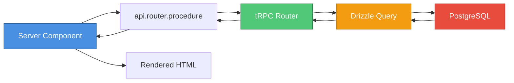
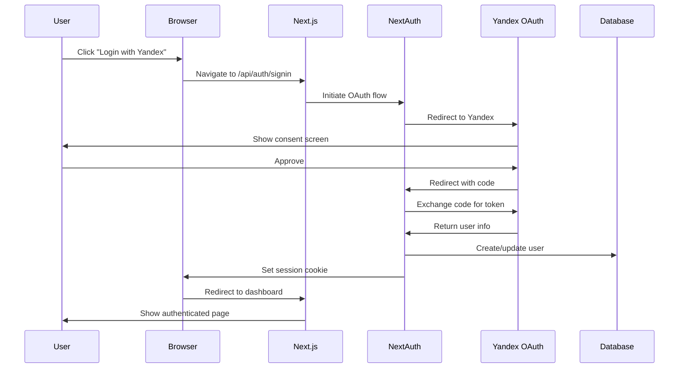
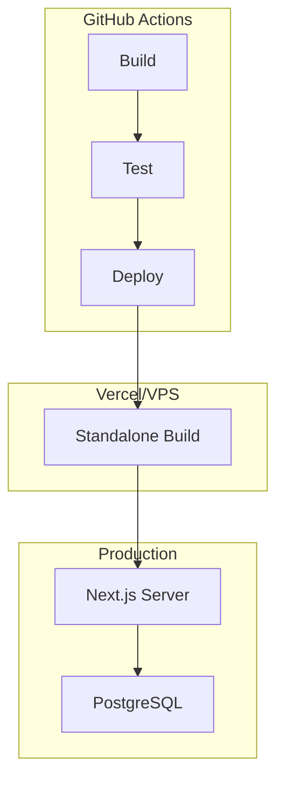

# T3 Stack Architecture

## Overview

This project uses the [T3 Stack](https://create.t3.gg/) - a modern, full-stack TypeScript framework combining Next.js, tRPC, and Drizzle ORM for type-safe, rapid development.

## Core Principles

1. **End-to-end Type Safety** - TypeScript from database to UI
2. **Server-First** - Leverage React Server Components by default
3. **Type-Safe APIs** - tRPC provides automatic type inference
4. **Modern React** - React 19 with Server Components and Suspense
5. **Database Type Safety** - Drizzle ORM with TypeScript schemas

## Technology Stack

### Framework Layer
- **Next.js 16.0.1** - React framework with App Router
- **React 19.2.0** - UI library with Server Components
- **TypeScript 5.9.3** - Type-safe JavaScript

### API Layer
- **tRPC 11.7.1** - End-to-end type-safe APIs
- **React Query** - Data fetching and caching (via tRPC)
- **Zod** - Runtime validation and type inference

### Data Layer
- **Drizzle ORM 0.44.7** - Type-safe SQL query builder
- **PostgreSQL** - Relational database
- **postgres.js** - PostgreSQL client

### Authentication
- **NextAuth 5.0.0-beta.25** - Authentication framework
- **Yandex OAuth** - OAuth provider

### Styling
- **TailwindCSS 4.1.17** - Utility-first CSS
- **Radix UI** - Accessible component primitives

## Project Structure

```
src/
├── app/                    # Next.js App Router pages
│   ├── (auth)/            # Auth-related pages
│   │   └── login/         # Login page
│   ├── api/               # API routes
│   │   ├── auth/          # NextAuth endpoints
│   │   └── trpc/          # tRPC HTTP adapter
│   ├── community/         # Community features
│   │   ├── chats/        # Chat functionality
│   │   └── rules/        # Community rules
│   ├── my/                # User dashboard
│   │   └── property/     # Property management
│   ├── layout.tsx         # Root layout
│   └── page.tsx           # Home page
│
├── components/            # React components
│   ├── ui/               # Radix UI + Shadcn components
│   ├── login-form.tsx    # Login form component
│   ├── navigation.tsx    # Navigation component
│   └── ...               # Other components
│
├── server/                # Server-side code
│   ├── api/              # tRPC routers
│   │   ├── routers/     # Feature-specific routers
│   │   ├── root.ts      # Root router (combines all routers)
│   │   └── trpc.ts      # tRPC setup and context
│   ├── auth/             # Authentication
│   │   ├── config.ts    # NextAuth configuration
│   │   └── index.ts     # Auth helpers
│   └── db/               # Database
│       ├── index.ts     # Database connection
│       └── schema.ts    # Drizzle schemas
│
├── trpc/                  # tRPC client setup
│   ├── query-client.ts   # React Query configuration
│   ├── react.tsx         # tRPC React hooks
│   └── server.ts         # Server-side tRPC caller
│
├── lib/                   # Shared utilities
│   └── utils.ts          # Helper functions
│
├── styles/                # Global styles
│   └── globals.css       # Tailwind + custom CSS
│
└── env.js                 # Environment variable validation
```

## Data Flow

### Server Component Data Flow



### Client Component Data Flow


## Authentication Flow



## tRPC Pattern

### 1. Define Schema (Database)

```typescript
// src/server/db/schema.ts
export const properties = pgTable("property", {
  id: uuid("id").defaultRandom().primaryKey(),
  userId: varchar("user_id", { length: 255 }).notNull(),
  buildingId: uuid("building_id").references(() => buildings.id),
  number: integer("number").notNull(),
  type: text("type", { enum: ["apartment", "parking"] }).notNull(),
});
```

### 2. Create Router (API)

```typescript
// src/server/api/routers/property.ts
export const propertyRouter = createTRPCRouter({
  getAll: protectedProcedure.query(async ({ ctx }) => {
    return await ctx.db.query.properties.findMany({
      where: eq(properties.userId, ctx.session.user.id),
    });
  }),

  register: protectedProcedure
    .input(z.object({
      buildingId: z.string(),
      number: z.number(),
      type: z.enum(["apartment", "parking"]),
    }))
    .mutation(async ({ ctx, input }) => {
      return await ctx.db.insert(properties).values({
        ...input,
        userId: ctx.session.user.id,
      });
    }),
});
```

### 3. Use in Server Component

```typescript
// src/app/my/property/page.tsx
export default async function PropertyPage() {
  const properties = await api.property.getAll();
  return (
    <div>
      {properties.map(p => (
        <div key={p.id}>{p.number}</div>
      ))}
    </div>
  );
}
```

### 4. Use in Client Component

```typescript
// src/components/property-form.tsx
"use client";

export function PropertyForm() {
  const utils = api.useUtils();
  const register = api.property.register.useMutation({
    onSuccess: () => utils.property.getAll.invalidate(),
  });

  const onSubmit = (data) => {
    register.mutate(data);
  };

  return <form onSubmit={handleSubmit(onSubmit)}>...</form>;
}
```

## Type Safety Chain

```
Database Schema (Drizzle)
    ↓ (inferred)
TypeScript Types
    ↓ (used in)
tRPC Router
    ↓ (inferred)
tRPC Client Types
    ↓ (used in)
React Components
```

**Result**: End-to-end type safety from database to UI with zero manual type definitions.

## State Management

### Server State (React Query via tRPC)
- **Queries**: Data fetching with caching
- **Mutations**: Data updates with optimistic updates
- **Invalidation**: Automatic cache invalidation

### Client State (React Hooks)
- **useState**: Local component state
- **useReducer**: Complex state logic
- **useContext**: Shared state (sparingly)

### URL State (Next.js Router)
- **Search params**: Filters, pagination
- **Route params**: Resource IDs

## Caching Strategy

### React Query (via tRPC)
```typescript
// Default configuration
const queryClient = new QueryClient({
  defaultOptions: {
    queries: {
      staleTime: 30 * 1000, // 30 seconds
      gcTime: 5 * 60 * 1000, // 5 minutes
    },
  },
});
```

### Next.js Caching
- **Server Components**: Automatic request memoization
- **Route Cache**: Cached by default in production
- **Data Cache**: Can be controlled with `revalidate`

## Database Schema

### Core Tables
- **users**: User accounts (managed by NextAuth)
- **accounts**: OAuth accounts (managed by NextAuth)
- **sessions**: User sessions (managed by NextAuth)
- **verification_tokens**: Email verification (managed by NextAuth)
- **buildings**: Building information
- **properties**: User-owned properties (apartments, parking)

### Relationships
```
users (1) ──→ (n) properties
buildings (1) ──→ (n) properties
users (1) ──→ (n) accounts
```

## Development Workflow

### 1. Start Database
```bash
docker-compose up -d
```

### 2. Push Schema Changes
```bash
bun run db:push
```

### 3. Start Development Server
```bash
bun dev
```

### 4. Access Application
- **Frontend**: http://localhost:3000
- **Database Studio**: `bun run db:studio`

## Testing Strategy

### Unit Tests (Jest + RTL)
- Component rendering
- Hook behavior
- Utility functions

### Integration Tests (Jest)
- tRPC procedures
- Database operations
- Authentication flows

### E2E Tests (Playwright)
- User journeys
- Form submissions
- Navigation flows

## Deployment Architecture



## Environment Variables

Required environment variables (see `.env.example`):
- `DATABASE_URL` - PostgreSQL connection string
- `DATABASE_NAME` - Database name
- `NEXTAUTH_SECRET` - NextAuth encryption key
- `NEXTAUTH_URL` - Application URL
- `YANDEX_CLIENT_ID` - Yandex OAuth client ID
- `YANDEX_CLIENT_SECRET` - Yandex OAuth client secret

## Performance Optimizations

1. **Server Components by Default** - Reduce client JavaScript
2. **Automatic Code Splitting** - Per-route bundles
3. **Image Optimization** - `next/image` component
4. **Font Optimization** - `next/font` with Geist
5. **Database Connection Pooling** - Reuse connections
6. **React Query Caching** - Minimize API calls

## Security Measures

1. **NextAuth Session Management** - Secure, HTTP-only cookies
2. **tRPC Protected Procedures** - Server-side auth checks
3. **Zod Input Validation** - Runtime type checking
4. **Drizzle Parameterized Queries** - SQL injection prevention
5. **CSRF Protection** - Built into Next.js
6. **Environment Variable Validation** - @t3-oss/env-nextjs

## Key Conventions

1. **Server Components**: Default, no "use client" needed
2. **Client Components**: Add "use client" directive
3. **tRPC Procedures**: Always validate inputs with Zod
4. **Database Queries**: Use Drizzle query builder
5. **Styling**: TailwindCSS utility classes
6. **Type Safety**: Let TypeScript infer, don't manually type

---

For detailed development guidelines, see [CLAUDE.md](CLAUDE.md)
