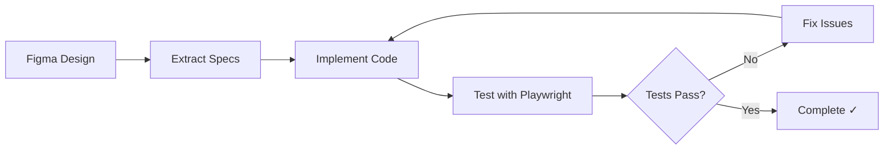

# MCP Setup Guide - T3 Stack Project

## Prerequisites

- **Claude Code CLI**: Install with `npm install -g @anthropic-ai/claude-code` ✅
- **Bun 1.3+**: Package manager for this project
- **Node.js 22+ LTS**: Required for some MCP servers
- **Chrome Browser**: Required for Chrome DevTools MCP (stable or newer)
- **Git**: For version control operations
- **Codex**: Install with `npm install -g @openai/codex` ✅
- **Gemini CLI**: Install with `npm install -g @google/gemini-cli` ✅

## Quick Setup

```bash
# Make script executable (first time only)
chmod +x .claude/scripts/verify_mcp.sh

# Full check with health validation (slower, ~30-60s)
./.claude/scripts/verify_mcp.sh

# Fast mode - skip health checks (faster, ~5-10s)
./.claude/scripts/verify_mcp.sh --fast
```

**Recommendation**: Use `--fast` for daily checks, full mode only when troubleshooting.

## MCP Tools We Use (8 Total)

### 1. Playwright - Browser Automation

**Why we need it**: Automated browser testing for Next.js application without leaving Claude

**Documentation**: https://github.com/microsoft/playwright-mcp

**Installation**:
```bash
claude mcp add playwright npx @playwright/mcp@latest
```

**Usage examples**:
```
"Navigate to http://localhost:3000 and take a screenshot"
"Test the login form with Yandex OAuth"
"Click the submit button and verify the success message appears"
"Check if the modal is keyboard accessible"
"Test the property registration form validation"
```

### 2. Context7 - Documentation Access

**Why we need it**: Get up-to-date documentation for Next.js, React, tRPC, Drizzle without leaving Claude

**Documentation**: https://github.com/upstash/context7

**Installation**:
```bash
claude mcp add --transport http context7 https://mcp.context7.com/mcp
```

**Usage examples**:
```
"Get the latest Next.js 16 App Router documentation"
"Show me tRPC v11 server setup examples"
"Find Drizzle ORM best practices for PostgreSQL"
"Get NextAuth v5 configuration docs"
"Show React 19 Server Components usage"
"Find TailwindCSS 4 migration guide"
```

### 3. Figma - Design Integration

**Why we need it**: Direct interaction with Figma designs for frontend development

**Documentation**: https://help.figma.com/hc/en-us/articles/32132100833559-Guide-to-the-Dev-Mode-MCP-Server

**Setup Figma Dev Mode Server**:
1. Open the Figma desktop app and update to the latest version
2. Create or open a Figma Design file
3. In the upper-left corner, open the Figma menu
4. Under Preferences, select **Enable local MCP Server**
5. You should see a confirmation message that the server is enabled and running

The server runs locally at `http://127.0.0.1:3845/mcp`

**Installation**:
```bash
claude mcp add --transport http figma http://127.0.0.1:3845/mcp
```

**Usage examples**:
```
"Show me the design for the login page"
"Get the color scheme from the Figma design system"
"Extract component specifications from Figma"
"Check spacing and layout from the Figma mockup"
```

### 4. Codex High - Advanced AI Agent (GPT-5)

**Why we need it**: Powerful AI agent using GPT-5 model for complex architecture validation and refactoring

**Documentation**: https://github.com/openai/codex

**Installation**:
```bash
claude mcp add codex-high -- codex mcp-server -c model="gpt-5-codex" -c model_reasoning_effort="high"
```

**Usage examples**:
```
"Use Codex High to validate the tRPC router architecture"
"Analyze the Drizzle schema design and suggest improvements"
"Review the NextAuth configuration for security issues"
"Validate the Phase 1 modernization plan"
```

### 5. Codex Medium - Standard AI Agent (GPT-5)

**Why we need it**: Balanced AI agent using GPT-5 model for standard coding tasks

**Documentation**: https://github.com/openai/codex

**Installation**:
```bash
claude mcp add codex-medium -- codex mcp-server -c model="gpt-5-codex" -c model_reasoning_effort="medium"
```

**Usage examples**:
```
"Use Codex Medium to implement the property management feature"
"Fix the form validation bugs"
"Add TypeScript types to this module"
"Write unit tests for the authentication service"
```

### 6. Gemini CLI - Google Workspace Integration

**Why we need it**: Document processing, specification analysis, and content summarization

**Documentation**:
- Gemini CLI: https://github.com/google-gemini/gemini-cli
- MCP Server: https://github.com/jamubc/gemini-mcp-tool

**Prerequisites**:
1. Install Gemini CLI first:
   ```bash
   npm install -g @google/gemini-cli
   ```
2. Get your API key from: https://aistudio.google.com/apikey
3. Keep your API key secure - you'll need it during installation

**Installation**:
```bash
claude mcp add gemini-cli \
  --env GEMINI_API_KEY=<your_api_key> \
  -- npx -y gemini-mcp-tool
```

**Setup Instructions**:
1. Generate a Gemini API key:
   - Go to https://aistudio.google.com/apikey
   - Click "Create API Key"
   - Copy the generated key
2. Replace `<your_api_key>` with your actual API key

**Usage examples**:
```
"Use Gemini to read and summarize this specification document"
"Ask Gemini to extract key requirements from the PRD"
"Use Gemini to analyze the architecture documentation"
"Have Gemini create a summary of technical notes"
"Use Gemini to convert this document to markdown"
```

### 7. Mermaid Validator - Diagram Validation

**Why we need it**: Validate Mermaid diagrams in documentation, specs, and plans before committing

**Documentation**: https://github.com/rtuin/mcp-mermaid-validator

**Installation**:
```bash
claude mcp add mermaid-validator -- npx -y @rtuin/mcp-mermaid-validator@latest
```

**Key Features**:
- Validate Mermaid diagram syntax before committing
- Render diagrams to check visual output
- Catch cycle errors, syntax issues, and structural problems
- Support for all Mermaid diagram types (flowchart, sequence, state, etc.)

**Usage examples**:
```
"Validate this Mermaid diagram"
"Check if this state diagram has any errors"
"Render this flowchart to see how it looks"
```

**Mandatory Validation**:
- **ALL Mermaid diagrams** MUST be validated before committing
- See [.claude/instructions/MARKDOWN_WORKFLOW.md](.claude/instructions/MARKDOWN_WORKFLOW.md) for complete workflow

### 8. Mermaid Generator - AI-Powered Diagram Creation

**Why we need it**: Generate Mermaid diagrams dynamically with AI assistance, export in multiple formats

**Documentation**: https://github.com/hustcc/mcp-mermaid

**Installation**:
```bash
# Install globally first (recommended to avoid dependency issues)
npm install -g mcp-mermaid
claude mcp add mermaid-generator -- mcp-mermaid
```

**Note**: Global installation is required because mcp-mermaid depends on Playwright for rendering.

**Key Features**:
- AI-assisted diagram generation from natural language descriptions
- Full support for all Mermaid syntax and features
- Export to PNG, SVG, and Mermaid formats
- Configurable themes and background colors
- Multi-round syntax and graphic validation

**Usage examples**:
```
"Generate a sequence diagram showing the NextAuth authentication flow"
"Create a flowchart for the user property registration process"
"Build an ER diagram for the Drizzle schema"
"Generate a state diagram for the application lifecycle"
"Export this diagram as PNG with dark theme"
"Create a component diagram showing the tRPC API structure"
```

**Workflow Integration**:
- **Use Mermaid Generator** for creating new diagrams from descriptions
- **Use Mermaid Validator** for validating syntax before committing
- See [.claude/instructions/MARKDOWN_WORKFLOW.md](.claude/instructions/MARKDOWN_WORKFLOW.md) for complete diagram workflow

### 9. Chrome DevTools - Frontend Performance & Debugging

**Why we need it**: Deep frontend performance analysis, debugging, and browser automation for Next.js app

**Documentation**: https://github.com/ChromeDevTools/chrome-devtools-mcp

**Installation**:
```bash
claude mcp add chrome-devtools npx -y chrome-devtools-mcp@latest
```

**Key Features**:
- Performance insights using Chrome DevTools
- Advanced browser debugging capabilities
- Reliable browser automation with Puppeteer
- Network request analysis and monitoring
- CPU and network emulation for testing
- Console error detection

**Available Tools** (26 total):
- **Input Automation**: `click`, `drag`, `fill`, `fill_form`, `handle_dialog`, `hover`, `upload_file`
- **Navigation**: `navigate_page`, `navigate_page_history`, `new_page`, `close_page`, `list_pages`, `select_page`, `wait_for`
- **Performance**: `performance_analyze_insight`, `performance_start_trace`, `performance_stop_trace`
- **Network**: `get_network_request`, `list_network_requests`
- **Emulation**: `emulate_cpu`, `emulate_network`, `resize_page`
- **Debugging**: `evaluate_script`, `list_console_messages`, `take_screenshot`, `take_snapshot`

**Setup Requirements**:
- Node.js 22 or latest LTS
- Chrome browser (current stable or newer)
- npm

**Configuration Options**:
- `--headless`: Run in headless mode
- `--browserUrl`: Connect to existing Chrome instance
- `--executablePath`: Custom Chrome executable path
- `--isolated`: Use temporary user data directory
- `--channel`: Specify Chrome channel (stable, canary, beta, dev)
- `--logFile`: Path for debug logs

**Usage examples**:
```
"Check the performance of http://localhost:3000"
"Analyze the network requests on the property listing page"
"Take a screenshot of the login component"
"Emulate a slow 3G connection and test page load"
"Profile CPU usage during map rendering"
"Check for console errors on the dashboard page"
"Take a full-page snapshot of the UI"
"Test the form with different viewport sizes"
```

**Next.js Development Workflow**:
```
"Navigate to http://localhost:3000 and analyze performance"
"Start a performance trace, interact with the property form, then stop and analyze"
"Check network requests during Yandex OAuth flow"
"Emulate mobile device and test responsive design"
"Take screenshots of all component states"
"Monitor console for errors during user registration"
```

## Setup Instructions

### Automated Setup (Recommended)

```bash
# Make script executable (first time only)
chmod +x .claude/scripts/verify_mcp.sh

# First-time setup (full validation)
./.claude/scripts/verify_mcp.sh

# Daily quick check (fast mode, recommended)
./.claude/scripts/verify_mcp.sh --fast
```

This single script handles:
- ✅ Prerequisites check (Claude Code CLI, Node.js, Codex)
- ✅ Initial installation of all MCPs
- ✅ Daily verification and health checks (optional with --fast)
- ✅ Updates to latest versions
- ✅ Clear status reporting

**Performance**: Full mode ~30-60s (validates all connections), Fast mode ~5-10s (skips validation)

### Manual Setup

1. **Install Claude Code CLI**:
   ```bash
   npm install -g @anthropic-ai/claude-code
   ```

2. **Install Bun** (if not already installed):
   ```bash
   curl -fsSL https://bun.sh/install | bash
   ```

3. **Install Codex**:
   ```bash
   npm install -g @openai/codex
   ```

4. **For Figma**: Enable the MCP server in Figma desktop app first (see instructions above)

5. **For Gemini**: Generate an API key from https://aistudio.google.com/apikey

6. **Add MCP servers** using the individual commands above

7. **Verify**: Run `/mcp` in Claude - you should see all configured servers

### Verification & Daily Usage

#### Initial Verification
After installation, verify MCPs are working:
- **In Claude Code**: Type `/mcp` to list all servers
- **Test each MCP**: Try a simple command for each
  - Playwright: `"Navigate to http://example.com"`
  - Context7: `"Get React 19 documentation"`
  - Figma: `"Show selected component"` (with Figma open)
  - Codex: `"Use Codex to analyze this file"`
  - Chrome DevTools: `"Take screenshot of http://localhost:3000"`

#### Daily Health Check
Run the script daily to maintain a healthy MCP environment:
```bash
# Recommended: Fast mode for daily checks (5-10s)
./.claude/scripts/verify_mcp.sh --fast

# Or full validation when troubleshooting (30-60s)
./.claude/scripts/verify_mcp.sh
```

This ensures:
- All MCPs remain installed and accessible
- Updates are applied automatically
- Issues are detected and reported early
- Clear instructions provided for any problems

**Tip**: Use `--fast` for quick daily checks, full mode only when debugging MCP issues.

## Frontend Development Workflow: Figma + Playwright

### The Design-to-Test Loop

This powerful workflow combines Figma design extraction with automated Playwright testing to ensure pixel-perfect implementations:



### Real Developer Prompts - Natural Language Works!

You don't need structured prompts. Claude understands developer intent naturally:

#### Simple & Effective Prompts:

**Basic Implementation + Testing:**
```
I've selected a button in Figma. Build it and test that it works.
```

**Form with Validation:**
```
Create a property registration form from my Figma selection and verify the validation works properly.
```

**Responsive Component:**
```
Build this building card component from Figma and test it looks good on mobile and desktop.
```

**Complete Feature:**
```
Implement the property dashboard from my Figma design, make sure all the interactions work,
and take screenshots to show it matches the design.
```

### When Claude Automatically Uses Tools:

| Your Words | What Claude Does |
|------------|------------------|
| "build from Figma" | Extracts design specs automatically |
| "test", "verify", "check" | Uses Playwright for testing |
| "screenshot", "show me" | Takes visual proof |
| "make sure it works" | Tests functionality |
| "matches the design" | Compares with Figma |

### The Magic Keywords:
- **"test"** → Triggers Playwright testing
- **"verify"** / **"check"** → Ensures functionality
- **"screenshot"** → Visual documentation
- **"from Figma"** → Extracts design specs
- **"make sure"** → Validates implementation

## Troubleshooting

### General Issues
- **Servers not showing**: Restart Claude Code after adding
- **Context7 connection issues**: Check internet connection

### Figma MCP Issues
- **Figma not connecting**: Ensure Figma desktop app is running with MCP server enabled
- **"Nothing selected" in Figma**: Select a component in Figma desktop app before running prompts
- **Response too large**: Use specific node IDs to limit scope

### Playwright MCP Issues
- **Browser not installed**: Ask Claude: "Install the browser for Playwright"
- **Page not loading**: Ensure dev server is running (`bun dev`)
- **Elements not found**: Element might be lazy-loaded, ask Claude to "wait for [element] to appear"
- **Timing issues**: Add explicit waits: "Wait for the loading spinner to disappear before testing"
- **Tests are flaky**: Use more specific selectors or add wait conditions

### Codex MCP Issues
- **Codex not responding**: Ensure npx can access the package registry
- **Permission errors**: Check file system permissions for the working directory
- **High memory usage**: Codex High requires more resources, use Codex Medium for lighter tasks
- **Timeout errors**: Complex tasks may timeout, break them into smaller steps

### Gemini CLI MCP Issues
- **API key invalid**: Verify your API key is active at https://aistudio.google.com/apikey
- **Rate limiting**: Free tier has usage limits, wait or upgrade if you hit them
- **Connection errors**: Check internet connectivity and firewall settings
- **Gemini CLI not found**: Ensure `npm install -g @google/gemini-cli` completed successfully
- **MCP not responding**: Try reinstalling with `claude mcp remove gemini-cli` then add again

### Chrome DevTools MCP Issues
- **Chrome not found**: Ensure Chrome browser is installed (stable, canary, beta, or dev)
- **Connection failed**: Try specifying Chrome executable path with `--executablePath`
- **Port conflicts**: Another Chrome instance may be using the debugging port
- **Sandboxing issues**: On some systems, use `--browserUrl` to connect to manually started Chrome
- **Performance trace too large**: Limit trace duration or filter to specific operations
- **Headless mode issues**: Some sites detect headless mode, try running with visible browser

## Quick Command Reference

### Testing & Browser Automation (Playwright)
| What You Want | What to Say |
|--------------|-------------|
| Test a page | "Test [page] at [route]" |
| Test a form | "Test the property registration form including all validations" |
| Check responsive | "Test on mobile/tablet/desktop" |
| Check for errors | "Check for console errors" |
| Take screenshots | "Screenshot and show me" |
| Test after fix | "Retest now that I've fixed it" |

### Documentation & Libraries (Context7)
| What You Want | What to Say |
|--------------|-------------|
| Get library docs | "Get [Next.js/tRPC/Drizzle] documentation" |
| Find examples | "Show me [NextAuth/React Query] examples" |
| Check best practices | "Find [Next.js 16/React 19] best practices" |
| Latest API docs | "Get latest [library] API documentation" |

### AI Agents (Codex)
| What You Want | What to Say |
|--------------|-------------|
| Complex refactoring | "Use Codex High to refactor [module]" |
| Standard fixes | "Use Codex Medium to fix [issue]" |
| Architecture review | "Use Codex High to analyze architecture" |
| Quick implementations | "Use Codex Medium to implement [feature]" |

### Document Processing (Gemini)
| What You Want | What to Say |
|--------------|-------------|
| Document summarization | "Use Gemini to summarize this specification" |
| Extract key points | "Ask Gemini to extract main requirements from [document]" |
| Technical notes | "Use Gemini to summarize technical notes" |
| Action items | "Ask Gemini to extract action items from this doc" |
| Document conversion | "Use Gemini to convert this doc to markdown" |

### Diagram Creation & Validation (Mermaid Tools)
| What You Want | What to Say | Which MCP |
|--------------|-------------|-----------|
| Generate new diagram | "Generate a sequence diagram for authentication" | Mermaid Generator |
| Create from description | "Create a flowchart showing the tRPC data flow" | Mermaid Generator |
| Export diagram | "Export this as PNG with dark theme" | Mermaid Generator |
| Build complex diagram | "Build a component diagram for the Next.js app" | Mermaid Generator |
| Validate syntax | "Validate this Mermaid diagram" | Mermaid Validator |
| Check for errors | "Check if this state diagram has any errors" | Mermaid Validator |
| Verify structure | "Check this diagram for cycle errors" | Mermaid Validator |
| Full workflow | "Generate a state diagram, then validate it" | Both |

### Frontend Performance & Debugging (Chrome DevTools)
| What You Want | What to Say |
|--------------|-------------|
| Performance analysis | "Analyze performance of [page URL]" |
| Network monitoring | "List network requests on [page]" |
| Console errors | "Check console messages on [page]" |
| Screenshot capture | "Take screenshot of [element/page]" |
| CPU profiling | "Profile CPU usage during [interaction]" |
| Network emulation | "Emulate [slow-3G/fast-3G/offline] and test [page]" |
| Mobile testing | "Resize to mobile viewport and test [page]" |
| Performance trace | "Start trace, [do action], stop and analyze" |
| Full page snapshot | "Take full page snapshot of [URL]" |
| Script evaluation | "Evaluate [script] on [page]" |

---

## Project-Specific Usage

### T3 Stack Development
This project uses:
- **Next.js 16.0.1** with App Router
- **React 19.2.0** with Server Components
- **tRPC 11.7.1** for type-safe APIs
- **Drizzle ORM 0.44.7** with PostgreSQL
- **NextAuth 5.0.0-beta.25** with Yandex OAuth
- **TailwindCSS 4.1.17** with Radix UI components

### Common Workflows

**Testing the Development Server:**
```
"Start http://localhost:3000 and check for any console errors"
"Test the Yandex OAuth login flow end-to-end"
"Verify the property registration form validation"
```

**Performance Analysis:**
```
"Analyze the performance of the building map component"
"Check network requests during tRPC procedure calls"
"Profile the dashboard page load time"
```

**Documentation Lookup:**
```
"Get Next.js 16 data fetching documentation"
"Show me tRPC v11 server-side rendering examples"
"Find Drizzle PostgreSQL migration best practices"
"Get NextAuth v5 OAuth provider configuration"
```

**Architecture Validation:**
```
"Use Codex High to review the tRPC router structure"
"Validate the Drizzle schema design with Codex"
"Analyze the NextAuth configuration for security issues"
```

---

*For questions about this MCP setup, refer to the main project documentation*
