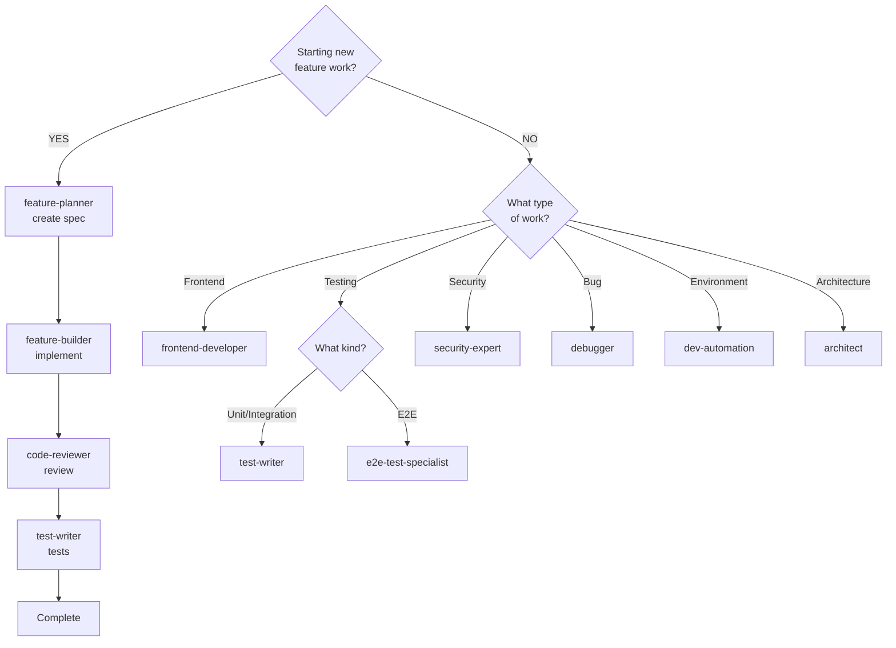
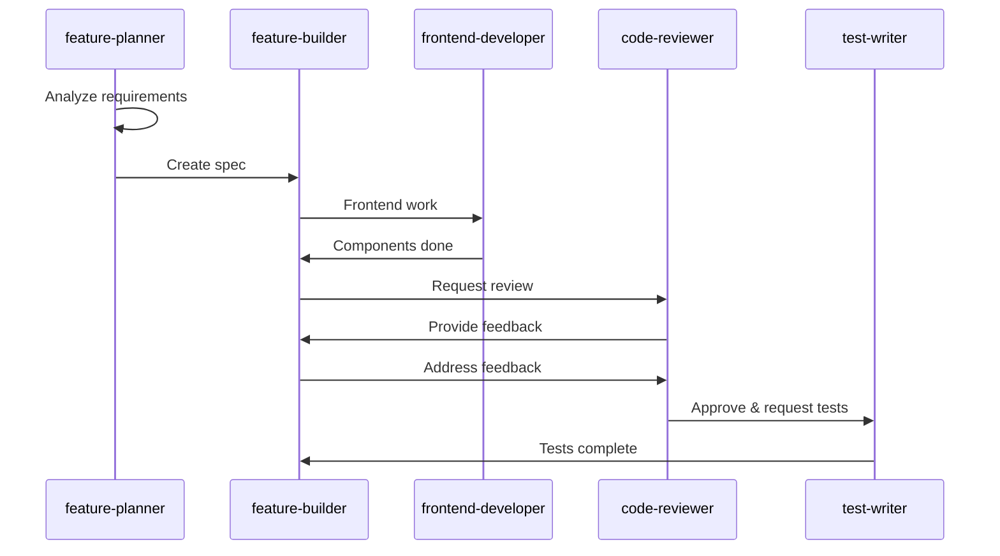

# Agent Usage Guidelines

## Unified Agent Organization

All agents are consolidated in `/.claude/agents/` with clear naming conventions.

## Quick Decision Guide

**Which agent should I use?**

| Situation              | Use This Agent         |
| ---------------------- | ---------------------- |
| Planning new feature   | `@feature-planner`     |
| Implementing from spec | `@feature-builder`     |
| Code review needed     | `@code-reviewer`       |
| Frontend/React work    | `@frontend-developer`  |
| Writing tests          | `@test-writer`         |
| E2E/Playwright tests   | `@e2e-test-specialist` |
| Test failures (>3)     | `@test-analyzer`       |
| Security concerns      | `@security-expert`     |
| Complex debugging      | `@debugger`            |
| System architecture    | `@architect`           |
| Local dev environment  | `@dev-automation`      |

---

## Available Agents (11)

### Core Workflow Agents (4)

- **feature-planner**: Creates technical specifications
  - **Purpose**: Plans features, creates specs in `/specs/`
  - **When to Use**: Starting new feature work
  - **Generates**: `/specs/[feature-name]_spec.md`

- **feature-builder**: Implements from specifications
  - **Purpose**: Systematic implementation from specs
  - **When to Use**: Have spec, ready to implement
  - **Collaborates With**: frontend-developer, code-reviewer

- **code-reviewer**: Code quality review
  - **Purpose**: Reviews code for quality, patterns, best practices
  - **When to Use**: Before merging, after implementation
  - **Expertise**: T3 Stack patterns, TypeScript, React 19

- **frontend-developer**: React/Next.js engineering
  - **Purpose**: Frontend implementation, components, performance
  - **When to Use**: UI work, React components, styling
  - **Expertise**: Next.js 16, React 19, TailwindCSS, Radix UI

### Development Environment (1)

- **dev-automation**: Local development environment
  - **Purpose**: Manages Docker/PostgreSQL, validates UI changes
  - **When to Use**: Environment setup, UI validation
  - **MCP Tools**: Playwright MCP, Chrome DevTools MCP

### Testing Agents (3)

- **test-writer**: Unit/integration tests
  - **Purpose**: Creates Jest + React Testing Library tests
  - **Scope**: Unit and integration tests ONLY (not E2E)
  - **When to Use**: Writing tests for components/utilities

- **e2e-test-specialist**: E2E and accessibility tests
  - **Purpose**: Playwright E2E + WCAG accessibility
  - **When to Use**: User journey tests, accessibility audits
  - **MCP Tools**: Playwright MCP, Chrome DevTools MCP

- **test-analyzer**: Test failure analysis
  - **Purpose**: Analyzes multiple test failures (>3)
  - **When to Use**: Many tests failing, need root cause
  - **Called By**: test-writer, e2e-test-specialist

### Universal Agents (3)

- **architect**: System architecture
  - **Purpose**: System-level design, ADRs, major refactoring
  - **When to Use**: Complex architectural decisions
  - **Generates**: `/specs/architecture/[problem]_spec.md`

- **security-expert**: Security assessment
  - **Purpose**: Security audits, auth review, vulnerability checks
  - **When to Use**: Auth changes, security concerns
  - **Expertise**: NextAuth v5, Zod validation, OWASP

- **debugger**: Complex debugging
  - **Purpose**: Root cause analysis, difficult bugs
  - **When to Use**: Complex bugs, unclear errors
  - **Expertise**: React DevTools, tRPC debugging, DB issues

---

## Workflow Decision Tree



## Standard Feature Development Flow



---

## Agent File Locations

All agent definitions in `/.claude/agents/`:

```
.claude/agents/
├── feature-planner.md      # Feature planning
├── feature-builder.md      # Implementation
├── code-reviewer.md        # Code review
├── frontend-developer.md   # React/Next.js
├── dev-automation.md       # Dev environment
├── test-writer.md          # Unit tests
├── e2e-test-specialist.md  # E2E tests
├── test-analyzer.md        # Test analysis
├── architect.md            # Architecture
├── security-expert.md      # Security
└── debugger.md             # Debugging
```

---

## Best Practices

### Agent Usage

1. **Start with feature-planner** for new features
2. **Use frontend-developer** for React/component work
3. **Always get code review** before merging
4. **Use dev-automation** to validate UI changes
5. **Document specifications** in `/specs/`

### Quality Standards

1. **Type safety**: TypeScript strict mode
2. **Validation**: Zod for all tRPC inputs
3. **Testing**: Cover critical paths
4. **Performance**: Monitor bundle size

---

## MCP Tools Integration

| MCP Server          | Primary Agents                      | Purpose                |
| ------------------- | ----------------------------------- | ---------------------- |
| **Playwright**      | dev-automation, e2e-test-specialist | Browser automation     |
| **Chrome DevTools** | dev-automation, frontend-developer  | Debugging, performance |

---

_For detailed agent instructions, see individual files in `/.claude/agents/`_
