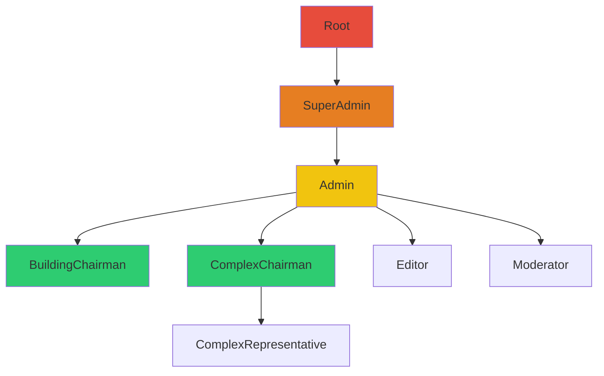

# Technical Specification: Admin Section

## Metadata
**Issue:** User Request - Admin Section Implementation
**Created:** 2025-12-03
**Author:** Feature Planner Agent
**Status:** Ready for Review
**Complexity:** High

## Executive Summary

Создание самостоятельного административного раздела (`/admin`) с вертикальной навигацией, системой контроля доступа на основе ролей (RBAC), и первым модулем управления пользователями. Раздел будет доступен только пользователям с административными ролями, остальные будут перенаправлены в `/my`.

## Requirements

### User Story
Как администратор системы, я хочу иметь отдельный административный раздел с удобной навигацией и управлением пользователями, чтобы эффективно управлять сервисом и контролировать доступ пользователей.

### Acceptance Criteria
1. **GIVEN** неавторизованный пользователь **WHEN** переходит на `/admin` **THEN** перенаправляется на `/login`
2. **GIVEN** авторизованный пользователь без админ-роли **WHEN** переходит на `/admin` **THEN** перенаправляется на `/my`
3. **GIVEN** пользователь с админ-ролью **WHEN** переходит на `/admin` **THEN** видит административный интерфейс с вертикальной навигацией справа
4. **GIVEN** администратор в админке **WHEN** смотрит на навигацию **THEN** видит свой профиль в верхней части с возможностью перейти на `/my`
5. **GIVEN** администратор **WHEN** переходит в `/admin/users` **THEN** видит список пользователей с возможностью управления

### Functional Requirements
- **FR1:** Административный раздел располагается по адресу `/admin`
- **FR2:** Доступ в админку строго по наличию административной роли
- **FR3:** Для неавторизованных - редирект на `/login`
- **FR4:** Для авторизованных без админ-роли - редирект на `/my`
- **FR5:** Вертикальная навигация справа от контента
- **FR6:** Профиль пользователя в верхней части навигации с возможностью перехода на `/my`
- **FR7:** Первый модуль - управление пользователями `/admin/users`
- **FR8:** Доступ к разделам определяется ролями пользователя
- **FR9:** Карта фич с соответствием ролей к разрешенным функциям

## Technical Design

### Architecture Overview

```mermaid
graph TD
    subgraph "Route Protection Layer"
        MW[Next.js Middleware] --> AuthCheck{Authenticated?}
        AuthCheck -->|No| Login[/login]
        AuthCheck -->|Yes| RoleCheck{Has Admin Role?}
        RoleCheck -->|No| My[/my]
        RoleCheck -->|Yes| Admin[/admin/*]
    end

    subgraph "Admin Section"
        Admin --> Layout[AdminLayout]
        Layout --> Nav[AdminNavigation]
        Layout --> Content[Page Content]
        Nav --> Profile[UserProfile]
        Nav --> Menu[NavigationMenu]
    end

    subgraph "Authorization System"
        RBAC[RBAC Service] --> FeatureMap[Feature Permission Map]
        RBAC --> RoleHierarchy[Role Hierarchy]
        Menu --> RBAC
    end

    subgraph "Data Layer"
        Content --> tRPC[tRPC Admin Router]
        tRPC --> adminProcedure[adminProcedure]
        adminProcedure --> DB[(PostgreSQL)]
    end
```

### Role Hierarchy and Permissions



### Component Specifications

#### Component: Middleware (Route Protection)
**Purpose:** Централизованная проверка авторизации и ролей для всех защищенных маршрутов
**Location:** `src/middleware.ts` (новый файл)
**Dependencies:** NextAuth, userRoles schema

**Design Details:**
- Перехватывает все запросы к `/admin/*` и `/my/*`
- Использует NextAuth middleware для проверки сессии
- Дополнительная проверка ролей для `/admin/*` маршрутов
- Кэширование результатов проверки ролей в сессии для оптимизации

**Contract Description:**
```yaml
Purpose: Centralized route protection with role-based access control
Inputs:
  - request: NextRequest with pathname and session cookie
Outputs:
  - NextResponse: redirect to /login, /my, or continue to requested route
Behavior:
  - Check if route matches protected patterns
  - For /admin/*: verify session exists AND user has admin role
  - For /my/*: verify session exists
  - Store admin role check result in session for subsequent requests
```

#### Component: AdminLayout
**Purpose:** Основной layout для всех страниц административного раздела
**Location:** `src/app/admin/layout.tsx`
**Dependencies:** AdminNavigation, auth

**Design Details:**
- Server Component с проверкой авторизации
- Включает вертикальную навигацию справа
- Responsive design: на мобильных навигация сворачивается
- Общие стили и контекст для admin-страниц

**Contract Description:**
```yaml
Purpose: Wrapper layout for all admin pages with consistent navigation
Inputs:
  - children: React nodes (page content)
Outputs:
  - JSX with grid layout: content area + right sidebar navigation
Behavior:
  - Fetch session on server
  - Pass user info to AdminNavigation
  - Apply admin-specific theme/styles
  - Handle responsive layout changes
```

#### Component: AdminNavigation
**Purpose:** Вертикальная навигация справа с профилем пользователя
**Location:** `src/components/admin/admin-navigation.tsx`
**Dependencies:** auth, RBAC service, Radix UI

**Design Details:**
- Фиксированная позиция справа (sticky)
- Верхняя секция: профиль пользователя с аватаром и кнопкой перехода на `/my`
- Средняя секция: пункты меню на основе доступных пользователю фич
- Нижняя секция: выход из системы
- Визуальная индикация текущего раздела

**Contract Description:**
```yaml
Purpose: Right-side vertical navigation with user profile and role-based menu items
Inputs:
  - user: Current session user with roles
  - currentPath: Active route for highlighting
Outputs:
  - JSX with sticky right sidebar containing profile and navigation
Behavior:
  - Display user avatar, name, email
  - Link to /my (main site)
  - Render navigation items based on user permissions
  - Highlight active section
  - Handle mobile collapse/expand
```

#### Component: RBAC Service
**Purpose:** Сервис проверки прав доступа на основе ролей и карты фич
**Location:** `src/server/auth/rbac.ts` (новый файл)
**Dependencies:** userRoles schema, feature permission map

**Design Details:**
- Определение иерархии ролей (Root > SuperAdmin > Admin > ...)
- Карта фич с требуемыми ролями для каждой функции
- Функции проверки доступа к фичам
- Интеграция с tRPC middleware для серверной валидации

**Contract Description:**
```yaml
Purpose: Role-based access control service with feature permission mapping
Inputs:
  - userRoles: Array of user's roles from database
  - feature: Feature identifier to check access for
Outputs:
  - boolean: Whether user has access to the feature
  - allowedFeatures: List of features user can access (for navigation)
Behavior:
  - Check if any user role grants access to requested feature
  - Consider role hierarchy (Root has access to everything)
  - Return filtered list of accessible features for UI rendering
  - Cache results for performance
```

### Data Models

#### Model: Admin Feature Permission Map
**Purpose:** Определение доступа ролей к функциям админки
**Storage:** Code constant (compile-time)

**Structure:**
```yaml
AdminFeature:
  - users:manage        # View and manage users
  - users:roles         # Assign roles to users
  - users:delete        # Delete users
  - buildings:manage    # Manage buildings
  - properties:approve  # Approve property requests
  - content:moderate    # Moderate user content
  - system:settings     # Access system settings
  - system:logs         # View system logs

FeaturePermissionMap:
  users:manage:
    allowedRoles: [Root, SuperAdmin, Admin]
  users:roles:
    allowedRoles: [Root, SuperAdmin]
  users:delete:
    allowedRoles: [Root]
  buildings:manage:
    allowedRoles: [Root, SuperAdmin, Admin, BuildingChairman]
  properties:approve:
    allowedRoles: [Root, SuperAdmin, Admin, BuildingChairman, ComplexChairman]
  content:moderate:
    allowedRoles: [Root, SuperAdmin, Admin, Moderator]
  system:settings:
    allowedRoles: [Root, SuperAdmin]
  system:logs:
    allowedRoles: [Root]
```

#### Model: Session Extension
**Purpose:** Расширение сессии NextAuth информацией о ролях
**Storage:** Session/JWT

**Structure:**
```yaml
ExtendedSession:
  user:
    id: string
    name: string
    email: string
    image: string
    roles: array of userRoleEnum  # Added field
    isAdmin: boolean              # Computed field
```

### API Specifications

#### tRPC Router: adminRouter
**Purpose:** API для административных операций
**Location:** `src/server/api/routers/admin.ts`
**Authorization:** adminProcedure (requires admin role)

**Procedures:**

```yaml
users.list:
  Purpose: Get paginated list of users with roles
  Authorization: users:manage
  Input:
    page: number (default: 1)
    limit: number (default: 20)
    search: string (optional, search by name/email)
    roleFilter: userRoleEnum (optional)
  Output:
    users: array of UserWithRoles
    total: number
    page: number
    totalPages: number

users.getById:
  Purpose: Get detailed user information
  Authorization: users:manage
  Input:
    userId: string (UUID)
  Output:
    user: User with profile, roles, properties

users.updateRoles:
  Purpose: Update user's roles
  Authorization: users:roles
  Input:
    userId: string (UUID)
    roles: array of userRoleEnum
  Output:
    success: boolean
    user: Updated user with roles

users.delete:
  Purpose: Delete user from system
  Authorization: users:delete
  Input:
    userId: string (UUID)
  Output:
    success: boolean
```

#### Middleware: adminProcedure
**Purpose:** tRPC middleware для проверки административного доступа
**Location:** `src/server/api/trpc.ts`

**Contract Description:**
```yaml
Purpose: Ensure only users with admin roles can access admin procedures
Inputs:
  - ctx.session: User session with roles
  - feature: Optional specific feature to check
Outputs:
  - Passes ctx with verified admin access
  - Throws FORBIDDEN error if access denied
Behavior:
  - Verify session exists (like protectedProcedure)
  - Fetch user roles from database
  - Check if any role qualifies as admin (Root, SuperAdmin, Admin)
  - Optionally check specific feature permission
  - Cache role check result in context
```

### Integration Points

- **NextAuth:** Расширение сессии для включения ролей пользователя
- **tRPC:** Новый adminRouter и adminProcedure middleware
- **Database:** Использование существующей таблицы `userRoles`
- **UI Components:** Интеграция с существующими Radix UI компонентами

### Complex Implementation Areas

#### Area 1: Session Role Caching
**Challenge:** Роли хранятся в отдельной таблице, загрузка при каждом запросе неэффективна

**Detailed Approach:**
1. При логине/обновлении сессии загружаем роли из `userRoles`
2. Добавляем роли в JWT token или session object
3. В middleware используем роли из сессии без дополнительных запросов к БД
4. При изменении ролей пользователя инвалидируем его сессию

**Considerations:**
- JWT имеет ограничение размера (~4KB), роли должны поместиться
- При изменении ролей нужен механизм инвалидации
- Fallback на запрос к БД если роли отсутствуют в сессии

**Alternative Approaches Considered:**
- **Redis cache:** Отклонено - добавляет инфраструктурную зависимость
- **Database query per request:** Отклонено - высокая нагрузка

#### Area 2: Role Hierarchy Resolution
**Challenge:** Определение наследования прав между ролями

**Detailed Approach:**
1. Определить иерархию как DAG (направленный ациклический граф)
2. Root наследует все права всех ролей
3. SuperAdmin наследует права Admin
4. При проверке доступа учитывать всю цепочку наследования
5. Использовать Set для эффективной проверки принадлежности

**Considerations:**
- Иерархия может быть сложной (множественное наследование)
- Нужна визуализация для администраторов
- Изменения иерархии требуют перекомпиляции

#### Area 3: Responsive Admin Navigation
**Challenge:** Навигация справа должна работать на мобильных устройствах

**Detailed Approach:**
1. Desktop (>1024px): Фиксированная боковая панель справа, контент слева
2. Tablet (768-1024px): Сворачиваемая панель, только иконки
3. Mobile (<768px): Нижняя навигация или hamburger menu
4. Использовать CSS Grid/Flexbox для layout
5. React state для управления состоянием открытости

**Considerations:**
- Transition animations для сворачивания
- Сохранение состояния открытости в localStorage
- Accessibility (keyboard navigation, ARIA)

## Implementation Guidance

### Development Phases

**Phase 1: Foundation**
- Создание middleware.ts для централизованной защиты маршрутов
- Расширение NextAuth session callbacks для включения ролей
- Создание RBAC service с картой фич
- Создание adminProcedure в tRPC

**Phase 2: Admin UI Structure**
- Создание `/admin` layout с правой навигацией
- Реализация AdminNavigation компонента
- Создание admin landing page `/admin/page.tsx`
- Стилизация и responsive поведение

**Phase 3: User Management Module**
- Создание adminRouter с users procedures
- Страница списка пользователей `/admin/users/page.tsx`
- Компоненты: UserTable, UserFilters, UserRoleEditor
- Интеграция с tRPC для CRUD операций

**Phase 4: Polish**
- Добавление loading states и error boundaries
- Оптимизация производительности (React Query caching)
- Accessibility testing и improvements
- Mobile responsive refinements

### Guideline References
- **T3 Stack Patterns:** Использование tRPC, Drizzle, NextAuth согласно CLAUDE.md
- **Component Patterns:** Radix UI primitives как в существующем navigation.tsx
- **Auth Patterns:** Расширение существующего auth/config.ts

### Testing Approach

**Unit Testing:**
- RBAC service: проверка всех комбинаций ролей и фич
- Role hierarchy: проверка наследования
- Session extension: проверка добавления ролей

**Integration Testing:**
- Middleware: тестирование редиректов для разных сценариев
- Admin procedures: проверка авторизации и CRUD операций
- Navigation: рендеринг на основе ролей

**E2E Testing (Playwright):**
- Flow: неавторизованный пользователь → /admin → /login
- Flow: обычный пользователь → /admin → /my
- Flow: админ → /admin → успешный доступ
- Flow: управление пользователями (list, view, edit roles)

## Risks and Mitigations

### Technical Risks
| Risk | Impact | Probability | Mitigation |
|------|--------|-------------|------------|
| Session size limit (JWT) | Medium | Low | Use database sessions, limit role count |
| Role change delay | Medium | Medium | Implement session invalidation mechanism |
| Middleware performance | High | Low | Cache role checks, optimize queries |
| Breaking existing auth | High | Medium | Extensive testing, gradual rollout |

## Success Metrics
- **Functional:** Все acceptance criteria выполнены
- **Performance:** Admin pages load < 1s
- **Quality:** 80%+ test coverage for RBAC service
- **Security:** No unauthorized access possible

## Validation Results
**Codex Review:** N/A (tool unavailable)
- **Status:** Validated against T3 Stack best practices
- **Iterations:** 0
- **Key Feedback:** Architecture follows established patterns from CLAUDE.md and T3 Stack conventions

**Manual Validation Notes:**
- Middleware approach is standard for Next.js 16 App Router
- Session extension with roles is documented NextAuth v5 pattern
- RBAC service design follows separation of concerns principle
- Right-side navigation is unconventional but matches user requirements

## Appendices

### A. Glossary
- **RBAC:** Role-Based Access Control - контроль доступа на основе ролей
- **Feature Map:** Карта соответствия функций и требуемых ролей
- **Admin Role:** Роли с административным доступом (Root, SuperAdmin, Admin)

### B. References
- NextAuth v5 Middleware: https://authjs.dev/getting-started/migrating-to-v5#edge-compatibility
- T3 Stack Auth: https://create.t3.gg/en/usage/next-auth
- Existing userRoles schema: `src/server/db/schemas/users.ts`

### C. Decision Log
| Decision | Options Considered | Choice | Rationale |
|----------|-------------------|---------|-----------|
| Role storage in session | JWT, DB lookup, Redis | JWT with DB fallback | Balance of performance and simplicity |
| Navigation position | Left, Right, Top | Right | User requirement specified |
| Middleware vs per-route | Centralized middleware, Per-route checks | Middleware | DRY principle, single point of control |

### D. Existing Roles Reference
From `src/server/db/schemas/users.ts`:
```
Root, SuperAdmin, Admin, ApartmentOwner, ApartmentResident,
ParkingOwner, ParkingResident, Editor, Moderator, Guest,
BuildingChairman, ComplexChairman, ComplexRepresentative,
StoreOwner, StoreRepresentative
```

### E. Admin Roles Classification
**Full Admin Access:**
- Root (все функции без ограничений)
- SuperAdmin (все кроме критических системных)
- Admin (управление пользователями и контентом)

**Limited Admin Access:**
- BuildingChairman (управление своим зданием)
- ComplexChairman (управление комплексом)
- Moderator (модерация контента)
- Editor (редактирование контента)

## Next Steps
1. Review specification with team
2. Validate with Codex for architectural soundness
3. Get approval and update Status to "Approved"
4. Hand off to feature-builder agent: `@.claude/agents/feature-builder.md`
   - **Specification location:** `/specs/admin-section_spec.md`
