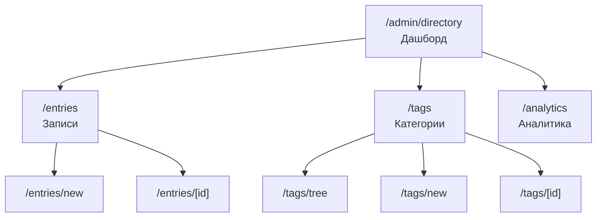

# Architecture: Directory Admin Interface Redesign

## Problem Statement

Текущий интерфейс администрирования справочника имеет критические недостатки, препятствующие эффективному наполнению контента:

1. **Навигация**: Отсутствует визуализация полной иерархии тегов, нет breadcrumbs, нельзя фильтровать записи по тегам
2. **Управление тегами**: Hardcoded список тегов в форме редактирования, показываются только корневые теги
3. **Управление записями**: Нет bulk-операций, дублирования, preview, индикации неполных записей
4. **Управление контактами**: Сложный UI для множества контактов, непонятная разница label vs subtitle
5. **Информационные**: Нет статистики использования, подсказок о незаполненных полях

## Context

### Current State

```
/admin/directory
  page.tsx - 2 вкладки (Записи/Категории), плоский список
  /new/page.tsx - форма создания (только корневые теги)
  /[id]/page.tsx - форма редактирования (hardcoded контактные теги)
  /tags/[id]/page.tsx - редактирование тега
  /tags/new/page.tsx - создание тега
```

### Data Model

- **directoryEntries**: записи (contact, organization, location, document)
- **directoryContacts**: контактные данные с привязкой к записи
- **directoryTags**: иерархические категории (parentId self-reference)
- **directoryEntryTags**: теги на уровне записи
- **directoryContactTags**: теги на уровне контакта (для гранулярного поиска)
- **directorySchedules**: график работы

### Constraints

- **T3 Stack**: Next.js 16, React 19, tRPC, Drizzle, shadcn/ui
- **Pre-production**: Breaking changes допустимы
- **Масштаб**: 7 строений, ~1800 квартир, ~800 парковочных мест
- **Пользователи**: Администраторы ЖК (1-3 человека)

## Decision

Редизайн интерфейса администрирования справочника с фокусом на:
1. Визуализацию иерархии тегов
2. Полноценную поддержку двухуровневого тегирования
3. Улучшение UX при массовом вводе данных
4. Информативность и обратную связь

---

## Новая структура страниц



### 1. Дашборд `/admin/directory`

**Назначение**: Быстрый обзор состояния справочника и навигация.

**Содержимое**:
- Статистика карточками:
  - Всего записей / активных / неактивных
  - Записей без тегов (проблема)
  - Записей без контактов (проблема)
  - Популярные запросы (топ-5)
- Quick Actions: Создать запись, Создать категорию
- Последние изменения (5 записей)
- Проблемные записи (без тегов, без контактов)

### 2. Список записей `/admin/directory/entries`

**Текущие проблемы**:
- Нет фильтрации по тегам
- Нет bulk-операций
- Нет индикации проблем

**Новый UI**:

```
+----------------------------------------------------------+
|  Записи справочника                    [+ Создать запись] |
+----------------------------------------------------------+
|  [ Поиск...           ] [Тип: v] [Теги: v] [Проблемы: v] |
|                                                          |
|  [ ] Выбрать все         Выбрано: 3  [Теги] [Удалить]   |
+----------------------------------------------------------+
|  [ ] | Диспетчерская УК         | Контакт | 3 контакта  |
|       Описание...                         | Службы, Core |
|       /dispetcherskaia-uk                 | [!] Нет тегов|
|       Просмотров: 245 | Звонков: 89                      |
+----------------------------------------------------------+
|  [ ] | Консьержи                | Контакт | 12 контактов|
|       Для всех строений                   | Строения     |
|       /konsiierzhi                        |              |
|       Просмотров: 1,024 | Звонков: 456                   |
+----------------------------------------------------------+
```

**Функциональность**:

1. **Расширенная фильтрация**:
   - По типу (contact, organization, location, document)
   - По тегам (multi-select с иерархией)
   - По проблемам (без тегов, без контактов, неактивные)
   - По scope (core, commerce, city, promoted)

2. **Bulk-операции**:
   - Массовое присвоение тегов
   - Массовое удаление (soft delete)
   - Массовое изменение статуса

3. **Индикаторы проблем**:
   - Красная метка "Нет тегов" если запись без категорий
   - Желтая метка "Нет контактов" если пустые контакты
   - Серая метка "Неактивна" для скрытых записей

4. **Статистика inline**:
   - Количество просмотров
   - Количество кликов по телефонам
   - Последняя активность

### 3. Форма создания/редактирования записи

**Текущие проблемы**:
- Только корневые теги в sidebar
- Hardcoded контактные теги
- Нет preview
- Нет подсказок

**Новый UI**:

```
+----------------------------------------------------------+
|  [<] Редактирование записи              /dispetcherskaia |
+----------------------------------------------------------+
| [Основное] [Контакты] [График] [Теги] [Предпросмотр]     |
+----------------------------------------------------------+
|                                                          |
|  ОСНОВНАЯ ИНФОРМАЦИЯ                                     |
|  ─────────────────────────────────────────────────────   |
|  Тип записи:  [Контакт v]                               |
|                                                          |
|  Название *:  [Диспетчерская УК                    ]    |
|               Подсказка: Краткое, понятное название      |
|                                                          |
|  Подзаголовок:[Литеры 2, 3                          ]    |
|               Для уточнения (необязательно)              |
|                                                          |
|  Описание:    [______________________________________]   |
|               [______________________________________]   |
|               Краткое описание для результатов поиска    |
|                                                          |
+----------------------------------------------------------+
|  SIDEBAR                                                 |
|  ─────────────────────────────────────────────────────   |
|  Статус: [Активна v]                                    |
|                                                          |
|  Категории записи:                                       |
|  [Выбрать категории...]                                  |
|  > Службы                                                |
|    > Диспетчерская [x]                                   |
|  > Аварийные службы [x]                                  |
|                                                          |
|  [Сохранить]  [Предпросмотр]                            |
+----------------------------------------------------------+
```

**Улучшения формы**:

1. **Табы вместо скролла**:
   - Основное (type, title, subtitle, description, content)
   - Контакты (список контактов с тегами)
   - График работы
   - Теги (визуальное дерево выбора)
   - Предпросмотр (как будет выглядеть на сайте)

2. **Inline-подсказки**:
   - Под каждым полем - пояснение назначения
   - Примеры заполнения
   - Валидация в реальном времени

3. **Иерархический выбор тегов**:
   - Визуальное дерево с чекбоксами
   - Поиск по тегам
   - Группировка по scope

4. **Предпросмотр**:
   - Рендеринг карточки как на публичной странице
   - Переключение мобильный/десктоп вид

### 4. Управление контактами (отдельный таб)

**Текущие проблемы**:
- Непонятно что такое label vs subtitle
- Нет drag-and-drop для порядка
- Hardcoded список контактных тегов

**Новый UI**:

```
+----------------------------------------------------------+
|  КОНТАКТЫ                                   [+ Добавить] |
+----------------------------------------------------------+
|                                                          |
|  ≡  ТЕЛЕФОН | +7 999 123-45-67           | [Основной]   |
|     ├─ Подпись: Диспетчерская                           |
|     ├─ ФИО: Иванова М.П.                                |
|     ├─ Режим: [24/7] График: Пн-Вс                      |
|     └─ Теги: [Строение 1 x] [Подъезд 1-4 x] [+ тег]    |
|                                            [Дубл.] [x]   |
|  ─────────────────────────────────────────────────────   |
|  ≡  ТЕЛЕФОН | +7 999 234-56-78           |              |
|     ├─ Подпись: Диспетчерская                           |
|     ├─ ФИО: Петрова А.С.                                |
|     ├─ Режим: [ ] График: Пн-Пт 9:00-18:00             |
|     └─ Теги: [Строение 2 x] [Подъезд 1-3 x] [+ тег]    |
|                                            [Дубл.] [x]   |
+----------------------------------------------------------+
```

**Функциональность**:

1. **Drag-and-drop порядок** (≡ handle)

2. **Понятные названия полей**:
   - `label` -> "Подпись" (Диспетчерская, Приёмная)
   - `subtitle` -> "ФИО / Должность" (Иванова М.П., Инженер)

3. **Режим работы контакта**:
   - Checkbox "24/7" (is24h)
   - Текстовое поле "График" (scheduleNote)

4. **Динамический выбор контактных тегов**:
   - Загрузка из БД, не hardcoded
   - Группировка: Строения, Подъезды, Службы
   - Autocomplete поиск

5. **Дублирование контакта**:
   - Кнопка "Дубл." копирует контакт
   - Полезно для создания похожих контактов разных строений

### 5. Управление категориями `/admin/directory/tags`

**Текущие проблемы**:
- Плоский список с expand/collapse
- Нет визуализации scope
- Нет drag-and-drop для порядка
- Нет предупреждения о каскадном удалении

**Новый UI - Split View**:

```
+----------------------------------------------------------+
|  Категории справочника                   [+ Категория]   |
+----------------------------------------------------------+
|  ДЕРЕВО                    |  ДЕТАЛИ                     |
|  ─────────────────────────|─────────────────────────────|
|  [ Поиск категорий... ]   |  Категория: Строение 1      |
|                           |                              |
|  ▼ core - ЖК (45)        |  Slug: stroenie-1            |
|    ▼ Строения (28)       |  Scope: core                 |
|      ► Строение 1 (4)    |  Родитель: Строения          |
|      ► Строение 2 (4)    |                              |
|      ► ...               |  Записей: 4                  |
|    ▼ Службы (12)         |  - Консьержи (3 контакта)    |
|      ► Консьержи         |  - Диспетчерская (1)         |
|      ► Диспетчерская     |  - ...                       |
|    ▼ Аварийные (5)       |                              |
|      ► Электрики         |  Контактов с тегом: 12       |
|      ► Сантехники        |  - Консьержи: 4 контакта     |
|                          |  - Диспетчерская: 2          |
|  ▼ commerce - Арендаторы |                              |
|    ► Магазины            |  Синонимы: строение 1, лит 1,|
|    ► Кафе                |  литер 1, корпус 1           |
|                          |                              |
|  ▼ city - Город (8)      |  [Редактировать] [Удалить]   |
|    ► Больницы            |                              |
|    ► Школы               |  ⚠️ При удалении будут       |
|                          |  удалены связи с 4 записями  |
|  ► promoted - Реклама    |  и 12 контактами             |
+----------------------------------------------------------+
```

**Функциональность**:

1. **Split View**:
   - Левая панель: дерево категорий
   - Правая панель: детали выбранной категории

2. **Визуализация scope**:
   - Цветовая кодировка: core (синий), commerce (зеленый), city (оранжевый), promoted (красный)
   - Иконки для каждого scope

3. **Информация о использовании**:
   - Количество записей с этим тегом
   - Количество контактов с этим тегом
   - Список связанных записей

4. **Предупреждение о каскадном удалении**:
   - Показывать сколько записей/контактов потеряют связь
   - Требовать подтверждение с вводом названия

5. **Drag-and-drop**:
   - Изменение порядка (order)
   - Перемещение в другого родителя

### 6. Аналитика `/admin/directory/analytics`

**Назначение**: Понимание как используется справочник.

```
+----------------------------------------------------------+
|  Аналитика справочника              [Период: Месяц v]    |
+----------------------------------------------------------+
|  ОБЗОР                                                   |
|  ─────────────────────────────────────────────────────   |
|  [ Поисков: 2,450 ] [ Просмотров: 8,920 ] [ Звонков: 890]|
+----------------------------------------------------------+
|  ПОПУЛЯРНЫЕ ЗАПРОСЫ           |  ПОПУЛЯРНЫЕ ЗАПИСИ       |
|  ─────────────────────────────|─────────────────────────|
|  1. консьерж строение 2 (145) |  1. Консьержи (1,024)   |
|  2. диспетчерская (98)        |  2. Диспетчерская (890) |
|  3. электрик (76)             |  3. Электрики (456)     |
|  4. лифт (54)                 |  4. Сантехники (234)    |
|  5. сантехник (43)            |  5. Магазин Пятёрочка   |
+----------------------------------------------------------+
|  ЗАПРОСЫ БЕЗ РЕЗУЛЬТАТОВ                                |
|  ─────────────────────────────────────────────────────   |
|  • охрана (23 запроса) - Нет записи                     |
|  • паркинг (18 запросов) - Нет записи                   |
|  • детская площадка (12) - Нет записи                   |
|  [Создать записи для этих запросов]                      |
+----------------------------------------------------------+
```

**Функциональность**:

1. **Период анализа**: День, Неделя, Месяц, Квартал, Год

2. **Метрики**:
   - Количество поисковых запросов
   - Количество просмотров записей
   - Количество кликов по телефонам
   - Количество кликов по ссылкам

3. **Топы**:
   - Популярные поисковые запросы
   - Популярные записи
   - Популярные категории

4. **Запросы без результатов**:
   - Список запросов, которые не нашли записей
   - Quick action: создать запись для запроса

---

## Ключевые компоненты

### 1. TagTreePicker

**Назначение**: Визуальный выбор тегов из иерархии.

```typescript
interface TagTreePickerProps {
  // Все теги (загружаются один раз)
  tags: Tag[];
  // Выбранные ID
  selected: string[];
  // Callback при изменении
  onChange: (selected: string[]) => void;
  // Фильтр по scope
  scopes?: ('core' | 'commerce' | 'city' | 'promoted')[];
  // Режим выбора
  mode?: 'single' | 'multiple';
  // Показывать количество записей
  showCounts?: boolean;
  // Placeholder для поиска
  searchPlaceholder?: string;
}
```

**UI**: Дерево с чекбоксами, поиск, группировка по scope.

### 2. ContactEditor

**Назначение**: Редактирование одного контакта с drag-handle.

```typescript
interface ContactEditorProps {
  contact: Contact;
  index: number;
  onChange: (contact: Contact) => void;
  onRemove: () => void;
  onDuplicate: () => void;
  // Доступные теги для контакта
  availableTags: Tag[];
  // Drag-and-drop handlers
  dragHandleProps?: DragHandleProps;
}
```

### 3. EntryPreview

**Назначение**: Предпросмотр записи как на публичной странице.

```typescript
interface EntryPreviewProps {
  entry: {
    type: string;
    title: string;
    subtitle?: string;
    description?: string;
    contacts: Contact[];
    tags: Tag[];
  };
  // Режим отображения
  viewport?: 'mobile' | 'desktop';
}
```

### 4. TagTreeView

**Назначение**: Дерево категорий с действиями (для страницы управления тегами).

```typescript
interface TagTreeViewProps {
  tags: Tag[];
  selectedId?: string;
  onSelect: (tag: Tag) => void;
  onReorder?: (tagId: string, newParentId: string | null, newOrder: number) => void;
}
```

### 5. BulkActionBar

**Назначение**: Панель bulk-операций над записями.

```typescript
interface BulkActionBarProps {
  selectedCount: number;
  onAddTags: (tagIds: string[]) => void;
  onRemoveTags: (tagIds: string[]) => void;
  onDelete: () => void;
  onChangeStatus: (isActive: boolean) => void;
}
```

---

## Новые tRPC endpoints

### admin.listWithStats

Расширенный список записей со статистикой.

```typescript
admin.listWithStats: adminProcedure
  .input(z.object({
    page: z.number().min(1).default(1),
    limit: z.number().min(1).max(100).default(20),
    type: directoryEntryTypeSchema.optional(),
    tagIds: z.array(z.string()).optional(), // NEW: фильтр по тегам
    scope: directoryScopeSchema.optional(), // NEW: фильтр по scope
    hasProblems: z.enum(['noTags', 'noContacts', 'inactive']).optional(), // NEW
    search: z.string().optional(),
  }))
  .query(async ({ ctx, input }) => {
    // Возвращает записи + статистику (viewCount, callCount)
  })
```

### admin.bulkUpdateTags

Массовое обновление тегов.

```typescript
admin.bulkUpdateTags: adminProcedure
  .input(z.object({
    entryIds: z.array(z.string()),
    addTagIds: z.array(z.string()).optional(),
    removeTagIds: z.array(z.string()).optional(),
  }))
  .mutation(async ({ ctx, input }) => {
    // Добавляет/удаляет теги для нескольких записей
  })
```

### admin.bulkDelete

Массовое удаление (soft delete).

```typescript
admin.bulkDelete: adminProcedure
  .input(z.object({
    entryIds: z.array(z.string()),
  }))
  .mutation(async ({ ctx, input }) => {
    // Soft delete нескольких записей
  })
```

### admin.duplicateEntry

Дублирование записи.

```typescript
admin.duplicateEntry: adminProcedure
  .input(z.object({
    id: z.string(),
  }))
  .mutation(async ({ ctx, input }) => {
    // Создаёт копию записи с "(копия)" в названии
  })
```

### admin.getTagTree

Полное дерево категорий для визуализации.

```typescript
admin.getTagTree: adminProcedure
  .query(async ({ ctx }) => {
    // Возвращает дерево с вложенными children
    // + entryCount и contactCount для каждого тега
  })
```

### admin.reorderTags

Изменение порядка и родителя тега.

```typescript
admin.reorderTags: adminProcedure
  .input(z.object({
    tagId: z.string(),
    newParentId: z.string().nullable(),
    newOrder: z.number(),
  }))
  .mutation(async ({ ctx, input }) => {
    // Обновляет parentId и order
  })
```

### admin.getDashboardStats

Статистика для дашборда.

```typescript
admin.getDashboardStats: adminProcedure
  .query(async ({ ctx }) => {
    return {
      totalEntries: number,
      activeEntries: number,
      entriesWithoutTags: number,
      entriesWithoutContacts: number,
      topSearchQueries: SearchQuery[],
      recentChanges: Entry[],
    }
  })
```

### admin.getAnalytics

Аналитика использования.

```typescript
admin.getAnalytics: adminProcedure
  .input(z.object({
    period: z.enum(['day', 'week', 'month', 'quarter', 'year']),
  }))
  .query(async ({ ctx, input }) => {
    return {
      totalSearches: number,
      totalViews: number,
      totalCalls: number,
      topQueries: { query: string, count: number }[],
      topEntries: { entry: Entry, viewCount: number }[],
      queriesWithoutResults: { query: string, count: number }[],
    }
  })
```

---

## Implementation Roadmap

### Phase 1: Критические улучшения (MVP)

**Цель**: Устранить главные боли.

1. **Иерархический выбор тегов в форме редактирования**
   - Компонент `TagTreePicker`
   - Замена hardcoded списка на динамический
   - Группировка по scope

2. **Расширенная фильтрация списка записей**
   - Фильтр по тегам (multi-select)
   - Фильтр по проблемам (без тегов, без контактов)
   - Endpoint `admin.listWithStats`

3. **Индикаторы проблем в списке**
   - Badges "Нет тегов", "Нет контактов"
   - Inline-статистика (просмотры, звонки)

### Phase 2: Улучшение UX

**Цель**: Ускорить работу администратора.

4. **Новый UI контактов**
   - Понятные названия полей (label -> Подпись, subtitle -> ФИО)
   - Динамический выбор контактных тегов
   - Дублирование контакта

5. **Split View для категорий**
   - Дерево слева, детали справа
   - Информация о связях (записи, контакты)
   - Предупреждение о каскадном удалении

6. **Bulk-операции**
   - Массовое присвоение тегов
   - Массовое удаление
   - Компонент `BulkActionBar`

### Phase 3: Продвинутые функции

**Цель**: Полноценный инструмент управления.

7. **Дашборд**
   - Статистика карточками
   - Проблемные записи
   - Quick actions

8. **Аналитика**
   - Популярные запросы/записи
   - Запросы без результатов
   - Период анализа

9. **Drag-and-drop**
   - Порядок контактов
   - Порядок категорий
   - Перемещение категорий

10. **Предпросмотр записи**
    - Рендеринг как на публичной странице
    - Мобильный/десктоп режимы

---

## Risks and Mitigations

| Risk | Impact | Probability | Mitigation |
|------|--------|-------------|------------|
| **Сложность иерархического UI** | Средний | Средняя | Использовать проверенные паттерны (shadcn Tree, react-dnd) |
| **Производительность дерева тегов** | Низкий | Низкая | Ленивая загрузка children, virtualization |
| **Миграция данных контактных тегов** | Низкий | Низкая | Не требуется - структура БД уже поддерживает |
| **Обучение администраторов** | Средний | Средняя | Inline-подсказки, tooltips |
| **Время разработки** | Средний | Высокая | Фазовая реализация, MVP первым |

---

## Decision Record

- **Status**: Proposed
- **Date**: 2026-01-11
- **Context**: Справочник - главный инструмент сайта, требуется удобное администрирование
- **Decision**: Редизайн с фокусом на визуализацию иерархии и двухуровневое тегирование
- **Consequences**: Улучшение UX администраторов, более полное наполнение справочника

---

## Technical Notes

### Зависимости компонентов

```
TagTreePicker
├── shadcn/ui: Checkbox, Input, Badge
├── lucide-react: ChevronRight, Search
└── Custom: recursive TagNode

ContactEditor
├── shadcn/ui: Input, Select, Button, Badge
├── @dnd-kit/core: useDraggable
└── TagTreePicker (для контактных тегов)

EntryPreview
├── Custom: DirectoryCard (из публичной части)
└── shadcn/ui: Tabs (mobile/desktop)
```

### Структура файлов

```
src/app/(admin)/admin/directory/
├── page.tsx                    # Дашборд
├── entries/
│   ├── page.tsx               # Список записей
│   ├── new/page.tsx           # Создание
│   └── [id]/page.tsx          # Редактирование
├── tags/
│   ├── page.tsx               # Управление категориями (split view)
│   ├── new/page.tsx           # Создание категории
│   └── [id]/page.tsx          # Редактирование категории
└── analytics/
    └── page.tsx               # Аналитика

src/components/admin/directory/
├── tag-tree-picker.tsx        # Выбор тегов из дерева
├── contact-editor.tsx         # Редактор одного контакта
├── entry-preview.tsx          # Предпросмотр записи
├── tag-tree-view.tsx          # Дерево категорий
├── bulk-action-bar.tsx        # Панель массовых операций
└── entry-list-item.tsx        # Карточка записи в списке
```

---

## Success Criteria

- [ ] Администратор может выбирать теги из визуального дерева
- [ ] Контактные теги загружаются динамически (не hardcoded)
- [ ] В списке записей видны проблемы (без тегов, без контактов)
- [ ] Можно фильтровать записи по тегам
- [ ] Можно массово присваивать теги записям
- [ ] Дерево категорий показывает количество связанных записей
- [ ] Удаление категории предупреждает о последствиях
- [ ] Статистика использования доступна в аналитике
