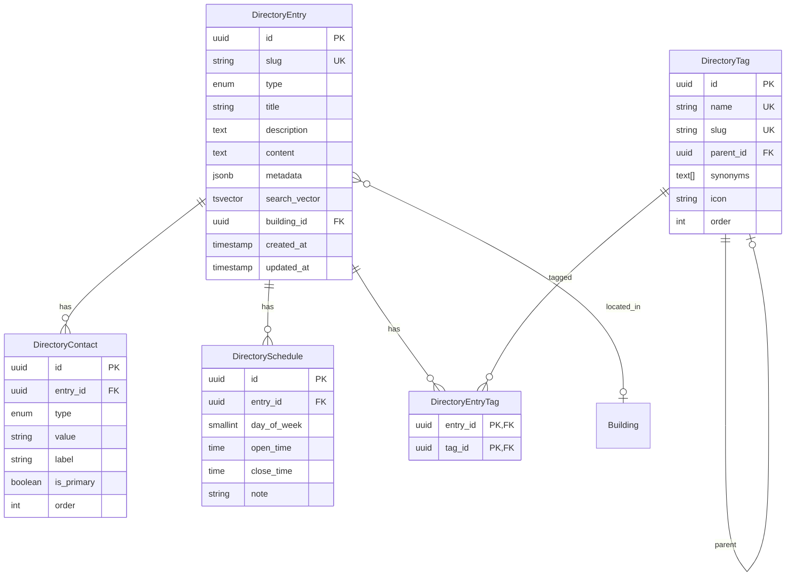

# Technical Specification: Reference Directory System (Справочная)

## Metadata
**Issue:** User Request - Comprehensive Reference/Directory System
**Created:** 2025-12-04
**Author:** Feature Planner Agent
**Status:** Draft
**Complexity:** High

## Executive Summary

Создание комплексной справочной системы для жилого комплекса, объединяющей контакты УК, экстренных служб, организации, локации и документы в единую структуру с поддержкой иерархических тегов, быстрого поиска и гибкой системы контактной информации в стиле CardDAV.

## Requirements

### User Story
Как житель ЖК, я хочу иметь единую справочную систему с быстрым поиском и удобной навигацией, чтобы мгновенно находить нужные контакты, организации и информацию о комплексе.

### Acceptance Criteria
1. **GIVEN** пользователь на странице справочной **WHEN** вводит поисковый запрос **THEN** видит результаты в реальном времени с подсветкой совпадений
2. **GIVEN** поисковый запрос "сантехник" **WHEN** выполняется поиск **THEN** находятся записи с тегами "сантехника", "водопровод", "трубы"
3. **GIVEN** пользователь просматривает категорию **WHEN** выбирает подкатегорию **THEN** видит вложенные элементы
4. **GIVEN** запись справочника с телефоном **WHEN** пользователь нажимает на номер **THEN** открывается приложение звонка
5. **GIVEN** администратор в админке **WHEN** редактирует запись **THEN** может добавить множественные контакты разных типов

### Functional Requirements
- **FR1:** Единая сущность DirectoryEntry для всех типов записей (контакты, организации, локации, документы)
- **FR2:** Иерархическая система тегов с поддержкой синонимов
- **FR3:** Поиск по названию, описанию и тегам с typo-tolerance
- **FR4:** Множественные контакты (телефоны, email, мессенджеры, адреса) для одной записи
- **FR5:** Привязка записей к зданиям/локациям ЖК
- **FR6:** График работы для организаций
- **FR7:** Административный интерфейс для управления справочником
- **FR8:** Публичный API для поиска и получения записей

### Non-Functional Requirements
- **Performance:** Поиск должен отвечать < 100ms для базы до 1000 записей
- **Scalability:** Возможность расширения до 10,000+ записей в будущем
- **UX:** Instant search с результатами по мере ввода (debounce 150ms)

## Technical Design

### Architecture Overview

```mermaid
graph TD
    subgraph "Frontend Layer"
        UI[Reference Page /info] --> Search[SearchInput]
        UI --> Tree[CategoryTree]
        UI --> Results[SearchResults]
        Search --> Debounce[150ms Debounce]
    end

    subgraph "API Layer"
        Debounce --> tRPC[tRPC Directory Router]
        Tree --> tRPC
        tRPC --> Procedures[directory.search / directory.byTag / directory.getEntry]
    end

    subgraph "Data Layer"
        Procedures --> PG[(PostgreSQL)]
        PG --> FTS[Full-Text Search]
        PG --> Tags[Tag System]
        PG --> Entries[Directory Entries]
    end

    subgraph "Admin Layer"
        Admin[/admin/directory] --> AdminRouter[admin.directory.*]
        AdminRouter --> PG
    end
```

### Search Strategy Decision

После анализа вариантов поиска, рекомендуется **гибридный подход PostgreSQL FTS + pgvector**:

#### Почему не внешний поиск (Meilisearch/Typesense):
1. **Инфраструктурная сложность** - требуется дополнительный сервис
2. **Синхронизация данных** - нужна логика репликации
3. **Размер данных** - для ЖК с ~1000 записей PostgreSQL FTS достаточно

#### Выбранный подход:
1. **Фаза 1:** PostgreSQL Full-Text Search с `tsvector`
   - Typo-tolerance через trigram индекс (`pg_trgm`)
   - Поддержка русского языка через конфигурацию `russian`
   - Достаточно для MVP с < 1000 записей

2. **Фаза 2 (опционально):** Добавление pgvector
   - Семантический поиск для сложных запросов
   - Embeddings через OpenAI API или локальную модель
   - Гибридный ranking: FTS score + vector similarity

### Data Model Overview



### Component Specifications

#### Component: DirectoryEntry Schema
**Purpose:** Универсальная сущность для всех типов справочных записей
**Location:** `src/server/db/schemas/directory.ts`
**Dependencies:** buildings schema, drizzle-orm

**Design Details:**
- Единая таблица для контактов, организаций, локаций, документов
- Поле `type` определяет тип записи (contact, organization, location, document)
- `metadata` (JSONB) для типо-специфичных данных
- `search_vector` автоматически обновляется триггером
- `slug` для SEO-friendly URL

**Contract Description:**
```yaml
Purpose: Universal directory entry for all reference types
Fields:
  id: UUID, auto-generated primary key
  slug: Unique URL-safe identifier (auto-generated from title)
  type: Enum (contact, organization, location, document)
  title: Display name (required, max 255)
  description: Short description (optional, max 500)
  content: Rich text content (optional)
  metadata: Type-specific JSON data
  searchVector: Auto-generated tsvector for FTS
  buildingId: Optional FK to building
  createdAt: Auto timestamp
  updatedAt: Auto-updated timestamp
Indexes:
  - GIN index on search_vector
  - GIN index on metadata using gin_trgm_ops
  - B-tree on type, slug
Triggers:
  - Update search_vector on INSERT/UPDATE (title + description + content)
```

#### Component: DirectoryContact Schema
**Purpose:** Контактная информация в стиле CardDAV
**Location:** `src/server/db/schemas/directory.ts`
**Dependencies:** DirectoryEntry

**Design Details:**
- Поддержка множественных контактов разных типов
- Типы: phone, email, address, messenger, website, social
- Метки для контекста (домашний, рабочий, экстренный)
- Возможность указать основной контакт
- Сортировка по `order`

**Contract Description:**
```yaml
Purpose: Contact information following CardDAV-like structure
Fields:
  id: UUID primary key
  entryId: FK to DirectoryEntry
  type: Enum (phone, email, address, telegram, whatsapp, website, other)
  value: Contact value (phone number, email, URL, etc.)
  label: Human-readable label ("Диспетчерская", "Приёмная")
  isPrimary: Boolean, first contact to show
  order: Display order within type group
Validation:
  - Phone: E.164 format validation
  - Email: RFC 5322 validation
  - URL: Valid URL format
```

#### Component: DirectoryTag Schema
**Purpose:** Иерархическая система тегов с синонимами
**Location:** `src/server/db/schemas/directory.ts`
**Dependencies:** None

**Design Details:**
- Самореферентная иерархия (parentId)
- Массив синонимов для улучшения поиска
- Иконка для визуализации (Lucide icon name)
- Глубина вложенности ограничена 3 уровнями (категория → подкатегория → тег)

**Contract Description:**
```yaml
Purpose: Hierarchical tags with synonyms for improved search
Fields:
  id: UUID primary key
  name: Display name (unique)
  slug: URL-safe identifier (unique)
  parentId: FK to self for hierarchy
  synonyms: TEXT[] for search aliases
  icon: Optional Lucide icon name
  order: Display order within parent
Hierarchy Rules:
  - Max depth: 3 levels
  - Root tags (parentId = null) are categories
  - Level 2 are subcategories
  - Level 3 are leaf tags
Examples:
  - УК → Диспетчерская → Сантехника
  - Услуги → Еда → Кофе
  - Локации → Детское → Площадки
```

#### Component: DirectorySchedule Schema
**Purpose:** График работы организаций
**Location:** `src/server/db/schemas/directory.ts`
**Dependencies:** DirectoryEntry

**Design Details:**
- Гибкий график с возможностью перерывов
- Поддержка выходных и праздничных дней
- Примечания для особых случаев

**Contract Description:**
```yaml
Purpose: Working hours for organizations
Fields:
  id: UUID primary key
  entryId: FK to DirectoryEntry
  dayOfWeek: 0-6 (Sunday-Saturday)
  openTime: TIME without timezone
  closeTime: TIME without timezone
  note: Optional note ("обед 13:00-14:00", "выходной")
Special Values:
  - null openTime + null closeTime + note = special day
  - Both null without note = closed day
```

### API Specifications

#### tRPC Router: directoryRouter
**Purpose:** Публичный API для справочной системы
**Location:** `src/server/api/routers/directory.ts`
**Authorization:** Public (publicProcedure)

**Procedures:**

```yaml
search:
  Purpose: Full-text search across directory
  Input:
    query: string (min 2 chars)
    type: DirectoryEntryType (optional filter)
    tagIds: string[] (optional filter)
    limit: number (default 20, max 100)
    offset: number (default 0)
  Output:
    results: DirectoryEntry[] with contacts and tags
    total: number
    hasMore: boolean
  Implementation:
    - Use plainto_tsquery for query parsing
    - Combine FTS rank with trigram similarity
    - Include tag synonym matching
    - Sort by relevance score

byTag:
  Purpose: Get entries by tag hierarchy
  Input:
    tagSlug: string
    includeChildren: boolean (default true)
    limit: number
    offset: number
  Output:
    tag: DirectoryTag with path to root
    entries: DirectoryEntry[]
    childTags: DirectoryTag[] (if has children)
    total: number

getEntry:
  Purpose: Get single entry by slug
  Input:
    slug: string
  Output:
    entry: DirectoryEntry with all relations
    relatedEntries: DirectoryEntry[] (by shared tags)

getTags:
  Purpose: Get tag tree for navigation
  Input:
    parentId: string (optional, null for root)
  Output:
    tags: DirectoryTag[] with entry counts

suggest:
  Purpose: Search suggestions as-you-type
  Input:
    query: string (min 1 char)
    limit: number (default 5)
  Output:
    suggestions: {title, slug, type}[]
  Implementation:
    - Use trigram similarity for fuzzy matching
    - Prioritize tags and categories
    - Fast response (< 50ms target)
```

#### tRPC Router: adminDirectoryRouter
**Purpose:** Административный API для управления справочником
**Location:** `src/server/api/routers/admin.ts` (extend existing)
**Authorization:** adminProcedure (Editor+ role)

**Procedures:**

```yaml
directory.list:
  Purpose: List all entries with filters
  Authorization: directory:view
  Input:
    type, tagIds, search, page, limit, sortBy, sortOrder
  Output:
    entries with stats, total, pagination

directory.create:
  Purpose: Create new directory entry
  Authorization: directory:create
  Input:
    type, title, description, content, metadata
    contacts: {type, value, label, isPrimary, order}[]
    schedule: {dayOfWeek, openTime, closeTime, note}[]
    tagIds: string[]
    buildingId: string (optional)
  Output:
    entry: Created DirectoryEntry with all relations
  Behavior:
    - Auto-generate slug from title
    - Validate contacts by type
    - Trigger search_vector update

directory.update:
  Purpose: Update existing entry
  Authorization: directory:update
  Input:
    id, ...same as create (partial)
  Output:
    entry: Updated DirectoryEntry

directory.delete:
  Purpose: Soft-delete entry
  Authorization: directory:delete
  Input:
    id: string
  Output:
    success: boolean

directory.tags.create:
  Purpose: Create new tag
  Authorization: directory:tags
  Input:
    name, parentId, synonyms, icon, order

directory.tags.update:
  Purpose: Update tag
  Authorization: directory:tags

directory.tags.delete:
  Purpose: Delete tag (unlinks from entries)
  Authorization: directory:tags

directory.import:
  Purpose: Bulk import entries from JSON/CSV
  Authorization: directory:import
  Input:
    format: 'json' | 'csv'
    data: string
  Output:
    imported: number
    errors: {row, message}[]
```

### Migration Plan from Existing Schema

#### Phase 1: Create New Tables (Non-Breaking)
1. Создать новые таблицы: `directory_entry`, `directory_contact`, `directory_tag`, `directory_schedule`, `directory_entry_tags`
2. Установить pg_trgm extension
3. Создать триггер для search_vector

#### Phase 2: Migrate Existing Data
1. Мигрировать `contactGroups` → `directory_entry` (type: 'contact')
2. Мигрировать `properties` → `directory_contact`
3. Объединить `tags` и `organizationTags` → `directory_tag`
4. Мигрировать `organizations` → `directory_entry` (type: 'organization')
5. Создать связи с buildings

#### Phase 3: Deprecate Old Tables
1. Добавить views для обратной совместимости (если есть внешние зависимости)
2. Удалить старые таблицы после полной миграции

### Integration Points

- **Buildings Schema:** Связь directory_entry.building_id с существующей иерархией зданий
- **Auth System:** Использование существующего adminProcedure для административных операций
- **Navigation:** Добавление /info в главную навигацию (уже есть заглушка)

### Complex Implementation Areas

#### Area 1: Search Vector with Russian Language
**Challenge:** PostgreSQL FTS требует правильной конфигурации для русского языка

**Detailed Approach:**
1. Использовать конфигурацию `russian` для tsvector
2. Создать комбинированный tsvector из title (weight A), description (weight B), content (weight C)
3. Добавить trigram индекс для fuzzy matching
4. Нормализовать синонимы тегов в search query

**Considerations:**
- Стемминг русского языка встроен в PostgreSQL
- Для лучших результатов можно добавить словарь синонимов
- Тестировать на реальных запросах жителей

#### Area 2: Tag Hierarchy Navigation
**Challenge:** Эффективное отображение дерева тегов с количеством записей

**Detailed Approach:**
1. Кэшировать структуру тегов на клиенте (React Query)
2. Использовать recursive CTE для получения всех потомков
3. Считать записи через LEFT JOIN с агрегацией
4. Предзагружать первый уровень при открытии страницы

**Considerations:**
- При изменении тегов инвалидировать кэш
- Показывать loading state при загрузке подуровней
- Breadcrumb навигация для текущей позиции

#### Area 3: Contact Type Validation
**Challenge:** Разные типы контактов требуют разной валидации

**Detailed Approach:**
1. Создать Zod схемы для каждого типа контакта
2. Discriminated union по полю `type`
3. Валидация на сервере в tRPC input
4. Форматирование телефонов в E.164

**Validation Rules:**
```yaml
phone:
  pattern: "^\\+?[1-9]\\d{1,14}$"
  format: E.164 (+7XXXXXXXXXX)
email:
  pattern: RFC 5322 compliant
telegram:
  pattern: "^@?[a-zA-Z][a-zA-Z0-9_]{4,}$"
  format: @username or t.me/username
whatsapp:
  pattern: Phone number format
website:
  pattern: Valid URL with http(s)
address:
  freeform: true
  maxLength: 500
```

## UI/UX Design

### Page Structure: /info

```
┌─────────────────────────────────────────────────────────┐
│  [🔍 Поиск по справочнику...]                           │
├─────────────────────────────────────────────────────────┤
│                                                         │
│  Категории                        Результаты           │
│  ┌─────────────────┐              ┌──────────────────┐ │
│  │ ▼ УК и ЖКХ      │              │ [Card]           │ │
│  │   • Диспетчерская│              │ Диспетчерская УК │ │
│  │   • Сантехника  │              │ ☎ +7 xxx xxx     │ │
│  │   • Электрика   │              │ 📍 ЖК "Название"  │ │
│  │ ▼ Экстренные    │              └──────────────────┘ │
│  │   • Полиция     │              ┌──────────────────┐ │
│  │   • Скорая      │              │ [Card]           │ │
│  │ ▼ Организации   │              │ ...              │ │
│  │   • Магазины    │              └──────────────────┘ │
│  │   • Кафе        │                                   │
│  │ ▼ Локации       │                                   │
│  └─────────────────┘                                   │
│                                                         │
└─────────────────────────────────────────────────────────┘
```

### Card Component: DirectoryEntryCard

```
┌────────────────────────────────────────────┐
│ [Icon]  Название записи           [Tags]   │
├────────────────────────────────────────────┤
│ Краткое описание записи на две строки      │
│ максимум с обрезкой по overflow...         │
├────────────────────────────────────────────┤
│ ☎ +7 (999) 123-45-67  [📋]                │
│ 📱 @telegram_handle                        │
│ 📍 Дом 1, этаж 1                          │
│ 🕐 Пн-Пт 9:00-18:00                       │
└────────────────────────────────────────────┘
```

### Mobile Responsive

- **Desktop (>1024px):** Две колонки - категории слева, результаты справа
- **Tablet (768-1024px):** Категории сворачиваются в dropdown
- **Mobile (<768px):** Полноширинный поиск, категории в sheet снизу

## Implementation Guidance

### Development Phases

**Phase 1: Foundation (Database & API)**
- Создание schema в `src/server/db/schemas/directory.ts`
- Database migration с триггерами для search_vector
- Базовые tRPC procedures (CRUD)
- Seed data с примерами

**Phase 2: Search & Navigation**
- Реализация FTS с trigram
- Tag hierarchy procedures
- Search suggestions API
- Базовый UI с категориями

**Phase 3: Full UI**
- Страница /info с поиском
- DirectoryEntryCard компонент
- Детальная страница записи
- Mobile responsive

**Phase 4: Admin Panel**
- Административные procedures
- UI для создания/редактирования записей
- Управление тегами
- Импорт данных

**Phase 5: Polish**
- Оптимизация поиска
- Кэширование
- SEO (meta tags, structured data)
- Analytics

### Guideline References
- **T3 Stack Patterns:** tRPC, Drizzle, NextAuth согласно CLAUDE.md
- **Schema Patterns:** Следовать существующим schemas в проекте
- **Component Patterns:** Radix UI + TailwindCSS

### Testing Approach

**Unit Testing:**
- Zod validation schemas для контактов
- Search vector generation
- Tag hierarchy traversal

**Integration Testing:**
- FTS queries с русским текстом
- CRUD operations через tRPC
- Migration от старых таблиц

**E2E Testing (Playwright):**
- Поиск по справочнику
- Навигация по категориям
- Открытие карточки записи
- Клик по телефону (mobile intent)

## Risks and Mitigations

### Technical Risks
| Risk | Impact | Probability | Mitigation |
|------|--------|-------------|------------|
| FTS performance degradation | Medium | Low | Добавить pgvector в Phase 2 |
| Complex tag hierarchy queries | Medium | Medium | Кэширование структуры тегов |
| Migration data loss | High | Low | Backup + staged migration |
| Russian language stemming issues | Medium | Medium | Тестирование на реальных запросах |

## Success Metrics
- **Functional:** Поиск возвращает релевантные результаты для типичных запросов
- **Performance:** Search response < 100ms (p95)
- **Quality:** 80%+ test coverage для критических путей
- **UX:** Instant search без видимой задержки

## Validation Notes

### Research Sources
- [pgvector GitHub](https://github.com/pgvector/pgvector) - Vector similarity search for Postgres
- [PostgreSQL FTS vs Dedicated Search](https://nomadz.pl/en/blog/postgres-full-text-search-or-meilisearch-vs-typesense) - Comparison analysis
- [Meilisearch vs Typesense](https://www.meilisearch.com/blog/meilisearch-vs-typesense) - Feature comparison

### Architecture Decision: PostgreSQL FTS First
**Rationale:**
1. Нет необходимости в дополнительной инфраструктуре
2. Для масштаба ЖК (~1000 записей) PostgreSQL FTS достаточно
3. pg_trgm обеспечивает fuzzy matching
4. Возможность добавить pgvector позже без миграции

## Appendices

### A. Glossary
- **DirectoryEntry:** Универсальная сущность справочника
- **CardDAV:** Стандарт для хранения контактной информации
- **FTS:** Full-Text Search - полнотекстовый поиск
- **tsvector:** PostgreSQL тип для текстового поиска
- **pg_trgm:** PostgreSQL extension для триграмного сходства

### B. References
- PostgreSQL FTS Docs: https://www.postgresql.org/docs/current/textsearch.html
- pg_trgm: https://www.postgresql.org/docs/current/pgtrgm.html
- Drizzle ORM: https://orm.drizzle.team/docs/overview

### C. Decision Log
| Decision | Options Considered | Choice | Rationale |
|----------|-------------------|---------|-----------|
| Search engine | Meilisearch, Typesense, PostgreSQL FTS | PostgreSQL FTS | No extra infrastructure, sufficient for scale |
| Data model | Separate tables, Unified DirectoryEntry | Unified DirectoryEntry | Simpler queries, consistent interface |
| Tag system | Flat tags, Hierarchical | Hierarchical with synonyms | Better navigation, improved search |
| Contact storage | JSONB, Separate table | Separate table | Type safety, easier queries |

### D. Existing Data to Migrate
From `contacts.ts`:
- `contactGroups` (6 fields)
- `propertyGroups` (4 fields)
- `properties` (6 fields)
- `tags` (2 fields)
- `contactGroupTags` (junction)

From `organizations.ts`:
- `organizations` (8 fields)
- `organizationTags` (2 fields)
- `organizationToTags` (junction)

### E. Sample Tag Hierarchy
```
УК и ЖКХ
├── Диспетчерская
│   ├── Сантехника [synonyms: водопровод, трубы, краны]
│   ├── Электрика [synonyms: свет, проводка, розетки]
│   └── Лифты [synonyms: подъёмник]
├── Управляющая компания
└── Консьерж

Экстренные службы
├── Полиция [synonyms: милиция, участковый]
├── Скорая помощь [synonyms: ambulance, медики]
├── Пожарная [synonyms: МЧС, огонь]
└── Газ [synonyms: газовая служба, утечка]

Организации
├── Еда
│   ├── Кафе
│   ├── Рестораны
│   └── Доставка
├── Магазины
│   ├── Продукты
│   ├── Товары для дома
│   └── Аптека
└── Услуги
    ├── Красота [synonyms: парикмахерская, маникюр]
    ├── Ремонт
    └── Химчистка

Локации
├── Детское
│   ├── Площадки
│   └── Комнаты
├── Спорт
└── Паркинг
```

## Next Steps
1. Review specification with user
2. Discuss search strategy preference (FTS-only vs hybrid)
3. Confirm tag hierarchy structure
4. Get approval and update Status to "Approved"
5. Hand off to implementation: create schemas, migration, API
